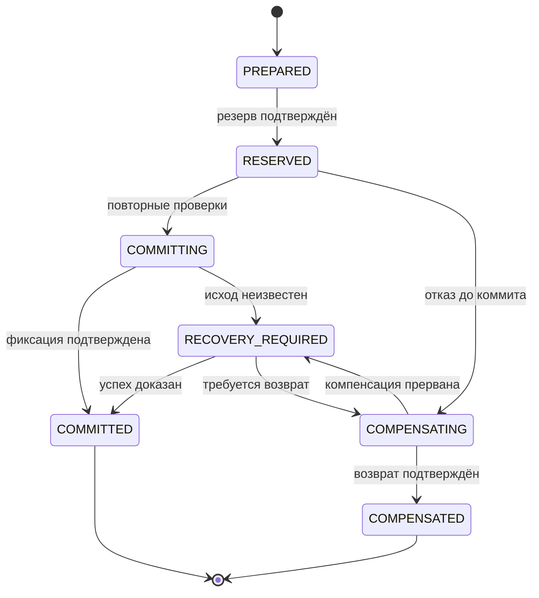

# Elementra — техническая спецификация

**Проект:** Elementra  
**Редакция:** 3.1.1 · 8 октября 2026 года (точечное обновление требований; не редакция 3.2)  
**Статус:** полная сводная рабочая документация + реестр фактической реализации  
**Основание:** предыдущая сводная редакция 3.0; FourNations/HuntingGrounds; пакет ForgeSystem 2–3 октября 2026 года; фактические сборки GradostroyGUI, ServerMineEconomy, AdminPanel и MineTrains по состоянию на 4 октября 2026 года.

Документ описывает требования, проектные решения и известное состояние реализации. Для каждого существующего модуля необходимо различать наличие исходников/JAR, успешную компиляцию, автономный прототип, интеграционную готовность и runtime-проверку на целевом Purpur. Числа, помеченные как тестовые или рекомендуемые, не становятся утверждённым балансом после включения в эту редакцию.

## Содержание

0. [Фактическое состояние реализации и ближайшая интеграция](#t-00)
1. [Назначение, целевая среда и статус спецификации](#t-01)
2. [Архитектура, компоненты и сборка](#t-02)
3. [Идентификаторы, API и готовность интеграций](#t-03)
4. [Транзакции, резервы и критические сценарии](#t-04)
5. [Хранилище, кэши, потоки, структуры и предметы](#t-05)
6. [GUI, физические интерфейсы, права и сообщения](#t-06)
7. [WorldProgression, Печати, сезоны и карта](#t-07)
8. [Economy, Cities и Protection: модели и реализация](#t-08)
9. [MobDifficulty, Dungeons и боссы: состояния и обработчики](#t-09)
10. [FourNations: актуальные данные, свойства и Возвышения](#t-10)
11. [FourNations: AbilityEngine и механика народов](#t-11)
12. [FourNations: конфигурация, миграция, диагностика и испытания](#t-12)
13. [FourNations: визуальный движок и ресурсные ограничения](#t-13)
14. [HuntingGrounds: домен, животные, квоты и предложения](#t-14)
15. [HuntingGrounds: договоры, убийства, выплаты и интеграции](#t-15)
16. [HuntingGrounds: БД, события, конфигурация и эксплуатация](#t-16)
17. [Конфигурация, аудит, метрики и производительность](#t-17)
18. [Сбои, резервные копии, миграции, выпуск и откат](#t-18)
19. [План испытаний и критерии технической готовности](#t-19)
20. [Архитектурные решения и порядок реализации](#t-20)
21. [Открытые технические вопросы](#t-21)
22. [Глоссарий, источники и история согласования](#t-22)


<a id="t-00"></a>

## 0. Фактическое состояние реализации и ближайшая интеграция

**Срез состояния:** 4 октября 2026 года.

### 0.1. Правила трактовки готовности

Технический статус фиксируется по ступеням:

```text
SPEC
→ SOURCE_READY
→ COMPILED
→ STANDALONE_TESTABLE
→ INTEGRATED
→ RUNTIME_VERIFIED
→ RELEASE_READY
```

Переход на следующую ступень не выводится автоматически. Наличие JAR не означает прохождение smoke-теста, а работа автономного прототипа не означает production-интеграцию.

### 0.2. Реестр текущих модулей

| Модуль | Версия/состояние | Технически подтверждено | Ближайший блокер |
|---|---|---|---|
| `ForgeMinigame` | v2.4 / `0.6.0-SNAPSHOT` | Java 25; Paper/Purpur 26.2; чистый core; 3 стадии; HUD; cooling/reheat prototype; конфиг сложности | Перенос runtime-состояния в persistent Workpiece и ForgeStation |
| `ForgeSystem` | `3.1.0-dev` | 54-slot GUI; физический multiblock на `BLAST_FURNACE`; общий heat/fuel state; fuel/metal/reheat; 9 изделий; HOT_BLANK/PDC; безопасный возврат; RP с 21 кадром температуры | Интеграция ForgeMinigame, recovery/anti-dupe, UNQUENCHED и downstream-цикл |
| `ForgeItems` | SPEC / contract-ready | Workpiece/Hammer definitions, schema version, codec/API, session lock, item registry/model IDs; подготовлены спрайты состояний | Финальная реализация ownership и интеграционные тесты |
| `GradostroyGUI` | MVP | Purpur 26.2/Java 25; книга и GUI; demo-city; territory/treasury/residents/upgrades/management/diplomacy; 4→12→24→40→64 | Настоящий storage + chunk ownership/protection + Economy integration |
| `ServerMineEconomy` | API ready / server plugin unfinished | HMAC/PDC money; reserve/commit/release; idempotent operationId; SQLite journal; ServicesManager API | Финальный server JAR и end-to-end payment tests |
| `AdminPanel` | 1.0.1 | JAR/source; player/world/server GUI; audit; Vanish/God/Fly; Java 21 bytecode совместим с Java 25 | Runtime smoke-test; Fly persistence; permission granularity |
| `MineTrains` | 1.0.0 | Compile verified; chain coupling; PDC persistence; physical following; max 12 carts | Runtime test on target Purpur and physics tuning |
| `Cooking/CropKettle` | SPEC | Complete server-side port specification | Plugin implementation and compatible RP |
| `CropKettleBreweryBridge` | PLAN/SPEC | Integration ownership and bottling boundary fixed | Bridge implementation and idempotency/restart tests |
| `FourNations`, `HuntingGrounds`, `WorldProgression`, `Dungeons`, `Seasons` | SPEC | Domain contracts and acceptance criteria documented | Production implementation |
| `NetherSealsPlugin` | `0.1.0` / SOURCE_READY, 08.10.2026 | Код алтарей, рейдов, хранителя/4 способностей, SQLite и миграций, Ядер, recovery, Nether lock и админ-команд; 130 `@Test` в 20 test-классах присутствуют в исходниках | WorldProgression ownership, fail-closed, конфигурации, build/CI и runtime-тесты |

### 0.3. Current integration graph

```text
                    ┌────────────────────┐
                    │    AdminPanel      │
                    │ operations / audit │
                    └─────────┬──────────┘
                              │
┌──────────────────┐   ┌──────▼──────────┐   ┌────────────────────┐
│ ServerMineEconomy│◄──│ Gradostroy/Cities│──►│ Protection (next)  │
└──────────────────┘   └─────────────────┘   └────────────────────┘

┌──────────────────┐   ┌─────────────────┐   ┌────────────────────┐
│  ForgeItems/PDC  │──►│ ForgeSystem     │──►│ ForgeMinigame v2.4 │
│  Workpiece       │   │ Station + GUI   │   │ runtime mechanic   │
└──────────────────┘   └─────────────────┘   └─────────┬──────────┘
                                                       ▼
                                             UNQUENCHED / hardening
```

### 0.4. Приоритетный технический roadmap

**P0 — Forge integration.** Объединить Workpiece, настоящий горн и ForgeMinigame; исключить тестовые команды из пользовательского пути; добавить session lock, logout/death/server-disable recovery, idempotent finish и переход в `UNQUENCHED`.

**P1 — Forge downstream.** Закалка, `QUENCHED_PART`, рукоять для инструментов/оружия, финальная материализация, затем iron→diamond→netherite с сохранением Forge metadata и качества.

**P2 — Economy + Cities.** Завершить server-side Economy, подключить казну Gradostroy, реализовать persistent город, соседние чанки, защиту и серверную проверку покупки. GUI не является источником истины.

**P3 — Operations.** Прогнать AdminPanel 1.0.1 и MineTrains 1.0.0 на целевом Purpur, закрыть выявленные runtime-дефекты и включить их в общий release checklist.

**P4 — Core world systems.** После стабилизации инфраструктуры переходить к WorldProgression, FourNations, PvE/Dungeons, HuntingGrounds, NetherSeals и Seasons.

### 0.5. Городской доменный контракт первой реализации

Для Gradostroy/Cities фиксируется:

```text
player-facing control = city book + GUI
admin commands = service/diagnostic path
start territory = 4 chunks
expansion = adjacent chunks only
stage caps = 4 / 12 / 24 / 40 / 64
payment owner = Economy
city treasury owner = Cities
territory owner = Cities
protection enforcement = Protection/Cities adapter
```

Промежуточные названия стадий между поселением и королевством и их числовые требования остаются балансным решением. Телепорт на городскую площадь не входит в обязательный MVP.

### 0.6. Проверка фактической реализации NetherSealsPlugin (08.10.2026)

**Уровень доказательности:** `SOURCE_READY` — файлы доступны для статической проверки; сборка, запуск JUnit, успешный CI, запуск на Purpur/Paper 26.2 и интеграция с WorldProgression в этой ревизии **не подтверждены**. Плагин `0.1.0`, `build.gradle.kts`: Java toolchain 25 / `paper-api:26.2.build.+`, SQLite JDBC, Gradle; в архиве присутствуют `README.md`, `config.yml`, `altars.yml`, `bosses.yml`, `src/main` и `src/test`.

**Реализованные модули по исходникам:** `StartupSequencer`, `AltarService`, `BattleService`, `BossService`, 4 abilities, `CoreService`, `ProgressService`, `RecoveryService`, `NetherLockService` + Paper listeners, миграции БД, основные админ-команды. По умолчанию `altars.yml` пуст; в `bosses.yml` есть шаблон `test_boss`. Это не доказывает проходимость рейда игроками.

**Несоответствия нормативному контракту и задачи до ЗБТ:**

1. **NS-01 — владелец `netherOpen`.** В `NetherLockService` и `ProgressService` хранятся/вычисляются собственные флаги открытия и выполняется `unlock` локальной БД. По §7.10 владелец разрешения на измерение — **WorldProgression**. Требуется единый контракт состояния/события и единый проверяемый enforcement на всех входах; временный автономный режим допустим только на изолированном тестовом сервере.
2. **NS-02 — fail-closed.** `NetherSeals.onEnable` отключает плагин при ошибке инициализации; listener блокировки регистрируется только при успешном старте. При выключенном плагине контроль входа в Незер этим модулем не осуществляется. Нужен независимый gate/блокировка запуска игроков, аварийная диагностика и отказобезопасные тесты.
3. **NS-03 — конфигурация Печатей.** `AltarConfigLoader` пропускает ошибочные записи с предупреждением. При `progress.required-altars = -1` (по умолчанию) `ProgressService` выводит порог из загруженных `required` алтарей; самовосстановление на старте может открыть Незер при некорректно уменьшенном списке. Для production нужен фиксированный/версионированный набор **ровно четырёх различных обязательных ID (FIRE/WATER/EARTH/AIR)**, stop-on-invalid, миграция и запрет auto-unlock при проблеме.
4. **NS-04 — reload.** Команда `admin reload` вызывает `reloadDefinitionsAndReconcile` без сквозной валидации набора Печатей и без явной защиты активных рейдов/записи снимка конфигурации. Требуются атомарная проверка, запрет опасных изменений и тесты активной сессии.
5. **NS-05 — bypass.** YAML содержит `nether-lock.allow-bypass-permission: true`, но `ConfigLoader` не считывает поле; `NetherLockListener.hasBypass()` всегда использует право `netherseals.bypass.nether-lock` (`default: op`). Поведение опов нужно согласовать с утверждённой политикой входа, а параметр либо реализовать, либо удалить.
6. **NS-06 — README/операции.** README содержит устаревшее «boss-id не влияет» и перечень админ-команд как ещё не реализованных. Синхронизировать руководство со сборкой, конфигами и permission-map, не заявляя о runtime-готовности.
7. **NS-07 — контент.** Настроить реальный алтарь и арену, финальный boss-id/поведение и безопасные координаты `safe-exit`. Тестовый шаблон не приравнивать к готовому боссу или мировому прогрессу.
8. **NS-08 — тестирование.** Выполнить сборку на Java 25, JUnit, smoke-test на точной Paper/Purpur 26.2 сборке; матрицу портал/команда/плагины/смена мира; два одновременных рейда, logout/death/rejoin/wipe, ядро после поражения/победы, краш и перезапуск до/после каждого commit, полную БД, permissions, backup/restore. Сохранить логи, версии и результаты.

**Критерий готовности:** `SOURCE_READY` → `COMPILED` → `STANDALONE_TESTABLE` → `INTEGRATED` (включая WorldProgression) → `RUNTIME_VERIFIED` → `RELEASE_READY`. Никакая стадия не пропускается автоматически. В первой ЗБТ возможен **условный** вертикальный срез с одним алтарём, если закрыты NS-01…NS-05 и аварийные сценарии; тест одного алтаря **не отменяет утверждённый набор из четырёх стихийных Печатей** для основной карты.

**Основание:** пользовательский архив `NetherSealsPlugin-main.zip`, SHA-256 `9095d1c9fef4f9017ee77d650bcad46cd96dcc96ce9159307840d8318639d482`; Git-история отсутствует, поэтому утверждать состав последнего коммита нельзя.

<a id="t-01"></a>

## 1. Назначение, целевая среда и статус спецификации

**Основание:** S06, S08, S09, S12.

### 1.1. Область технического документа

Документ определяет архитектуру, контракты данных, критические операции, интеграции, конфигурацию, наблюдаемость, восстановление, выпуск и проверку проекта. Игровой смысл систем, числовые тестовые пресеты и неутверждённые предложения описаны в концептуальной части.

Требование в этой редакции означает ожидаемое поведение реализации. Для части модулей уже существуют исходники, JAR или автономные прототипы, однако только строки реестра в разделе 0 фиксируют их известный фактический статус. Псевдокод, Java-интерфейсы и YAML в остальных главах остаются спецификацией, если явно не сказано обратное.

| Параметр | Целевой контракт источников | Что проверить перед выпуском |
|---|---|---|
| Сервер | Purpur 26.2, совместимый Paper API | Точный build, соответствие API, поддерживаемая версия протокола |
| Java | 25 | Совместимость JVM, toolchain и библиотек выбранной сборки |
| Клиент | Minecraft Java без обязательных модов | Основные механики без клиентских дополнений |
| Развёртывание | Один процесс, несколько доменных плагинов | Порядок готовности, деградация, перезапуск |
| Сборка | Многомодульный Gradle, целевое решение | Закреплённые версии зависимостей, воспроизводимость |
| Хранилище | SQLite допустима; отдельная БД на домен рекомендована | Миграции, WAL, блокировки, нагрузка, резервные копии |
| Публичные API | Paper/Purpur и API доменных плагинов | Наличие и семантика каждого используемого события/атрибута |

Имена Paper-событий, атрибутов и особенности загрузки сущностей перенесены из проектных спецификаций. Для выбранной сборки обязательны компиляционная проверка и испытания на настоящем сервере; этот документ не является отчётом о такой проверке. NMS и прямые внутренние вызовы CraftBukkit не входят в целевую архитектуру.

### 1.2. Единые инженерные правила

1. У каждого постоянного состояния один домен-владелец. Чужая база не читается и не изменяется напрямую.
2. На границах используются типизированные ID, неизменяемые снимки, версии и явные результаты.
3. SQL и файловый ввод-вывод выполняются вне игрового потока; Bukkit-мир и инвентарь — в разрешённом серверном контексте.
4. Критическая операция имеет устойчивый Operation ID, записанное состояние и путь восстановления.
5. GUI, предмет, NPC и PDC являются представлением. Их наличие не заменяет проверку серверного состояния.
6. Недоступная критическая интеграция блокирует опасное действие. Косметическая ошибка допускает упрощение.
7. Активные сессии используют снимок конфигурации. Reload не меняет стоимость уже принятого договора или сложность начатого рейда.
8. Перезапуск не должен дублировать награду, списание, прогрессию или физический объект.
9. Неизвестный результат платежа не повторяется с новым ID. Он остаётся в восстановлении до установления исхода.
10. Набор требований и испытания составляют единый выпуск; готовность не выводится из успешного `onEnable`.

<a id="t-02"></a>

## 2. Архитектура, компоненты и сборка

**Основание:** S06.

### 2.1. Архитектурные цели

#### Модульность

Каждая крупная система должна развиваться отдельно. Изменение сезонов не должно требовать изменения кода городского банка. Добавление нового данжа не должно затрагивать FourNations. Замена плагина NPC не должна менять доменную модель охоты.

#### Один владелец данных

Для каждого типа постоянного состояния существует единственная система-владелец.

Примеры:

- народ и наследие игрока принадлежат FourNations;
- баланс городского банка принадлежит Cities;
- подлинность физической валюты и операции оплаты принадлежат Economy;
- состояние открытых регионов принадлежит WorldProgression;
- состояние Печатей принадлежит NetherSeals;
- текущий сезон принадлежит Seasons;
- доступ к личному контейнеру принадлежит Protection;
- состояние прохождения данжа принадлежит Dungeons.

Другие плагины читают это состояние через API и не изменяют чужие таблицы напрямую.

#### Предсказуемость при сбоях

После любой ошибки система должна оказаться в одном из понятных состояний:

- операция не началась;
- операция завершилась ровно один раз;
- операция отменена без изменения прогресса;
- операция требует административной проверки;
- зависимая функция временно заблокирована безопасным режимом.

Недопустимо неопределённое состояние, при котором неизвестно, были ли списаны предметы или выдана награда.

#### Производительность

Архитектура должна выдерживать ожидаемый онлайн без постоянных глобальных циклов.

Основные правила:

- игровые события обрабатываются точечно;
- пространственные объекты индексируются по миру и чанку;
- SQL не выполняется синхронно в горячем обработчике;
- частицы отправляются только ближайшим наблюдателям;
- незагруженные чанки не загружаются без явной причины;
- второстепенные обновления обрабатываются пакетами с бюджетом времени;
- система умеет снижать косметическую нагрузку при падении TPS.

#### Поддерживаемость

Новая механика должна добавляться через существующие расширения:

- новый тип предмета — через реестр предметов;
- новый регион — через WorldProgression;
- новый эффект народа — через Ability API;
- новый тип награды — через Reward API;
- новый данж — через шаблон и регистрацию;
- новая интеграция — через адаптер;
- новое событие мира — через World Event API.

### 2.2. Архитектурный стиль

#### Общая модель

Сервер реализуется как набор доменных плагинов, работающих внутри одного процесса Purpur/Paper.

Это не микросервисы в сетевом смысле. Все плагины находятся в одной JVM, но сохраняют разделение ответственности, публичные контракты и независимое владение данными.

Целевая модель сочетает:

- модульную архитектуру;
- порты и адаптеры;
- доменную модель;
- событийное взаимодействие;
- явные прикладные сценарии;
- саги для междоменных транзакций.

#### Почему не один большой плагин

Один монолитный плагин кажется проще на старте, но приводит к проблемам:

- любой модуль получает доступ ко всем данным;
- классы городов начинают зависеть от классов народов;
- тестирование требует запуска всего проекта;
- обновление одной системы затрагивает остальные;
- становится сложно отключить или заменить механику;
- возрастает риск циклических зависимостей;
- ошибки базы одной системы могут повредить данные другой.

Поэтому общий код допускается только в платформенных API и технических библиотеках.

#### Почему не отдельные сетевые сервисы

Вынос экономики, городов или FourNations в отдельные процессы преждевременен для одного Minecraft-сервера.

Это добавит:

- сетевые ошибки;
- сложную синхронизацию;
- инфраструктуру развёртывания;
- задержки;
- дополнительные точки отказа.

На первом этапе все домены работают в одной JVM. Сетевой слой проектируется только как возможное дальнейшее расширение.

### 2.3. Высокоуровневая карта систем

#### ServerPlatform

Общий платформенный плагин.

Отвечает за:

- регистрацию сервисов;
- единый формат Operation ID;
- общий аудит технических операций;
- общий формат специальных предметов;
- безопасные планировщики;
- обработку состояния запуска и остановки;
- базовую диагностику;
- общие типы идентификаторов;
- общий реестр возможностей;
- интеграцию с ресурспаком;
- общую локализацию технических ошибок.

ServerPlatform не должен хранить доменные данные городов, народов или данжей.

#### WorldProgression

Владелец глобального развития мира.

Отвечает за:

- реестр регионов;
- состояние «закрыт / открыт»;
- этапы мира;
- зависимости между этапами;
- активацию новых границ;
- глобальные уведомления;
- сохранение мирового прогресса;
- предоставление API другим плагинам.

#### Economy

Владелец физической валюты и денежных транзакций.

Отвечает за:

- подлинность валюты;
- номиналы;
- обмен;
- операции оплаты;
- резервы средств;
- возвраты;
- журнал транзакций;
- ресурсный обменник;
- API оплаты для магазинов, городов и охоты.

#### Cities

Владелец городов.

Отвечает за:

- создание города;
- жителей;
- должности;
- участки;
- городской банк;
- улучшения;
- книгу управления;
- городской рынок;
- журнал управления;
- публичный API принадлежности и прав.

#### Protection

Владелец персональной защиты контейнеров и технического применения территориальных правил.

Отвечает за:

- личные ключи;
- владельцев контейнеров;
- списки доступа;
- проверку взаимодействий;
- защиту от поршней, воронок, взрывов и жидкостей;
- адаптацию правил городских территорий;
- аудит подозрительных действий.

Protection не определяет, кто является жителем города. Он получает это решение от Cities API.

#### FourNations

Владелец народов, наследия и Возвышений.

Отвечает за:

- нейтральный профиль;
- выбор народа;
- бонусы и слабости;
- уровни I–V;
- Возвышение;
- фиксированные награды Возвышений;
- Алтарь Единения;
- Алтари Наследия;
- ритуалы;
- публичное API профилей и способностей.

#### NationsLoot

Независимый источник предметов развития FourNations.

Отвечает за:

- Осколки развития;
- редкие компоненты;
- таблицы источников;
- выдачу предметов;
- интеграцию с данжами, мобами, торговцами и событиями.

FourNations проверяет предмет и стоимость, но не решает, где предмет выпадает.

#### CustomEnchantments

Владелец кастомных зачарований.

Отвечает за:

- определения зачарований;
- хранение на предмете;
- совместимость;
- обработчики эффектов;
- кулдауны;
- API проверки и применения;
- интеграцию с торговцем и лутом.

#### MobDifficulty

Владелец региональной сложности обычных и элитных существ.

Отвечает за:

- определение сложности региона;
- усиление существа при создании;
- ранги;
- способности элит;
- отображение опасности;
- таблицы наград;
- интеграцию с WorldProgression и Dungeons.

#### Dungeons

Владелец данжей.

Отвечает за:

- регистрацию локаций;
- состояние комнат;
- защиту;
- экземпляр прохождения;
- участников;
- спавн противников;
- восстановление;
- кулдауны;
- выдачу наград;
- аварийный сброс.

#### NetherSeals

Владелец Печатей Незера и рейдов на хранителей.

Отвечает за:

- глобальные алтари;
- арены;
- попытки рейда;
- состав участников;
- масштабирование босса;
- состояние Ядра Печати;
- подтверждённые события активации четырёх стихийных Печатей для WorldProgression;
- передачу событий для открытия Незера (решение и проверка доступа принадлежат WorldProgression);
- защиту стандартных порталов;
- восстановление после сбоя.

#### Seasons

Владелец календаря и сезонных правил.

Отвечает за:

- текущий сезон;
- дату перехода;
- модификаторы погоды;
- рост растений;
- появление животных;
- ночи;
- API сезонных коэффициентов;
- запуск сезонных событий.

#### HuntingGrounds

Владелец охотничьих угодий и договоров.

Отвечает за:

- реестр угодий;
- популяцию;
- метки диких животных;
- доску договоров;
- договор игрока;
- условия убийства;
- подтверждение сдачи;
- запрос награды у Economy.

#### BreweryIntegration

Необязательный модуль напитков.

Отвечает за:

- рецепты;
- качество;
- временные эффекты;
- совместимость с FourNations и сезонами;
- ограничения складывания.

Он не должен изменять постоянный прогресс народов.

#### ForgeSystem

Владелец кузнечного производственного цикла.

Отвечает за ForgeStation, состояние нагрева и топлива, Workpiece integration, ковку на наковальне, HUD, качество, закалку и материализацию результата. Автономный ForgeMinigame считается внутренним механизмом ForgeSystem после завершения интеграции, а не отдельным production-доменом.

#### AdminPanel

Эксплуатационный интерфейс администрации. Он не становится владельцем доменных данных и обязан вызывать публичные сервисы доменов, а не изменять их SQLite/PDC напрямую. Панель отвечает за диагностику, безопасные административные действия и аудит.

#### MineTrains

Независимый игровой utility-плагин сцепки вагонеток. Его состояние поездов хранится отдельно и не должно становиться частью Cities/Economy.

#### Cooking / CropKettle / Brewery Bridge

Поздний необязательный контент. Cooking владеет культурами, рецептами и кулинарными предметами. При использовании BreweryX bridge обязан разделять ответственность: BreweryX — производственный алкогольный цикл; Crop & Kettle — нативная бутылка, модель, возраст и Wine Rack после розлива.

### 2.4. Структура репозитория и сборки

#### Многомодульный проект

Рекомендуется один Git-репозиторий с Gradle Kotlin DSL.

Логическая структура:

- `platform-api` — общие публичные типы;
- `platform-core` — ServerPlatform;
- `economy-api` и `economy-plugin`;
- `cities-api` и `cities-plugin`;
- `protection-api` и `protection-plugin`;
- `fournations-api` и `fournations-plugin`;
- `nationsloot-api` и `nationsloot-plugin`;
- `enchantments-api` и `enchantments-plugin`;
- `mobdifficulty-api` и `mobdifficulty-plugin`;
- `dungeons-api` и `dungeons-plugin`;
- `worldprogression-api` и `worldprogression-plugin`;
- `netherseals-api` и `netherseals-plugin`;
- `seasons-api` и `seasons-plugin`;
- `hunting-api` и `hunting-plugin`;
- `forge-api`, `forge-core`, `forge-paper` и `forge-integration-tests`;
- `adminpanel-plugin`;
- `minetrains-plugin`;
- `cooking-api` и `cooking-plugin`;
- `cropkettle-brewery-bridge`;
- `integration-tests`;
- `test-server`;
- `build-logic`.

#### API и реализация

Публичный API выделяется в отдельный модуль без внутренних классов реализации.

Другие плагины могут зависеть от API, но не от `*-plugin`.

Запрещённая зависимость:

- Cities импортирует внутренний `SqliteEconomyRepository`.

Допустимая зависимость:

- Cities зависит от `EconomyApi`.

#### Общие библиотеки

В `platform-api` допускаются только действительно общие типы:

- `OperationId`;
- `PlayerId`;
- `WorldKey`;
- `ChunkKey`;
- `DomainResult`;
- `FailureCode`;
- `CapabilityId`;
- `AuditContext`.

Туда нельзя помещать доменные модели ради удобства.

#### Версионирование

Каждый API имеет независимую версию контракта.

Рекомендуется семантическое версионирование:

- MAJOR — несовместимый контракт;
- MINOR — совместимое расширение;
- PATCH — исправление.

Версия плагина и версия его API могут различаться.

### 2.5. Правила зависимостей

#### Разрешённое направление

Внутри плагина:

- Bukkit-адаптер зависит от прикладного слоя;
- прикладной слой зависит от домена и портов;
- домен не зависит от Bukkit;
- хранилище реализует порт репозитория;
- GUI вызывает прикладные сценарии;
- конфигурация преобразуется в типизированные доменные определения.

#### Запрещённые зависимости

- доменная модель импортирует `Player`, `Location` или `ItemStack`;
- один плагин читает таблицы другого;
- слушатель Bukkit напрямую изменяет SQL;
- GUI сам списывает предметы;
- событие другого плагина считается доказательством завершённой операции;
- конфигурационный YAML передаётся в доменную логику как необработанная карта;
- API возвращает изменяемую внутреннюю коллекцию;
- плагин использует рефлексию для доступа к внутренностям другого плагина.

#### Проверка архитектуры

Рекомендуется добавить автоматические тесты границ модулей.

Проверяются:

- отсутствие Bukkit в домене;
- отсутствие зависимостей API на реализацию;
- отсутствие циклов между модулями;
- отсутствие прямого SQL вне storage-пакетов;
- отсутствие публичных внутренних классов.

### 2.6. Системный контекст

#### Внешние участники

- игрок;
- администратор;
- консоль;
- Minecraft-сервер;
- сторонние плагины;
- ресурспак;
- база данных;
- файловая система;
- система резервного копирования;
- карта мира.

#### Входные воздействия

- вход и выход игрока;
- взаимодействие с блоком;
- изменение инвентаря;
- урон;
- смерть;
- разрушение блока;
- спавн существа;
- загрузка чанка;
- изменение времени и погоды;
- команда администратора;
- ответ внешнего API;
- перезапуск.

#### Выходные воздействия

- изменение мира;
- изменение профиля;
- выдача предмета;
- списание валюты;
- изменение прав;
- спавн существа;
- открытие GUI;
- сообщение;
- звук;
- частицы;
- публичное событие;
- запись в аудит.

### 2.7. Унифицированные имена и границы

Раннее имя «Server Core» в общих томах унифицировано как ServerPlatform. Это общий слой инфраструктуры, не владелец всех игровых данных.

| Модуль | Владеет | Не должен делать |
|---|---|---|
| ServerPlatform | Реестры сервисов, общие ID/форматы, аудит и инфраструктурные контракты | Хранить вместо доменов города, уровни и популяции |
| WorldProgression | Этап мира, открытые регионы и разрешение доступа в измерения | Вычислять боевую победу хранителя |
| NetherSeals | Печати, рейды, доказательства победы и права активации | Самостоятельно выдавать разные истины об открытии мира |
| Economy | Подлинность монет, размен, физические платежи, резервы и операции валюты | Прямо изменять баланс городского банка |
| Cities | Города, жители, роли, участки, казна и её журнал | Подделывать монеты или обходить личную защиту |
| Protection | Личные контейнеры и применение пространственных правил | Становиться вторым реестром городского членства |
| FourNations | Профиль народа, I–V, Возвышения, способности и ритуалы | Управлять экономикой, регионами или источниками всего лута |
| NationsLoot | Источники специальных материалов народа | Самостоятельно повышать уровень игрока |
| HuntingGrounds | Популяция, происхождение, договоры, следы и запросы выплат | Усиливать животных региональными множителями или выпускать валюту вне Economy |
| Dungeons | Шаблоны, прохождения, состояние и планы наград | Читать чужие базы или менять народ игрока напрямую |
| MobDifficulty | Региональные параметры разрешённых противников | Изменять управляемую охотничью популяцию |
| Seasons | Календарь и сезонный снимок | Пересчитывать подтверждённые выплаты |
| CustomEnchantments | Определения и применение своих зачарований | Неограниченно складывать эффекты в обход общих пределов |
| BreweryIntegration | Адаптация внешних напитков | Владеть профилем FourNations или снимать чужие эффекты |

<a id="t-03"></a>

## 3. Идентификаторы, API и готовность интеграций

**Основание:** S06, S08, S12.

### 3.1. Идентификаторы

#### Общие правила

Идентификатор:

- стабилен;
- не зависит от отображаемого имени;
- сериализуется;
- валидируется;
- имеет отдельный тип-значение;
- не переиспользуется после удаления критической сущности.

#### Основные типы

- `PlayerId` — UUID игрока;
- `CityId` — UUID или устойчивый строковый ID города;
- `RegionId` — строковый ID региона;
- `WorldStageId` — ID этапа мира;
- `AltarId` — UUID алтаря;
- `DungeonId` — ID шаблона данжа;
- `DungeonRunId` — UUID прохождения;
- `SealId` — ID Печати;
- `RaidAttemptId` — UUID попытки;
- `ContractId` — UUID охотничьего договора;
- `ItemDefinitionId` — namespaced ID предмета;
- `CurrencyId` — ID номинала;
- `OperationId` — UUID критической операции.

#### Отображаемые имена

Игрок может переименовать город или предмет только в рамках правил отображения.

Системные ID при этом не меняются.

### 3.2. Публичные API

#### Принципы

Публичный API:

- возвращает неизменяемые снимки;
- не возвращает `null`;
- использует типизированные результаты;
- документирует поток выполнения;
- не раскрывает внутренние репозитории;
- не позволяет обойти доменные инварианты;
- содержит версию контракта;
- поддерживает capability-проверку.

#### Чтение

Для чтения допускаются:

- быстрый доступ к кэшу;
- асинхронное чтение постоянного состояния;
- подписка на пост-события;
- запрос возможностей.

Пример семантики:

- `findCached` — не загружает базу;
- `find` — возвращает асинхронный результат;
- `getOrCreate` — только для системы-владельца или разрешённого сценария.

#### Мутации

Любая мутация проходит через прикладной сценарий.

Результат содержит:

- успешность;
- код отказа;
- отображаемое сообщение или ключ локализации;
- Operation ID;
- новую ревизию объекта;
- дополнительные данные результата.

#### События

События делятся на:

- `Before` — допускают отмену до коммита;
- `After` — уведомляют после успешного коммита;
- `Failed` — сообщают о техническом отказе;
- `Recovered` — сообщают о восстановлении операции.

Пост-событие не может быть отправлено до сохранения источника истины.

#### Capability API

Плагин сообщает доступные возможности.

Примеры:

- экономика готова принимать платежи;
- интеграция с городами активна;
- ресурсный обменник включён;
- сезонные модификаторы доступны;
- данжи поддерживают персональный кулдаун;
- обычные порталы открыты.

Это позволяет зависимым системам корректно деградировать.

### 3.3. Межплагинные интеграции

#### Сервисы

Внутри JVM сервисы публикуются через Bukkit ServicesManager или платформенный реестр.

Интеграция получает интерфейс, а не экземпляр реализации.

#### Жизненный цикл

Интеграция должна учитывать:

- зависимый плагин ещё не включён;
- зависимый плагин отключён;
- API несовместимо;
- capability временно недоступна;
- операция зависла;
- сервер выключается.

#### Обязательные и мягкие зависимости

Обязательная зависимость блокирует включение функции или плагина.

Мягкая зависимость отключает только дополнительную возможность.

Примеры:

- NetherSeals обязательно зависит от WorldProgression;
- FourNations может работать без Cities;
- HuntingGrounds может работать без Seasons, используя базовые коэффициенты;
- GUI может работать без ресурспака;
- PlaceholderAPI является необязательной интеграцией.

#### Политика отказа

##### Fail closed

Используется, когда ошибочное разрешение создаёт дюп или нарушение прав.

Примеры:

- неизвестен результат оплаты;
- недоступна проверка владельца контейнера;
- не удалось проверить доступ к алтарю;
- неизвестно состояние Печати.

Операция запрещается.

##### Fail open

Используется только для безопасных косметических функций.

Примеры:

- не загрузилась дополнительная частица;
- недоступен PlaceholderAPI;
- не найден сезонный звук.

### 3.4. Дополнительные требования к контрактам

Каждый запрос, меняющий состояние, содержит субъекта, Operation ID, ожидаемую версию и нормализованный хеш параметров. Повтор того же ID с другими параметрами отклоняется как конфликт. Событие после коммита описывает факт; доставка события сама по себе не является второй командой выполнения.

Критические результаты различают успех, отказ по правилу, конфликт версии, временную недоступность и неизвестный исход. `boolean` недостаточен для платежа или Возвышения. Для неизвестного исхода существует запрос статуса операции.

Политика способности: `DENY` от обязательного ограничителя сильнее разрешения. `ABSTAIN` означает отсутствие решения, а не автоматическое разрешение при падении обязательного провайдера. При утрате критического Protection новые опасные действия закрываются.

Совместимость версий проверяется при регистрации сервиса. Удаление старого Legacy API FourNations после реального выпуска требует изменения основной версии API; временный адаптер не должен возвращать пользователю систему очков.

<a id="t-04"></a>

## 4. Транзакции, резервы и критические сценарии

**Основание:** S06, S03, S08, S12.

### 4.1. Междоменные транзакции

#### Проблема

SQLite не предоставляет общую транзакцию между независимыми базами нескольких плагинов. Поэтому операция, затрагивающая два домена, не может считаться одной SQL-транзакцией.

Используется прикладная сага с резервированием, коммитом и компенсацией.

#### Общий алгоритм

1. Оркестратор создаёт Operation ID.
2. Каждый домен проверяет предварительные условия.
3. Ресурс резервируется, но ещё не считается окончательно потраченным.
4. Основной домен фиксирует результат.
5. Резерв подтверждается.
6. Все домены отмечают операцию завершённой.
7. Отправляются пост-события.
8. При ошибке запускаются компенсации.

#### Резервирование

Резерв должен иметь:

- Operation ID;
- владельца;
- тип ресурса;
- сумму или предметы;
- срок жизни;
- состояние;
- причину;
- ссылку на прикладной сценарий.

#### Компенсация

Компенсация не является попыткой «отменить время». Это отдельная идемпотентная операция.

Примеры:

- вернуть деньги;
- снять резерв территории;
- восстановить предмет;
- удалить ошибочно созданную запись;
- пометить операцию для администратора.

#### Неопределённый результат

Если система не может доказать, произошёл ли коммит, операция переходит в `RECOVERY_REQUIRED`.

Она не повторяется автоматически, если это может привести к двойной награде или списанию.

### 4.2. Граница SQL и игрового инвентаря

SQLite-транзакция не включает сохранение Minecraft-инвентаря и чанка. Поэтому фраза «атомарно списать предметы и записать SQL» задаёт целевую гарантию, но сама по себе не описывает готовый механизм.

**Редакционная увязка, обязательная к проверке реализации:** движок операций должен иметь устойчивую запись намерения, подтверждённый резерв/эскроу, идентификаторы стадий и сверку состояния после сбоя. Конкретный способ хранения предметного эскроу выбирается до запуска Economy и ритуалов. Нельзя объявлять exactly-once только потому, что добавлен UUID.

| Точка сбоя | Ожидаемое поведение |
|---|---|
| До создания операции | Нет списания и награды |
| После PREPARED, до резерва | Повтор с тем же ID продолжает или отменяет подготовку |
| Резерв создан, коммит не начат | Резерв доступен для освобождения или продолжения по журналу |
| Предметы изменены, подтверждение SQL неизвестно | RECOVERY_REQUIRED; автоматическая повторная выдача запрещена |
| Доменный коммит выполнен, событие не доставлено | Состояние сохраняется; уведомление можно повторить идемпотентно |
| Коммит выплаты подтверждён, договор ещё не CLAIMED | Сверить тот же payout ID, завершить договор без новой выплаты |
| Компенсация прервана | Возобновить компенсацию по её собственному состоянию |

Восстановление сверяет и SQL, и материальное состояние. Компенсация не создаёт деньги «на всякий случай». Административное решение фиксирует причину, оператора, прежнее и новое состояние.

### 4.3. Покупка территории из городского банка

Эта последовательность заменяет противоречивую схему исходного S06, где Economy резервировала чужой городской баланс.

1. Cities принимает запрос с `operationId`, `cityId`, субъектом, координатой участка и ожидаемой ревизией.
2. Проверяются роль, смежность, публичные проходы, свободное владение, лимиты и снимок цены.
3. В собственной транзакции Cities повторно проверяет ревизию и баланс, списывает казну, создаёт участок и запись журнала. Уникальность координаты предотвращает двойную продажу.
4. После коммита обновляется территориальный индекс и отправляется идемпотентное уведомление Protection.
5. До подтверждённой готовности индекса спорное изменение защищается безопасной политикой; повтор события не списывает казну заново.

Если игрок сначала вносит физические монеты в казну, это отдельная операция Economy ↔ Cities с резервом, коммитом и восстановлением. Economy не получает прямой SQL-доступ к Cities. Если выбрана модель оплаты участка непосредственно инвентарём, оформляется отдельная сага с теми же владельцами данных.

### 4.4. Последовательность покупки в магазине

1. Покупатель открывает магазин.
2. GUI создаёт сессию с ревизией магазина.
3. Shop-сервис повторно проверяет товар и цену.
4. Economy резервирует валюту покупателя.
5. Магазин резервирует единицы товара.
6. Предмет безопасно выдаётся или резервируется в почтовом/выдающем слоте.
7. Economy перечисляет выручку владельцу или в хранилище.
8. Резервы подтверждаются.
9. Операция записывается.

Если инвентарь заполнен, товар не должен выпадать на землю до подтверждения операции. Предпочтительно использовать гарантированный контейнер выдачи или отменять покупку.

### 4.5. Последовательность ритуала FourNations

1. Игрок открывает Алтарь Наследия.
2. FourNations создаёт GUI-сессию с ревизией профиля и конфигурации.
3. Игрок подтверждает.
4. FourNations повторно проверяет профиль, алтарь, доступ и стоимость.
5. Инвентарный адаптер резервирует специальные предметы.
6. Создаётся Ritual Session и Operation ID.
7. Запускается визуальная фаза.
8. Перед коммитом повторно проверяется структура и участник.
9. Профиль изменяется транзакционно.
10. Предметы окончательно списываются.
11. Эффекты пересчитываются.
12. Публикуется пост-событие.
13. Сессия очищается.

При отмене до коммита профиль не меняется, а резерв предметов возвращается.

### 4.6. Последовательность прохождения данжа

1. Игрок или группа входит в точку запуска.
2. Dungeons проверяет состояние, кулдауны и доступность мирового этапа.
3. Создаётся Dungeon Run ID.
4. Фиксируются участники.
5. Локация блокируется для текущей попытки.
6. Загружается снимок состояния комнат.
7. Спавнятся противники через MobDifficulty или специальный адаптер.
8. Прогресс сохраняется контрольными точками.
9. После победы формируется Reward Plan.
10. Награды выдаются через соответствующие владельцы предметов и валюты.
11. Прохождение фиксируется.
12. Данж переходит в восстановление.
13. Физические элементы сбрасываются пакетно.

При аварии незавершённый run не должен выдавать финальную награду.

### 4.7. Последовательность рейда Печати

1. NetherSeals проверяет, что Печать не активирована и арена свободна.
2. Создаётся предварительная лобби-сессия.
3. Игроки входят в зону.
4. При старте фиксируются UUID участников и число игроков.
5. Создаётся Raid Attempt ID.
6. Барьер закрывается.
7. WorldProgression подтверждает допустимость этапа.
8. Спавнится хранитель с рассчитанным снимком сложности.
9. Состояние фаз хранится в памяти, а критические контрольные точки — в журнале попытки.
10. Погибший или вышедший участник помечается выбывшим.
11. После победы попытка фиксируется.
12. Создаётся право активации Печати.
13. При установке Ядра NetherSeals меняет состояние Печати.
14. После последней Печати WorldProgression открывает этап Незера.
15. Portal Policy обновляет правила порталов.

Награда не должна зависеть только от выпавшего предмета. Право активации хранится в базе.

### 4.8. Согласование специальных сценариев

Ритуал FourNations фиксирует стоимость и ревизию, резервирует материалы, повторно проверяет алтарь и игрока, выполняет доменный переход, затем применяет способности и показывает успех. Для Возвышения результат: тот же народ, I уровень, счётчик +1 и автоматически выводимая награда. Никакой записи очков или покупки узла нет.

Рейд Печати сохраняет стартовый состав и снимок сложности. Победа, право активации, сама активация и мировое открытие — отдельные идемпотентные переходы. Восстановление отменяет незавершённый бой, но не стирает уже зафиксированную победу.

Охотничья выплата использует сохранённый `payoutOperationId` и состояния `COMPLETED_NOT_CLAIMED → PAYOUT_RESERVED → CLAIMED`. Подробный алгоритм дан в разделе HuntingGrounds; ранняя упрощённая схема не является вторым протоколом.

### 4.9. Схема восстановления критической операции



Схема показывает общий протокол. Конкретный домен уточняет допустимые отказы и состояния FAILED. Переход из неопределённого состояния разрешён только после сверки, а не по таймеру.

<a id="t-05"></a>

## 5. Хранилище, кэши, потоки, структуры и предметы

**Основание:** S06.

### 5.1. Хранилище данных

#### Общий подход

Каждый доменный плагин владеет своей базой SQLite в собственной папке данных.

Преимущества:

- независимые миграции;
- отсутствие конфликтов таблиц;
- простое резервное копирование;
- запрет прямого доступа;
- возможность заменить хранилище одного домена.

#### Файлы баз

Рекомендуемые файлы:

- `platform.db`;
- `economy.db`;
- `cities.db`;
- `protection.db`;
- `fournations.db`;
- `world_progression.db`;
- `dungeons.db`;
- `nether_seals.db`;
- `seasons.db`;
- `hunting.db`.

Небольшие плагины без критического состояния могут использовать конфигурационные файлы, но после появления транзакций должны перейти на базу.

#### Настройки SQLite

Рекомендуется:

- WAL;
- foreign keys ON;
- busy timeout;
- подготовленные выражения;
- один управляемый writer на базу;
- ограниченная очередь;
- миграции при запуске;
- проверка целостности;
- периодический checkpoint.

#### Запрет общей базы без владельца

Нельзя создавать одну базу, где любой плагин может изменять любые таблицы.

Если будет утверждён общий PostgreSQL для сети серверов, разделение владения сохраняется на уровне схем и учётных ролей.

### 5.2. Кэширование

#### Профили игроков

Онлайн-профили кэшируются в памяти владельцем домена.

Состояния:

- `NOT_LOADED`;
- `LOADING`;
- `READY`;
- `SAVING`;
- `UNLOADING`;
- `ERROR`.

Пока критический профиль не загружен, зависимые действия запрещаются с понятным сообщением.

#### Индексы мира

Пространственные объекты индексируются по:

- World Key;
- Chunk Key;
- типу объекта;
- локальному блочному диапазону.

Примеры:

- алтари;
- контейнеры;
- участки;
- данжи;
- арены;
- угодья;
- Печати.

#### Ограничение кэша

Кэш не должен бесконечно хранить офлайн-игроков и незагруженные объекты.

Используются:

- ограничение размера;
- время жизни;
- явная выгрузка;
- восстановление из базы;
- метрики попаданий.

#### Ревизии

Изменяемые сущности имеют ревизию.

GUI и внешние операции передают ожидаемую ревизию. Если она устарела, действие отклоняется и данные обновляются.

### 5.3. Потоки выполнения

#### Главный поток

Только главный поток изменяет:

- мир;
- инвентарь;
- сущностей;
- атрибуты;
- GUI;
- блоки;
- Bukkit API, не объявленное потокобезопасным.

#### Асинхронные операции

Вне главного потока выполняются:

- SQL;
- сериализация;
- подготовка отчётов;
- вычисление крупных таблиц без Bukkit-объектов;
- чтение файлов;
- резервное копирование;
- часть валидации конфигурации.

#### Запрет блокировки

Главный поток не должен ждать `Future.get`, `join` или синхронный SQL.

Прикладной сценарий строится как последовательность этапов:

- снимок на главном потоке;
- асинхронная работа;
- возврат на главный поток;
- финальная проверка;
- изменение мира.

#### Исполнители

Каждый владелец базы может иметь собственный ограниченный Storage Executor.

Для CPU-задач используется общий ограниченный executor платформы.

Запрещены:

- бесконтрольный cached thread pool;
- отдельный поток на игрока;
- отдельный поток на алтарь;
- создание нового executor при каждой операции.

#### Остановка

При выключении:

1. новые критические операции запрещаются;
2. активные операции получают сигнал завершения или отмены;
3. очередь критических записей сбрасывается;
4. некритические задачи отменяются;
5. временные сущности удаляются;
6. сервисы снимаются с регистрации;
7. соединения закрываются.

### 5.4. Состояние мира

#### Region Registry

WorldProgression хранит определения регионов:

- ID;
- мир;
- границы;
- начальное состояние;
- требования открытия;
- соседние регионы;
- политика входа;
- отображаемое имя;
- связанные данжи и события.

#### World Stage

Этап мира является глобальной доменной сущностью.

Примеры:

- `STARTING_REGION`;
- `NETHER_SEALS_AVAILABLE`;
- `NETHER_OPEN`;
- будущий `END_PREPARATION`.

Плагины спрашивают WorldProgression API, а не вычисляют этап самостоятельно.

#### Открытие региона

Открытие выполняется идемпотентно.

Операция:

- сохраняет состояние;
- обновляет барьер;
- активирует связанные возможности;
- отправляет событие;
- уведомляет игроков;
- записывает аудит.

Повторный вызов не должен повторно выдавать награды или запускать одноразовое событие.

#### Изменения карты

Физические изменения крупной области выполняются заранее подготовленными пакетами.

Нельзя синхронно заменять тысячи блоков в одном тике.

### 5.5. Многоблочные структуры

#### Общая библиотека

ServerPlatform может предоставлять техническую библиотеку шаблонов, но доменный владелец определяет смысл структуры.

Поддерживаются:

- относительные координаты;
- повороты;
- допустимые группы материалов;
- обязательные и декоративные блоки;
- центральный блок;
- версия шаблона.

#### Регистрация

При регистрации:

- определяется ориентация;
- проверяется шаблон;
- создаётся стабильный ID;
- записываются координаты;
- строится индекс связанных блоков;
- проверяются пересечения.

#### Повреждение

Block Event сначала ищет объект через пространственный индекс.

Полный обход всех структур запрещён.

Несколько изменений объединяются в одну отложенную проверку.

#### Изменение шаблона

Обновление шаблона не должно автоматически удалять существующие структуры.

Поддерживаются:

- версия шаблона;
- совместимость;
- миграция;
- устаревшее состояние;
- административная повторная проверка.

### 5.6. Специальные предметы

#### Идентификация

Предмет содержит в PDC:

- namespaced Item Definition ID;
- schema version;
- при необходимости instance ID;
- дополнительные подписанные данные;
- источник или Operation ID для редких предметов.

Название, lore и CustomModelData не являются доказательством подлинности.

#### Владение определениями

Каждый Item Definition принадлежит одному плагину.

Примеры:

- монеты — Economy;
- ключ — Protection;
- Осколок — NationsLoot;
- Ядро Печати — NetherSeals;
- договор — HuntingGrounds;
- книга управления — Cities.

#### Общий Item Registry

ServerPlatform публикует реестр и маршрутизирует проверку к владельцу.

Это не означает, что Platform может изменять правила предмета.

#### Миграции

Старые версии предметов:

- распознаются владельцем;
- мигрируются идемпотентно;
- не меняют тип;
- не дублируются;
- при неизвестной версии помещаются в безопасное состояние.

#### Стакирование

Стакирование разрешается только для предметов с одинаковыми значимыми данными.

Уникальные договоры, ядра или книги с владельцем не должны объединяться.

### 5.7. Единицы, время и ревизии

| Данные | Единица / правило |
|---|---|
| Валюта | Целое число минимальных единиц; проверять переполнение |
| Здоровье и урон | Единицы здоровья; 2 единицы соответствуют одному сердцу |
| Игровые эффекты | Тики сервера; при штатных 20 TPS 20 тиков соответствуют 1 секунде |
| Сроки договоров и аудит | UTC/Instant и явно выбранная политика времени |
| Расстояния | Блоки, квадрат расстояния для быстрых проверок |
| Проценты | Различать множитель, долю и процентные пункты; операция записана в определении |
| Ревизии | Неотрицательный монотонный счётчик; сравнение до коммита |
| ID | Стабильный UUID или namespaced ID по типу; отображаемое имя не ключ |

Правило 30 тиков для краткого эффекта означает около 1,5 секунды только при нормальной частоте тиков. Временные таймеры и календарные сроки не должны случайно смешиваться.

### 5.8. Безопасность и защита от дюпов

#### Сервер — источник истины

Клиентский GUI, имя предмета, событие или положение курсора не являются доверенными данными.

#### Повторные действия

Каждая критическая операция защищается от:

- двойного клика;
- двух открытых меню;
- повторного пакета;
- повторного API-вызова;
- таймаута;
- перезахода;
- перезапуска.

#### Инвентарные операции

Перед списанием создаётся план по конкретным слотам и отпечаткам предметов.

Перед коммитом план проверяется повторно.

#### Смерть и выход

Каждый прикладной сценарий определяет поведение при:

- смерти;
- выходе;
- смене мира;
- телепортации;
- закрытии GUI;
- отключении плагина.

#### Внешние плагины

Внешнему событию нельзя доверять без проверки источника.

Интеграционный адаптер:

- проверяет типы;
- ограничивает таймаут;
- обрабатывает исключения;
- не позволяет внешнему плагину напрямую менять доменную модель.

### 5.9. Архитектура ресурсов и моделей

#### Resource Pack Manifest

Платформа должна знать:

- версию ресурспака;
- хеш;
- совместимую версию плагинов;
- набор model ID;
- fallback-описания.

#### Стабильные model ID

CustomModelData и другие идентификаторы распределяются централизованно, чтобы плагины не конфликтовали.

#### Звуки

Кастомный звук имеет резервный ванильный звук или допускает отсутствие без нарушения механики.

#### Модели боссов

Модель не определяет хитбокс и состояние босса. Источником истины является серверная сущность и Boss Controller.

<a id="t-06"></a>

## 6. GUI, физические интерфейсы, права и сообщения

**Основание:** S06, S12.

### 6.1. GUI-архитектура

#### GUI не является источником истины

Иконка только отображает состояние.

При клике сервер повторно проверяет:

- профиль;
- права;
- ревизию;
- стоимость;
- доступность;
- состояние мира.

#### Menu Session

Сессия содержит:

- UUID игрока;
- тип меню;
- Session ID;
- время открытия;
- ревизию объекта;
- Config Snapshot ID;
- карту допустимых действий;
- срок жизни.

#### Защита инвентаря

Блокируются:

- shift-click;
- drag;
- number key;
- double click;
- offhand swap;
- drop;
- creative middle click;
- перенос служебных предметов.

#### Подтверждение

Опасные действия имеют отдельный экран:

- смена народа;
- удаление города;
- снятие защиты;
- передача мэрства;
- Возвышение;
- крупная покупка.

#### Ресурспак

Информация не должна существовать только в текстуре.

Без ресурспака остаются:

- понятное имя;
- описание;
- предупреждения;
- функциональный GUI.

### 6.2. NPC и физические интерфейсы

#### NPC как адаптер

NPC не хранит состояние операции.

Он:

- принимает взаимодействие;
- открывает GUI;
- вызывает API владельца;
- отображает результат.

#### Замена NPC-плагина

Интеграция с Citizens или другим решением находится в отдельном адаптере.

Домен не должен зависеть от конкретного NPC API.

#### Физические доски

Доска объявлений или охотничья доска идентифицируется зарегистрированной структурой или специальным блоком.

Обычная табличка с похожим текстом не должна открывать системное меню.

### 6.3. Система прав

#### Доменные права

Доменные права отличаются от Bukkit permissions.

Примеры:

- мэр города;
- владелец контейнера;
- участник рейда;
- владелец алтаря;
- арендатор магазина.

#### Административные permissions

Используются для:

- диагностики;
- ремонта;
- принудительного изменения;
- тестовых команд;
- управления конфигурацией.

Операторский статус не должен автоматически давать все опасные действия, если permission не выдано явно.

#### Решение доступа

API возвращает типизированное решение:

- разрешено;
- запрещено;
- временно недоступно;
- источник недоступен;
- требуется подтверждение.

Нельзя сводить сложную проверку только к boolean, если важна причина.

### 6.4. Локализация

#### Ключи

Все пользовательские строки хранятся по стабильным ключам.

#### Плейсхолдеры

Плейсхолдеры типизированы и экранируются.

Пользовательский ввод не должен позволять внедрить управляющие MiniMessage-теги без фильтрации.

#### Ошибка ключа

Если ключ отсутствует:

- игрок получает безопасный резервный текст;
- в лог записывается ключ;
- ошибка ограничивается по частоте.

### 6.5. Точный контракт меню FourNations

| Меню | Размер | Слоты |
|---|---:|---|
| Профиль | 45 | Народ 10; уровень 12; Возвышения 14; действующие свойства 16; уровни 29; развитие 31; Возвышения 33; закрыть 40 |
| Обзор свойств | 54 | Заголовок 4; I–V 11–15; Возвышения 29/31/33; действующие свойства 40; назад 45; закрыть 49; помощь 53 |

Индексы слотов трактуются в соответствии с GUI-контрактом реализации, единообразно для конфигурации и тестов. Закрытая ступень доступна для чтения. Просмотр не вызывает платёж или изменение профиля. Действие определяется ID и серверной сессией, а не текстом названия предмета.

Сессия содержит UUID игрока, тип меню, ID контекста, ревизию профиля/конфига и разрешённые действия. На каждом изменяющем клике повторно проверяются стоимость, право, состояние и версия. Shift-click, drag, hotbar swap, двойной клик и перенос предмета не обходят защиту GUI.

Для каждой характеристики показываются источник, величина, условие и причина подавления. Состояния различимы текстом, не только цветом. Меню не завершает ритуал и не является источником истины о награде.

<a id="t-07"></a>

## 7. WorldProgression, Печати, сезоны и карта

**Основание:** S02, S06.

### 7.1. Хранение мирового прогресса

#### Источник истины

Состояние хранится в серверной базе. Физическая структура визуализирует состояние, но не является единственным источником истины.

#### Обязательные данные

- текущий мировой этап;
- открытые регионы;
- состояние каждой Печати;
- доступность Незера;
- текущий сезон;
- дата смены сезона;
- завершённые глобальные события;
- активные общественные проекты.

#### Идемпотентность

Повторная активация одной Печати не должна повторно выдавать награду, дважды изменять этап или повторно открывать портал.

### 7.2. Защита от эксплуатации

#### Граница

Проверяются жемчуг, хорус, элитры, лодки, поршни, телепорт, порталы, смерть, кровати, команды и внешние плагины.

#### Незер

Проверяются готовые порталы, сторонняя телепортация, координатный перенос и восстановление после перезапуска.

#### Печати

Проверяются:

- атака снаружи;
- вход после начала;
- выход за барьер;
- дюп Ядра;
- повторная активация;
- смерть;
- отключение;
- остановка сервера.

#### Сезоны

Проверяются двойное применение бонуса, сохранение старого множителя, рост в незагруженных чанках, переполнение животных и конфликт времени.

#### Регионы

Проверяются приват общественного объекта, блокировка дороги, вытянутые участки, строительство внутри данжа и перемещение блоков извне.

### 7.3. Производительность

#### Региональные проверки

Нельзя каждый тик проверять сложную геометрию для всех игроков.

Используются:

- кэш;
- события перехода;
- индексы;
- простые проверки координат;
- ограниченные интервалы для некритических эффектов.

#### Сезоны

Нельзя сканировать все культуры, пересчитывать всех животных, загружать чанки или массово менять каждый блок мира.

Эффекты применяются через события роста, спавна и погоды.

#### Алтари и данжи

Неактивные структуры не создают постоянных задач.

#### Частицы

Количество зависит от числа наблюдателей, расстояния, TPS и важности события.

Критическая механика не должна быть понятна только через большое количество частиц.

### 7.4. Хранение данных

#### Мировой этап

Поля:

- идентификатор этапа;
- дата открытия;
- инициатор;
- дополнительные флаги;
- версия данных.

#### Регион

Поля:

- ID;
- состояние;
- дата открытия;
- причина;
- доступные функции.

#### Печать

Поля:

- ID;
- координаты;
- состояние;
- активная попытка;
- победа;
- активация;
- время последнего боя.

#### Сезон

Поля:

- текущий сезон;
- дата начала;
- плановая дата окончания;
- номер года;
- версия правил.

#### Аудит

Записываются:

- открытие региона;
- изменение этапа;
- активация Печати;
- административное изменение;
- смена сезона;
- аварийное восстановление.

### 7.5. Административные инструменты

Администратор должен иметь возможность:

- посмотреть мировой этап;
- проверить регион;
- открыть или закрыть регион в тестовой среде;
- диагностировать Печать;
- сбросить застрявшую арену;
- восстановить право активации;
- запустить тестового хранителя;
- сменить сезон;
- ускорить сезон на тестовом сервере;
- проверить границу;
- включить безопасный режим.

Все изменяющие действия записываются в аудит.

### 7.6. Безопасный режим

При критической ошибке мир не должен продолжать опасные мутации.

Безопасный режим может:

- запретить новые рейды;
- запретить активацию Печатей;
- остановить открытие регионов;
- сохранить чтение состояния;
- оставить обычное выживание доступным;
- сообщить администрации причину.

### 7.7. Требования к тестированию

#### Навигация

Игроки должны:

- найти центральный город;
- понять основные дороги;
- достигнуть каждого крупного направления;
- не зависеть только от координат.

#### Плотность

Проверяются:

- пустые зоны;
- перегрузка объектами;
- расстояния;
- повторяемость;
- места для городов.

#### Ресурсы

Проверяется доступность дерева, еды, животных, руд, воды и строительных блоков.

#### Сложность

Проверяются безопасный старт, границы опасных зон, пути отступления и размещение элит.

#### Глобальная прогрессия

Проверяются:

- закрытие Незера;
- поиск Печатей;
- запуск арен;
- поражение;
- победа;
- сохранение;
- открытие портала.

#### Сезоны

Проверяются коэффициенты, переходы, перезапуск, рост, животные, дождь, время суток и производительность.

### 7.8. Критерии готовности стартового мира

Мир готов к публичному запуску, если:

- граница работает;
- ключевые обходы закрыты;
- центральный город завершён;
- есть места для городов;
- дороги читаемы;
- ресурсы доступны;
- ранние данжи работают;
- Печати размещены;
- Незер закрыт;
- сезоны сохраняются;
- опасные зоны обозначены;
- карта выдержала нагрузочное тестирование;
- нет критических дыр и застреваний;
- администратор может восстановить мировое состояние.

### 7.9. Архитектура сезонов

#### Calendar Service

Хранит:

- текущий сезон;
- начало;
- окончание;
- номер игрового года;
- временную зону;
- состояние перехода.

#### Модификаторы

Другие плагины получают снимок сезонных коэффициентов через API.

Seasons не изменяет чужие таблицы.

#### Переход

Переход:

1. фиксируется в базе;
2. обновляет снимок;
3. отправляет событие;
4. запускает пакетные мировые действия;
5. уведомляет игроков.

#### Долгие мировые эффекты

Изменение снега, листвы или декора должно иметь отдельный бюджет и возможность продолжить после перезапуска.

### 7.10. Контракт открытия измерения и перехода сезона

WorldProgression принимает подтверждённые события активации Печатей с устойчивыми ID и сохраняет общесерверный этап. NetherSeals отвечает за подлинность своей активации, но не становится вторым владельцем `netherOpen`.

Все входы в закрытое измерение проходят через общую политику доступа: обычный портал, серверный портал, команда, NPC и внешний телепорт. Блокирование не должно бесконечно расходовать предметы активации. Ошибка чтения прогресса закрывает опасный вход, сохраняя безопасный выход/восстановление согласно политике сервера.

Сезон публикует неизменяемый `SeasonSnapshot` с ID, периодом, ревизией и модификаторами. Новые сессии получают новый снимок; активные ритуалы и рейды не меняются посередине. HuntingGrounds применяет новый сезон к будущим предложениям и восстановлению, но не пересчитывает цену принятого договора.

Административное изменение Печати или этапа допускается как контролируемое исправление/тест, с аудитом и согласованием зависимых данных. Это не отменяет необратимость обычной игровой активации.

### 7.11. Четыре стихийные Печати и WorldThreatSnapshot (контракт 08.10.2026)

**Статус:** утверждены ровно четыре обязательных стихийных Печати, их связь с четырьмя народами по тематике и зависимость сложности подходящих мобов от активаций. Конкретные значения баланса, имена/умения боссов и координаты ещё проходят проектирование. Реализация в текущем NetherSeals 0.1.0 **не подтверждена**.

| Стихия (`ElementKey`, логический код) | Народ (тематическая связь) | Босс (роль) |
|---|---|---|
| `FIRE` | Вулканцы | Огненный хранитель |
| `WATER` | Аквари | Водный хранитель |
| `EARTH` | Горны | Земляной хранитель |
| `AIR` | Аэриды | Воздушный хранитель |

Названия хранителей здесь являются **описательными рабочими обозначениями**, а не окончательными игровыми именами и не ID существующих исходников. Конкретный `SealId`/`BossId` назначается в конфигурации и после запуска сохраняется стабильно; существующие production-ID нельзя менять без миграции. Принадлежность игрока к народу **не является** пропуском на арену и **не влияет** на автоматическое масштабирование хранителя.

**Источник истины и переход:** NetherSeals сохраняет четыре независимых состояния Печатей и подтверждённые активации Ядер. WorldProgression подписывается на проверенные события и атомарно обновляет свой снимок `WorldThreatSnapshot`, а не считывает YAML или таблицы другого плагина в обработчике спавна. Рекомендуемые поля:

- `revision` и `balanceRevision`;
- `activatedSealIds: Set<SealId>`;
- `activatedElements: Set<ElementKey>`;
- `activatedCount: int` (инвариант 0…4 и равен мощности набора);
- `threatStage: int` (`0…4`, равен `activatedCount`);
- `netherOpen: boolean` (true **только** когда активированы все четыре **обязательных** Seal ID);
- `effectiveAt` / `operationId` для аудита и идемпотентного применения.

Обязательный набор Печатей должен быть **ровно из четырёх разных элементов**, без пропусков, дубликатов и посторонних требуемых записей. Ошибка чтения конфигурации или неполный список алтарей не снижает необходимый порог и **не открывает Незер**. Если ранее использовалось пять ID, миграция выполняется явно и с аудитом; нельзя молча выбросить пятый ID или преобразовать сохранённое состояние. Поскольку исходный ZIP 0.1.0 имеет `progress.required-altars = -1` и пропускает повреждённые `altars.yml`, это отдельный блокер до интеграции.

**Порядок commit:** (1) NetherSeals валидирует право и фиксирует переход конкретной Печати, (2) устойчиво публикует или предоставляет для повторного воспроизведения событие с operation ID, (3) WorldProgression применяет его один раз к набору, сохраняет новую ревизию, (4) публикует новый снимок для MobDifficulty, (5) только при полном наборе разрешает глобальное открытие Незера. После рестарта повторный replay не изменяет счётчик. Если мировая публикация временно недоступна, локальная победа/активация сохраняется, но опасность и разблокировка измерения не объявляются успешно применёнными до согласованного commit. Активные рейды и моб-сессии не пересчитываются задним числом.

<a id="t-08"></a>

## 8. Economy, Cities и Protection: модели и реализация

**Основание:** S03, S06.

### 8.1. Модель данных экономики

#### Валюта

- идентификатор типа;
- номинал;
- версия предмета;
- защитные данные.

#### Транзакция

- operation ID;
- тип;
- инициатор;
- получатель;
- сумма;
- источник;
- назначение;
- состояние;
- время;
- результат.

#### Магазин

- shop ID;
- владелец;
- город;
- координаты;
- товар;
- количество;
- цена;
- контейнер;
- статус;
- версия.

#### Обменник

- ID предложения;
- предмет;
- цена;
- лимит;
- использованный спрос;
- период;
- статус.

### 8.2. Модель данных города

#### Город

- city ID;
- название;
- мэр;
- дата создания;
- центр;
- статус;
- уровень;
- версия данных.

#### Житель

- city ID;
- UUID;
- должность;
- дата вступления;
- персональные права;
- статус.

#### Территория

- мир;
- координаты участка;
- city ID;
- тип;
- владелец участка;
- правила.

#### Должность

- role ID;
- название;
- набор прав;
- системность;
- приоритет.

#### Банк

- city ID;
- баланс;
- версия;
- лимиты;
- настройки.

#### Контейнер

- мир;
- координаты;
- container ID;
- владелец;
- город;
- режим;
- разрешения;
- версия.

### 8.3. Архитектура модулей

#### Economy

Отвечает за валюту, подлинность, обменник, транзакции, магазины и финансовую статистику.

#### Cities

Отвечает за города, жителей, должности, территории, банк, улучшения и книгу управления.

#### Protection

Отвечает за личные контейнеры, ключи и защиту от поршней, воронок и взрывов.

#### ServerPlatform

Предоставляет профили, аудит, базу, локализацию, общие ID, операции и конфигурацию.

Модули взаимодействуют через узкие сервисы и события. Cities не создаёт монеты самостоятельно, Economy не определяет права территории, а Protection не хранит городской банк.

### 8.4. Модель критической транзакции

Этапы:

1. Создание operation ID.
2. Проверка прав.
3. Проверка денег или баланса.
4. Проверка результата.
5. Блокировка состояния.
6. Выполнение.
7. Сохранение.
8. Обновление кэша.
9. Аудит.
10. Уведомление.

Повторный запрос с тем же operation ID не выполняется второй раз.

При ошибке операция полностью отменяется или помечается для ручного восстановления. После перезапуска система должна понимать, завершилась ли она, была отменена или осталась неоднозначной.

### 8.5. GUI

#### Обменник

Показывает ресурс, цену, спрос, лимит, итог и подтверждение.

#### Магазин

Показывает товар, количество, цену, владельца и остаток.

#### Банк

Показывает баланс, внесение, снятие, журнал, права и крупные операции.

#### Город

Основной интерфейс открывается книгой управления.

Из служебного GUI нельзя выносить предметы. Устаревшее окно не должно подтверждать операцию после изменения данных.

### 8.6. Команды и разрешения

Основные действия выполняются через книгу, городской центр, контейнер, магазин, обменник и ключ.

Административные команды нужны для:

- просмотра города;
- просмотра транзакции;
- ремонта;
- возврата денег;
- восстановления мэра;
- архивации;
- миграции;
- диагностики контейнера;
- проверки валюты.

Любая административная мутация записывает исполнителя, цель, старое и новое значение, причину и время.

### 8.7. Конфигурация

В конфигурацию экономики выносятся номиналы, курс, предложения обменника, лимиты, комиссии, цены системных операций, параметры магазина и миграции валюты.

В конфигурацию городов выносятся стоимость основания, стартовый размер, формула цены участка, лимиты, дистанции, должности, права, улучшения, неактивность, контейнеры, GUI и сообщения.

Каждый параметр должен содержать комментарий о назначении, безопасном диапазоне, влиянии на баланс и необходимости перезапуска.

Стабильные ID нельзя менять без миграции.

### 8.8. Производительность

Проверка территории должна работать из кэша. Запрос базы при каждом разрушении блока недопустим.

Контейнеры индексируются по координатам. Нельзя перебирать все защищённые хранилища мира.

Магазин проверяется только при взаимодействии.

SQL выполняется асинхронно, а Bukkit API — только в главном потоке.

Журналы должны иметь индексы, срок хранения, архивирование и очистку.

### 8.9. Защита от эксплойтов

Обязательные проверки:

- подделка и копирование валюты;
- повторная выдача после лагов;
- двойная покупка;
- дюп при размене;
- повторная сдача обменнику;
- конфликт двух казначеев;
- отрицательная сумма;
- поршни и жидкости на границе территории;
- обход через воронку;
- двойные сундуки с разными владельцами;
- удаление города во время операции;
- перезапуск в момент транзакции.

### 8.10. Восстановление

Для каждой критической операции сохраняются данные до и после. Администратор может завершить, отменить, вернуть или пометить её как проверенную.

При повреждении данных город переходит в безопасный режим: чтение и диагностика доступны, а необратимые операции запрещены.

Запись контейнера без блока не удаляется мгновенно, а проверяется при загрузке чанка. Блок без записи подчиняется общим правилам территории.

### 8.11. Тестирование

#### Экономика

- подлинная и поддельная монета;
- размен;
- заполненный инвентарь;
- одновременная покупка;
- лимит обменника;
- массовая сдача;
- перезапуск;
- миграция старой валюты.

#### Города

- создание;
- конфликт названия;
- покупка участка;
- несвязный участок;
- запрет особой зоны;
- назначение роли;
- передача мэрства;
- банк;
- удаление и восстановление;
- неактивность;
- книга у постороннего.

#### Контейнеры

- привязка;
- передача;
- снятие;
- воронка;
- поршень;
- взрыв;
- двойной сундук;
- шалкер;
- уход владельца;
- удаление города.

### 8.12. Критерии готовности

Система готова к публичному запуску, если:

- поддельный предмет не считается валютой;
- транзакция не выполняется дважды;
- магазин не выдаёт товар без оплаты;
- банк не теряет средства;
- город нельзя создать в запрещённой зоне;
- территория остаётся связной;
- права работают на границе участков;
- книга не передаёт полномочия;
- сундук нельзя обойти воронкой или взрывом;
- удаление города не уничтожает личные вещи без процедуры;
- перезапуск не ломает операции;
- администратор может диагностировать спорную транзакцию;
- система выдерживает ожидаемый онлайн.

### 8.13. Архитектура городских территорий

**Актуализация 4 октября 2026:** интерфейсный MVP Gradostroy использует стартовые 4 чанка и стадии с лимитами **4 / 12 / 24 / 40 / 64**. Production-реализация обязана хранить ownership серверно и разрешать покупку только смежного чанка после повторной проверки казны, stage cap, world/region restrictions и отсутствия конфликта. Результат клика в GUI не является коммитом территории.


#### Представление

Для карты 2000 × 2000 рекомендуется чанк-ориентированная или участок-ориентированная модель.

Точный размер участка утверждается отдельно.

#### Индекс

Cities предоставляет быстрый запрос:

- город по локации;
- участок по локации;
- права участника;
- тип зоны.

#### Пересечения

Регистрация проверяет пересечение с:

- центральным городом;
- данжем;
- ареной;
- угодьем;
- Печатью;
- закрытым регионом;
- другим городом.

#### Карта

Веб-карта получает read-only снимок через экспорт или API. Она не меняет города.

### 8.14. Архитектура защиты контейнеров

#### Container Key

Контейнер определяется по:

- World Key;
- координатам;
- типу;
- для двойного сундука — нормализованной паре блоков.

#### Проверки

Protection обрабатывает:

- open;
- break;
- explosion;
- piston;
- hopper;
- hopper minecart;
- fluid;
- block physics;
- merge и split двойного сундука.

#### Кэш

Записи активных чанков кэшируются. При выгрузке могут быть удалены из памяти.

#### Приоритет правил

Предлагаемый порядок:

1. административный запрет;
2. защита системной зоны;
3. личная защита;
4. городской участок;
5. ванильное действие.

Окончательный порядок должен быть утверждён, особенно для полномочий мэра над личным сундуком.

### 8.15. Разрешение спорных случаев защиты и оплаты

Двойной сундук имеет один нормализованный ключ пары; доступ к одной половине не обходит владельца второй. Индекс территории разделяет владение Cities и фактическое применение правил Protection. Личный контейнер не становится автоматически городским после покупки чанка.

Любая физическая выплата предварительно проверяет возможность выдачи и использует протокол устойчивой операции. В городском банке нет дробной валюты и отрицательного результата переполнения. Внешний Economy не редактирует банк через SQL.

При заполненном хранилище выручки магазин прекращает продажу. Вариант отдельного серверного счёта продавца не включается без решения D-E02. Исчезновение контейнера-магазина, изменение товара или роли между предпросмотром и подтверждением создаёт конфликт, а не частично выполненную покупку.

<a id="t-09"></a>

## 9. MobDifficulty, Dungeons и боссы: состояния и обработчики

**Основание:** S05, S06.

### 9.1. Жизненный цикл данжа

Рекомендуемые состояния:

- `AVAILABLE`;
- `RESERVED`;
- `RUNNING`;
- `COMPLETED`;
- `FAILED`;
- `RESETTING`;
- `COOLDOWN`;
- `DISABLED`;
- `ERROR`.

Перед стартом проверяются:

- доступность;
- отсутствие другой группы;
- целостность;
- участники;
- мировой этап;
- отсутствие оставшихся сущностей.

Успех:

1. фиксирует результат;
2. выдаёт награды;
3. записывает кулдаун;
4. очищает временные сущности;
5. запускает восстановление.

Поражение наступает при смерти всех, выходе всех, истечении времени или провале критической механики.

После перезапуска активная попытка безопасно завершается без награды и переводится в восстановление.

### 9.2. Восстановление данжа

Восстанавливаются:

- противники;
- двери;
- рычаги;
- ловушки;
- интерактивные объекты;
- декоративные сущности;
- контейнеры;
- редстоун;
- состояние головоломок.

Шаблон может храниться как схема или список исходных состояний блоков.

Большое восстановление распределяется по тикам. Данж становится доступным только после проверки структуры и очистки лишних сущностей.

### 9.3. Антиэксплойт

Проверяются:

- выход и повторный вход;
- смерть;
- телепортация;
- атака через стену;
- безопасная высота;
- застревание;
- питомцы;
- сторонние способности;
- лаг;
- перезапуск.

Для данжей:

- повторное открытие контейнера;
- две группы;
- повторная награда;
- обход кулдауна;
- сохранение моба после сброса;
- разрушение сторонним плагином.

Для боссов:

- вход после закрытия;
- атака снаружи;
- передача предметов;
- сброс фазы;
- повторное Ядро;
- активация без победы.

Каждая редкая награда имеет уникальный Operation ID.

### 9.4. Производительность

Запрещаются:

- полный обход всех мобов каждый тик;
- полный обход всех данжей;
- синхронная база в боевом событии;
- принудительная загрузка арен;
- неограниченные частицы;
- тяжёлая задача на каждого моба.

Используются:

- события урона;
- ограниченные задачи активной сессии;
- индексы зон;
- кэш попытки;
- асинхронное хранение;
- синхронное изменение мира только в главном потоке.

Неактивный данж не выполняет боевую логику.

После попытки удаляются задачи, сущности, display-объекты, временные блоки, метаданные и bossbar.

### 9.5. Данные

#### Тип противника

- Mob ID;
- параметры;
- способности;
- таблица наград;
- регион;
- версия.

#### Данж

- Dungeon ID;
- мир;
- границы;
- состояние;
- кулдаун;
- шаблон;
- активная группа;
- версия.

#### Попытка

- Attempt ID;
- участники;
- старт;
- завершение;
- результат;
- награды;
- причины выхода;
- версия правил.

#### Боссовая попытка

- Boss ID;
- Arena ID;
- участники;
- коэффициенты;
- фаза;
- состояние;
- Operation ID награды.

#### Печать

- Seal ID;
- состояние;
- подтверждённая победа;
- активация;
- дата;
- инициатор.

### 9.6. Конфигурация

Рекомендуемые файлы:

- `regions.yml`;
- `mobs.yml`;
- `abilities.yml`;
- `loot.yml`;
- `dungeons.yml`;
- `dungeon_rewards.yml`;
- `bosses.yml`;
- `arenas.yml`;
- `nether_seals.yml`;
- `messages.yml`;
- `performance.yml`;
- `integrations.yml`.

Каждый параметр должен описывать назначение, безопасный диапазон, влияние на баланс, влияние на производительность и необходимость перезапуска.

Стабильные ID нельзя менять без миграции.

### 9.7. Административные инструменты

Нужны средства:

- просмотра региона;
- спавна тестового моба;
- просмотра характеристик;
- удаления зависших мобов;
- просмотра и сброса данжа;
- отключения данжа;
- открытия и закрытия арены;
- завершения попытки;
- восстановления структуры;
- просмотра группы;
- проверки награды;
- тестовой активации Печати;
- отката Печати;
- проверки доступа в Незер.

Все изменяющие действия логируются.

### 9.8. Тестирование

#### Функциональное

- регион определяет сложность;
- усиление не дублируется;
- элита имеет правильные способности;
- данж запускается;
- защита работает;
- восстановление завершается;
- награда выдаётся один раз;
- босс меняет фазу;
- смерть исключает игрока;
- Печать сохраняется.

#### Нагрузочное

- массовый спавн;
- несколько активных данжей;
- несколько боссов в тестовой среде;
- частицы;
- восстановление большой области;
- массовое завершение попыток.

#### Аварийное

Сервер останавливается во время:

- спавна;
- награды;
- восстановления;
- смены фазы;
- победы до активации;
- открытия Незера.

#### Враждебное

Тестировщики ищут:

- дюпы;
- безопасные точки;
- выход за границу;
- повторный лут;
- обход кулдауна;
- бесконечный фарм;
- конфликт способностей.

### 9.9. Метрики

Собираются:

- спавны по категориям;
- убийства;
- смертность;
- длительность боя;
- длительность данжа;
- провалы;
- причины провалов;
- прохождения;
- редкий лут;
- размеры групп;
- длительность фаз;
- число выбывших;
- время открытия Печатей;
- уровень угрозы 0…4 и его ревизия;
- количество пробуждённых стихийных вариантов по элементам и регионам;
- случаи повторного применения множителей и отказа загрузки конфигурации;
- MSPT;
- число активных сущностей;
- длительность восстановления.

Метрики не изменяют баланс автоматически без анализа.

### 9.10. Критерии готовности

Система готова, если:

- региональная сложность определяется корректно;
- стартовые мобы не становятся чрезмерно сильными;
- элитные атаки имеют предупреждение;
- данжи защищены;
- две группы не ломают одну попытку;
- восстановление не создаёт лагов;
- награда не выдаётся дважды;
- смерть и выход обрабатываются;
- босс не застревает;
- масштабирование сохраняет разумную длительность;
- арена очищается;
- перезапуск не активирует Печать;
- Ядро нельзя потерять навсегда;
- Незер открывается только после **всех четырёх различных обязательных Печатей**;
- счётчик угрозы повышается только после подтверждённой активации Ядра и не дублируется;
- только уже активированные стихии доступны в стихийных вариантах мобов;
- нет известного дюпа;
- есть административная диагностика;
- нагрузочное тестирование пройдено.

### 9.11. Архитектура боссов

#### Boss Definition

Определение содержит:

- ID;
- стихийную привязку `FIRE | WATER | EARTH | AIR` для хранителей Печатей;
- базовые характеристики;
- фазы;
- способности;
- телеграфы;
- правила масштабирования;
- лимиты;
- таблицу наград;
- версию.

#### Boss Instance

Экземпляр содержит:

- Attempt ID;
- арену;
- участников;
- снимок конфигурации;
- текущую фазу;
- здоровье;
- активные механики;
- созданные сущности;
- таймеры;
- состояние завершения.

#### Планировщик

Вместо множества Bukkit-задач используется централизованный Boss Scheduler с ограниченным числом обновлений.

#### Телеграфы

Телеграф является частью механики и не удаляется при косметической деградации. Можно уменьшить количество частиц, но нельзя скрыть опасную область.

#### Очистка

После завершения удаляются:

- прислужники;
- display-сущности;
- projectiles;
- временные блоки;
- задачи;
- BossBar;
- метки участников.

### 9.12. Архитектура данжей

#### Template и Instance

Dungeon Template описывает постоянную локацию.

Dungeon Run описывает конкретное прохождение.

#### Комнаты

Комната имеет:

- ID;
- границы;
- состояние;
- условия входа;
- противников;
- триггеры;
- двери;
- правила завершения.

#### Сброс

Сброс использует сохранённый шаблон блоков или подготовленную схему изменений.

Нельзя каждый раз копировать всю область без оценки размера.

#### Лут

Dungeons формирует Reward Plan, но конкретный предмет выдаёт владелец определения.

#### Выход и повторный вход

Правила задаются данжем:

- повторный вход разрешён;
- повторный вход запрещён;
- игрок считается выбывшим;
- попытка сохраняется ограниченное время.

### 9.13. Согласование региональных мобов и охоты

Управляемые HuntingGrounds животные исключаются из MobDifficulty до применения региональных усилений и выпадений. Порядок регистрации не должен создавать окно, в котором подходящий охотничий моб сначала усиливается, а затем признаётся управляемым.

**Редакционная увязка:** интеграция использует предварительное решение по угодью/виду/происхождению либо состояние `REGISTRATION_PENDING`. До завершения решения спорная сущность не получает региональные усиления и не засчитывается по договору. После регистрации применяются окончательные правила. Пропущенное событие проверяется при загрузке сущности без полного сканирования мира.

В данже хранится версия шаблона и отдельный ID прохождения. Восстановление выполняется ограниченными пакетами; доступ во время RESETTING закрыт. План наград формируется и фиксируется до выдачи. Награда имеет собственный ID и не повторяется после рестарта или повторной доставки события победы.

Опасные телеграфы атак не убираются при снижении графического качества. Косметические эффекты могут исчезнуть, но форма, время и обязательное предупреждение механики должны оставаться читаемыми.

### 9.14. Глобальное усиление мобов после активации Печатей

#### Данные и область действия

MobDifficulty получает неизменяемый `WorldThreatSnapshot` от WorldProgression. Для подходящего **нового естественного спавна** учитывает: региональную базовую характеристику, экспозицию региона, мировой этап `0…4` и маску активированных стихий. Владелец региона определяет исходный уровень сложности; Печати дают **дополнительный ограниченный модификатор**, а не заменяют регион.

Обязательные исключения: мирные существа, питомцы, жители, управляемая популяция HuntingGrounds и зарегистрированные охотничьи животные; существа боссовых арен и данжей обрабатываются владельцем сессии и подключают мировую сложность **только по явному правилу шаблона**. Предварительная классификация охотничьей цели должна выполняться до усиления. Печати не изменяют PvP, личные способности народов и дроп договоров HuntingGrounds.

#### Тестовый баланс (настройки не утверждены)

| `threatStage` | Активировано | HP bonus | Damage bonus | Пример усиленных | Пример элит |
|---:|---:|---:|---:|---:|---:|
| 0 | 0/4 | 0% | 0% | 3% | 0,5% |
| 1 | 1/4 | 7% | 4% | 6% | 1% |
| 2 | 2/4 | 13% | 8% | 10% | 2% |
| 3 | 3/4 | 19% | 12% | 16% | 3,5% |
| 4 | 4/4 | 25% | 15% | 22% | 5% |

Все величины подлежат плейтесту и вынесены в версионированный конфиг. Рекомендуемая экспозиция: защищённый центральный город `0`; поселенческий пояс `0.35`; продвинутый регион `0.75`; опасная зона `1.0`. Формула предварительного профиля: `HP_final = clamp(HP_region * (1 + hpStageBonus * exposure), hpMin, hpCap)` и аналогично для урона. Шансы категорий определяются **по подходящим событиям спавна**, а не как дополнительный спавн или гарантированное число мобов. Не суммировать вероятность усиленных и элитных без учёта взаимоисключения категорий. Верхние пределы атрибутов, скоростей, эффектов и сложности региона обязательны.

#### Стихийные варианты

Пулы допускаются **только для активированных** стихий и соответствующих разрешённых регионов/типов мобов. Направления дизайна (не финальная таблица): `FIRE` — предупредительная огненная атака; `WATER` — короткий контролируемый поток/замедление в подходящей среде; `EARTH` — броня, сопротивление отбрасыванию, удар по площади; `AIR` — рывок, уклонение или отбрасывание. Они не требуют выбора соответствующего народа игроком и не создают гарантированную смерть без контрмеры. Запрещены нескончаемый огонь, разрушение защищённых блоков, бесконечные эффекты и неограниченные цепочки отбрасывания.

При 0/4 стихии ещё не разблокированы, но базовые региональные усиленные/элитные мобы могут встречаться. При `FIRE + AIR` на этапе 2 используются только огненный/воздушный пулы; `WATER` и `EARTH` заблокированы. При 4/4 в подходящих зонах доступны все четыре, без обязательного наложения четырёх стихий на одного моба.

#### События, повторное применение и производительность

- Применять расчёт единожды при подходящем спавне (или явной регистрации владельцем); сохранять на сущности `threatStage`, `balanceRevision`, `appliedMobProfileId` и отметку, предотвращающую двойной buff после выгрузки/загрузки чанка.
- Сохранённые существа не усиливаются повторно при `ChunkLoad`, рестарте, повторной публикации события Печати или входе другого игрока. Существующие враги **не изменяются** в момент активации новой Печати.
- При событии нового мирового снимка обновляется только кэш будущих спавнов. Никаких сканирований всех сущностей, принудительных загрузок чанков, SQL на основной нити в обработчике спавна и таймеров для каждого моба.
- Восстановление после крэша не должно одновременно создать моба по старому профилю и применить новый бонус второй раз; у ошибок чтения снимка должна быть безопасная политика без случайной разблокировки стихий.
- Используются диагностика уровня угрозы, списка стихий, региона, рассчитанных атрибутов и причины включения/исключения для выбранного моба.

#### Критерии тестирования

1. Проверить все **16 масок** четырёх стихий, включая пустую и полную; число этапа равно числу уникальных активированных Печатей независимо от порядка.
2. Проверить несколько порядков открытия, повтор Ядра, replay события и рестарт — каждое уникальное событие повышает этап ровно один раз.
3. Случай `3/4` не открывает Незер; `4/4` открывает его строго после подтверждённого commit WorldProgression; ошибочный, пустой или частично загруженный перечень алтарей не открывает портал.
4. Проверить регионы, защиту новичков, исключения HuntingGrounds и датчики причастности иных плагинов к спавну.
5. Проверить сохранение профиля моба после ChunkUnload/Load, перезапуска, смены этапа и reload без накопления бонусов.
6. Проверить предупреждение атак, верхние пределы характеристик, совместимость FourNations и инвариант силы активного рейда.
7. Проверить количество сущностей, MSPT, память, ограничение элит, метрики по стихиям и диагностику при недоступном WorldProgression.

<a id="t-10"></a>

## 10. FourNations: актуальные данные, свойства и Возвышения

**Основание:** S09, S12.

### 10.1. Модель свойств

#### Стабильные идентификаторы

Каждое отображаемое свойство получает стабильный системный ID. Отображаемое название не используется как ключ.

Рекомендуемый каталог встроенных свойств:

| Народ | ID свойства | Категория |
|---|---|---|
| Вулканцы | `vulcan.fire_resistance` | Бонус уровня |
| Вулканцы | `vulcan.lava_resistance` | Бонус уровня |
| Вулканцы | `vulcan.burning_target_damage` | Условный бонус уровня |
| Вулканцы | `vulcan.water_exposure` | Базовая условная слабость |
| Вулканцы | `vulcan.cold_vulnerability` | Базовая слабость |
| Аквари | `aquari.swim_speed` | Бонус уровня |
| Аквари | `aquari.max_air` | Бонус уровня |
| Аквари | `aquari.underwater_mining` | Условный бонус уровня |
| Аквари | `aquari.dolphins_grace` | Условный бонус V уровня |
| Аквари | `aquari.fire_vulnerability` | Базовая слабость |
| Горны | `gorn.scale` | Базовая особенность |
| Горны | `gorn.swimming_weakness` | Базовая условная слабость |
| Горны | `gorn.mining_speed` | Бонус уровня |
| Горны | `gorn.knockback_resistance` | Бонус уровня |
| Горны | `gorn.haste` | Бонус V уровня |
| Аэриды | `aerid.movement_speed` | Бонус уровня |
| Аэриды | `aerid.jump_strength` | Бонус уровня |
| Аэриды | `aerid.fall_resistance` | Бонус уровня |
| Аэриды | `aerid.max_health_weakness` | Базовая слабость |
| Аэриды | `aerid.knockback_weakness` | Базовая слабость |
| Аэриды | `aerid.heavy_armor_restriction` | Ограничение |

#### Представление свойства

Внутренний снимок свойства содержит:

| Поле | Назначение |
|---|---|
| `traitId` | Стабильный идентификатор |
| `category` | Бонус, слабость, условие или ограничение |
| `sourceType` | Народ, уровень, Возвышение, экипировка либо серверное правило |
| `sourceRank` | Номер уровня или Возвышения, если применимо |
| `rawValue` | Машинное значение |
| `displayValue` | Локализованное значение для GUI |
| `status` | Активно, неактивно, подавлено или закрыто |
| `conditionId` | Условие активации |
| `suppressionReason` | Причина временного отключения |
| `configRevision` | Версия конфигурации, по которой выполнен расчёт |

GUI не разбирает YAML и не вычисляет формулы самостоятельно. Он получает готовый неизменяемый снимок.

#### Порядок вычисления

Итоговые свойства вычисляются в следующем порядке:

1. Базовые свойства и слабости народа.
2. Кумулятивные свойства текущего уровня наследия.
3. Автоматические награды завершённых Возвышений.
4. Ограничения экипировки.
5. Ограничения мира, региона, данжа или арены.
6. Общие пределы и правила совместимости.
7. Текущее состояние условных свойств.

Награда Возвышения не имеет права обходить экипировочное, региональное или мировое ограничение.

#### Предпросмотр

Для интерфейса нужны три режима расчёта:

| Режим | Назначение |
|---|---|
| `CURRENT` | Фактические активные свойства персонажа |
| `LEVEL_PREVIEW` | Базовые свойства выбранного уровня с уже полученными Возвышениями |
| `ASCENSION_PREVIEW` | Постоянные награды после выбранного числа Возвышений |

Предпросмотр уровня показывает внутренние свойства ступени и явно помечает, что экипировка или регион могут изменить фактический результат.

### 10.2. Новая модель Возвышения

#### Источник истины

Единственным сохраняемым показателем постоянной прогрессии является `ascensionCount`.

Набор открытых наград вычисляется детерминированно:

| Число Возвышений | Открытые награды |
|---:|---|
| 0 | Нет |
| 1 | Награда I |
| 2 | Награды I и II |
| 3 | Награды I, II и III |

Отдельный список купленных наград не хранится.

#### Определение награды

`AscensionRewardDefinition` содержит:

- стабильный `rewardId`;
- народ;
- ранг I–III;
- отображаемое название;
- описание;
- один или несколько модификаторов свойств;
- ограничения и пределы;
- визуальный профиль;
- версию определения.

Для каждого включённого народа обязаны существовать награды всех рангов от I до настроенного максимума.

#### Коммит Возвышения

Операция выполняется в следующем порядке:

1. Загружается актуальный профиль.
2. Проверяются народ, V уровень, лимит Возвышений и отсутствие другой операции.
3. Определяется следующий ранг и его фиксированная награда.
4. Проверяются конфигурация награды и стоимость.
5. Создаётся снимок операции и выполняется резервирование предметов.
6. После финальной проверки в одной SQL-транзакции уровень устанавливается в I, а `ascensionCount` увеличивается на один.
7. В журнал операции записываются старый и новый ранг, `rewardId` и ревизия конфигурации.
8. Пересчитываются свойства.
9. Публикуется событие успешного Возвышения.
10. Игрок получает сообщение с названием награды.

Если определение награды отсутствует или не прошло валидацию, ритуал нельзя начать и предметы не резервируются.

#### Идемпотентность

Повтор одного `operationId`:

- не увеличивает число Возвышений второй раз;
- не списывает стоимость повторно;
- не публикует второе успешное событие;
- не создаёт вторую запись о той же награде.

Награда не «выдаётся предметом» и не записывается отдельной строкой, поэтому дублирование модификатора предотвращается стабильными ключами эффектов и полным пересчётом снимка.

#### Смена народа

При подтверждённой смене народа:

- уровень сбрасывается по действующим правилам;
- `ascensionCount` сбрасывается в 0;
- награды прежнего народа перестают вычисляться;
- старые модификаторы снимаются централизованным `reconcile`;
- отдельной очистки Очков или купленных узлов больше нет.

### 10.3. Архитектурные изменения

#### PlayerProfile

Актуальная модель профиля:

| Поле | Сохраняется | Назначение |
|---|---|---|
| `playerId` | Да | UUID игрока |
| `nationId` | Да | Выбранный народ или нейтральное состояние |
| `heritageLevel` | Да | Текущий уровень 0 либо 1–5 |
| `ascensionCount` | Да | Число завершённых Возвышений 0–3 |
| `profileVersion` | Да | Оптимистическая блокировка |
| `createdAt` | Да | Создание профиля |
| `updatedAt` | Да | Последнее изменение |
| `unspentLegacyPoints` | Нет | Удаляется |
| `legacyAllocations` | Нет | Удаляется |

Новые инварианты:

- нейтральный профиль имеет уровень 0 и `ascensionCount = 0`;
- профиль народа имеет уровень 1–5;
- `ascensionCount` находится в диапазоне 0–3;
- набор постоянных наград полностью определяется `nationId` и `ascensionCount`;
- изменение условий среды не увеличивает `profileVersion`, поскольку не меняет постоянные данные.

#### Новые компоненты

| Компонент | Ответственность |
|---|---|
| `AscensionRewardRegistry` | Хранит и валидирует определения наград I–III |
| `AscensionRewardResolver` | Возвращает награды по народу и числу Возвышений |
| `TraitSnapshotFactory` | Строит кумулятивный и фактический снимок свойств |
| `TraitPreviewService` | Строит предпросмотр уровня или Возвышения |
| `TraitPresentationService` | Форматирует значения, источники и статусы для GUI |
| `ConditionalIndicatorService` | Отправляет переходные сообщения, звуки и разрешённые эффекты |
| `PotionEffectLeaseService` | Безопасно поддерживает короткие условные эффекты без удаления внешних |
| `GornSwimmingWeaknessHandler` | Управляет условием активного плавания Горнов |
| `TraitsOverviewMenu` | Показывает уровни и Возвышения |
| `TraitDetailsMenu` | Показывает конкретную ступень |
| `ActiveTraitsMenu` | Показывает фактическое состояние игрока |

#### Удаляемые компоненты

- `LegacyPoints`.
- `LegacyUpgradeId`.
- `LegacyUpgradeDefinition`.
- `AllocateLegacyPointUseCase`.
- `LegacyUpgradeMenu`.
- `LegacyApi`.
- События покупки и возврата улучшений.
- Репозиторий распределения Очков.
- Проверки свободных и потраченных Очков.

Если код ещё не реализован, эти компоненты не создаются. Если они уже существуют в тестовой ветке, удаление выполняется одной законченной миграцией без временного параллельного использования двух моделей.

#### PlayerEffectSnapshot

Снимок дополняется:

- списком `unlockedAscensionRewardIds`;
- списком итоговых `effectiveTraits`;
- картой источников каждого итогового значения;
- текущими статусами условных свойств;
- причинами подавления.

Из снимка удаляются распределённые улучшения Очков наследия.

#### Пересчёт

Полный пересчёт выполняется:

- после выбора народа;
- после смены народа;
- после повышения уровня;
- после Возвышения;
- после загрузки профиля;
- после безопасной перезагрузки конфигурации;
- после административного изменения прогрессии.

Локальное обновление условного статуса выполняется при соответствующем событии и не требует повторного чтения БД.

### 10.4. Хранение данных и миграция

#### Новая схема профиля

Из таблицы `player_profiles` удаляется столбец `unspent_legacy_points`.

Таблица `legacy_allocations` удаляется полностью.

Награды Возвышения не требуют новой таблицы, поскольку вычисляются из `nation_id` и `ascension_count`.

#### Два допустимых сценария

##### Сценарий A — плагин ещё не выпущен с постоянными данными

- Начальная миграция сразу создаёт новую схему без Очков наследия.
- Миграция добавления Очков не включается в сборку.
- Мёртвые столбцы и таблицы не создаются «на будущее».

##### Сценарий B — существует база с профилями старой модели

- Перед изменением создаётся резервная копия.
- Используется следующая свободная версионированная миграция.
- SQLite-таблица профилей безопасно перестраивается без удаляемого столбца.
- `ascension_count` переносится без изменений.
- Строки `legacy_allocations` не конвертируются в выбор, потому что выбора больше не существует.
- Игрок автоматически получает первые N фиксированных наград, где N равно сохранённому `ascension_count`.
- Миграция записывает число обработанных профилей и удалённых распределений в журнал.

#### Нумерация миграции

Ранние технические документы FourNations расходятся в нумерации миграций. Нельзя переносить номера из этих примеров без проверки реальной истории схемы.

Поэтому настоящий документ не закрепляет выдуманный номер. Рабочее имя:

`V_NEXT__remove_legacy_points_and_use_fixed_ascension_rewards.sql`

Перед реализацией разработчик обязан посмотреть фактический каталог миграций и заменить `NEXT` следующим свободным номером.

#### Валидация после миграции

Проверяются:

- число профилей до и после;
- сохранность UUID, народа, уровня и числа Возвышений;
- диапазон `ascension_count` 0–3;
- отсутствие старого столбца;
- отсутствие старой таблицы;
- возможность загрузить каждый профиль;
- корректное вычисление наград I–III;
- отсутствие старых модификаторов после `reconcile`.

#### Откат

Автоматический downgrade схемы не выполняется. Откат производится восстановлением резервной копии вместе с предыдущей версией плагина и конфигурации.

### 10.5. Публичный API и интеграции

#### Изменение снимка профиля

Из `NationProfileSnapshot` удаляются:

- `unspentLegacyPoints`;
- `legacyUpgrades`.

Добавляется неизменяемый список `unlockedAscensionRewards` либо отдельный read-only запрос. Награды возвращаются в порядке рангов.

#### Новый read-only API

`AscensionRewardApi` предоставляет:

- определение награды по народу и рангу;
- список открытых наград профиля;
- следующую награду;
- проверку наличия награды;
- предпросмотр итоговых свойств после следующего Возвышения.

API не содержит методов покупки, возврата или распределения, потому что игрок не принимает такого решения.

#### Событие Возвышения

`PlayerAscendedEvent` содержит:

- UUID игрока;
- народ;
- старый и новый уровень;
- старое и новое число Возвышений;
- `unlockedRewardId`;
- снимок профиля после коммита;
- контекст и `operationId`.

Поле количества начисленных Очков удаляется.

#### Удаляемые события

- `LegacyUpgradePurchaseAttemptEvent`.
- `LegacyUpgradePurchasedEvent`.
- `LegacyUpgradeRefundedEvent`.

#### PlaceholderAPI

Актуальные плейсхолдеры:

- `%fournations_ascensions%`;
- `%fournations_next_ascension_reward%`;
- `%fournations_active_traits_count%`;
- `%fournations_has_reward_<reward_id>%`.

`%fournations_legacy_points%` считается устаревшим. Если публичная версия уже использовалась внешними конфигурациями, допускается один переходный релиз, в котором плейсхолдер возвращает число Возвышений и один раз предупреждает администратора об устаревании. В пользовательских интерфейсах FourNations этот плейсхолдер использовать запрещено.

#### Версионирование

Удаление `LegacyApi` является несовместимым изменением. Если API уже опубликован, требуется новая major-версия. Если проект ещё не выпустил стабильный API, черновой контракт обновляется напрямую без сохранения мёртвых методов.

### 10.6. Инварианты профиля и переходов

| Поле | Инвариант |
|---|---|
| playerId | Устойчивый UUID |
| nationId | Нейтральный или один из четырёх зарегистрированных народов |
| heritageLevel | 0 для нейтрального, 1–5 для выбранного народа |
| ascensionCount | 0–3; смена народа сбрасывает |
| profileVersion | Версия для оптимистической блокировки |
| createdAt / updatedAt | Согласованные UTC-метки |

Нейтральный профиль не должен скрыто сохранять активные награды бывшего народа. При обычном выборе устанавливаются I и 0 Возвышений; смена народа сбрасывает весь личный путь по S12. Административное исправление проходит тот же валидатор и аудит.

Фиксированные награды выводятся из `nationId + ascensionCount`. Полей `unspent_legacy_points`, приобретённых узлов и распределения очков в новой модели нет. История операции сохраняет `rewardId` и ревизию конфигурации, но не превращается во второй источник владения наградой.

`TraitId` вида `gorn.swimming_weakness` относится к модели отображаемых свойств. Старые `AbilityId` с подчёркиванием относятся к обработчикам. Их соответствие задаётся явным реестром/алиасами; замена разделителя строк не является безопасной миграцией ID.

Исходная модель `current_cycle` из альтернативной спецификации S10 не включена в основную схему. Если такая схема уже использовалась в реальной БД, требуется отдельная миграция с проверкой фактических данных; обновление S12 описывает прежде всего удаление старых очков.

<a id="t-11"></a>

## 11. FourNations: AbilityEngine и механика народов

**Основание:** S09, S12.

Ниже сохранена подробная реализационная модель пяти повторяемых уровней. Числа соответствуют тестовому пресету S09/S11; окончательные значения выбираются по D-F01 и D-F04. Устаревшая механика плавания Горна заменена S12, старые очки исключены.

### 11.1. Балансировочная матрица

Шкала: `1` — слабая сторона, `3` — нейтральный уровень, `5` — выраженная специализация.

| Направление | Нейтральный | Вулканцы | Аквари | Горны | Аэриды |
|---|---:|---:|---:|---:|---:|
| Наземная мобильность | 3 | 3 | 3 | 3 | 5 |
| Вертикальная мобильность | 3 | 3 | 3 | 2 | 5 |
| Водная мобильность | 3 | 2 | 5 | 1 | 3 |
| Добыча | 3 | 3 | 4 под водой | 5 | 3 |
| Физическая устойчивость | 3 | 3 | 3 | 5 | 1 |
| Экологическая устойчивость | 3 | 5 в жаре | 5 в воде | 4 под землёй | 4 при падении |
| Прямой урон | 3 | 4 по горящим | 3 | 3 | 3 |
| Исследование | 3 | 4 в Незере | 5 в воде | 4 в пещерах | 5 на поверхности |
| PvP | 3 | 4 ситуационно | 3–4 в воде | 4 в удержании позиции | 4 в мобильности |
| PvE | 3 | 4 в огненных регионах | 4 в водном контенте | 4 в шахтах и контроле | 4 в перемещении |
| Удобство повседневной игры | 3 | 3 | 4 | 4 | 4 |
| Зависимость от экипировки | 3 | 3 | 3 | 3 | 5 |
| Экономическое преимущество | 3 | 3 | 4 | 5 | 3 |

#### Обоснование

##### Вулканцы

Не получают универсального бонуса урона. Их боевое преимущество требует горящую цель, а защита максимально полезна только в огненной среде. Это удерживает народ от превращения в безусловно лучший PvP-вариант.

##### Аквари

Получают сильное преимущество в нише, которая в обычной игре используется реже суши. Подводная добыча влияет на экономику, но не ускоряет наземную шахту. Уязвимость к огню ограничивает Аквари в Незере и против огненных сборок.

##### Горны

Имеют самое сильное экономическое преимущество. Поэтому их бонус добычи ограничен тегами блоков, правильным инструментом, регионами и верхним пределом. Слабое плавание и отсутствие мобильности компенсируют эффективность шахтёра.

##### Аэриды

Обладают лучшей мобильностью, но теряют часть здоровья и сильнее отбрасываются. Тяжёлая броня отключает ключевую вершину развития, создавая выбор между бронёй и свободой движения.

### 11.2. Архитектура модуля способностей

#### Пакетная структура

| Путь / компонент |
|---|
| `ru.pechenkanow.fournations.nation` |
| `ru.pechenkanow.fournations.nation/domain` |
| `ru.pechenkanow.fournations.nation/domain/NationId.java` |
| `ru.pechenkanow.fournations.nation/domain/AbilityId.java` |
| `ru.pechenkanow.fournations.nation/domain/WeaknessId.java` |
| `ru.pechenkanow.fournations.nation/domain/HeritageLevel.java` |
| `ru.pechenkanow.fournations.nation/domain/NationDefinition.java` |
| `ru.pechenkanow.fournations.nation/ability` |
| `ru.pechenkanow.fournations.nation/ability/AbilityEngine.java` |
| `ru.pechenkanow.fournations.nation/ability/AbilityHandler.java` |
| `ru.pechenkanow.fournations.nation/ability/AbilityContext.java` |
| `ru.pechenkanow.fournations.nation/ability/AbilityRegistry.java` |
| `ru.pechenkanow.fournations.nation/ability/EffectiveNationState.java` |
| `ru.pechenkanow.fournations.nation/ability/DamageRules.java` |
| `ru.pechenkanow.fournations.nation/ability/MovementRules.java` |
| `ru.pechenkanow.fournations.nation/ability/MiningRules.java` |
| `ru.pechenkanow.fournations.nation/ability/EnvironmentRules.java` |
| `ru.pechenkanow.fournations.nation/ability/AttributePlan.java` |
| `ru.pechenkanow.fournations.nation/ability/handler` |
| `ru.pechenkanow.fournations.nation/ability/handler/VulcanDamageHandler.java` |
| `ru.pechenkanow.fournations.nation/ability/handler/VulcanWaterHandler.java` |
| `ru.pechenkanow.fournations.nation/ability/handler/AquariWaterHandler.java` |
| `ru.pechenkanow.fournations.nation/ability/handler/AquariDamageHandler.java` |
| `ru.pechenkanow.fournations.nation/ability/handler/GornMiningHandler.java` |
| `ru.pechenkanow.fournations.nation/ability/handler/GornHasteHandler.java` |
| `ru.pechenkanow.fournations.nation/ability/handler/AeridMovementHandler.java` |
| `ru.pechenkanow.fournations.nation/ability/handler/AeridFallHandler.java` |
| `ru.pechenkanow.fournations.nation/ability/handler/AeridKnockbackHandler.java` |
| `ru.pechenkanow.fournations.nation/context` |
| `ru.pechenkanow.fournations.nation/context/DamageAbilityContext.java` |
| `ru.pechenkanow.fournations.nation/context/MiningAbilityContext.java` |
| `ru.pechenkanow.fournations.nation/context/MovementAbilityContext.java` |
| `ru.pechenkanow.fournations.nation/context/EnvironmentAbilityContext.java` |
| `ru.pechenkanow.fournations.nation/reconcile` |
| `ru.pechenkanow.fournations.nation/reconcile/AbilityReconciler.java` |
| `ru.pechenkanow.fournations.nation/reconcile/AttributeApplier.java` |
| `ru.pechenkanow.fournations.nation/reconcile/PotionEffectController.java` |
| `ru.pechenkanow.fournations.nation/reconcile/ReconcileReason.java` |
| `ru.pechenkanow.fournations.nation/restriction` |
| `ru.pechenkanow.fournations.nation/restriction/AbilityRestrictionProvider.java` |
| `ru.pechenkanow.fournations.nation/restriction/AbilityDecision.java` |
| `ru.pechenkanow.fournations.nation/restriction/AbilityRestrictionService.java` |
| `ru.pechenkanow.fournations.nation/restriction/RestrictionReason.java` |
| `ru.pechenkanow.fournations.nation/tracker` |
| `ru.pechenkanow.fournations.nation/tracker/WaterExposureTracker.java` |
| `ru.pechenkanow.fournations.nation/tracker/HeavyArmorTracker.java` |
| `ru.pechenkanow.fournations.nation/tracker/MiningTargetTracker.java` |
| `ru.pechenkanow.fournations.nation/tracker/AbilityRestrictionTracker.java` |
| `ru.pechenkanow.fournations.nation/listener` |
| `ru.pechenkanow.fournations.nation/listener/NationDamageListener.java` |
| `ru.pechenkanow.fournations.nation/listener/NationMovementListener.java` |
| `ru.pechenkanow.fournations.nation/listener/NationMiningListener.java` |
| `ru.pechenkanow.fournations.nation/listener/NationEquipmentListener.java` |
| `ru.pechenkanow.fournations.nation/listener/NationLifecycleListener.java` |
| `ru.pechenkanow.fournations.nation/config` |
| `ru.pechenkanow.fournations.nation/config/NationConfigLoader.java` |
| `ru.pechenkanow.fournations.nation/config/NationConfigSnapshot.java` |
| `ru.pechenkanow.fournations.nation/config/NationConfigValidator.java` |
| `ru.pechenkanow.fournations.nation/diagnostic` |
| `ru.pechenkanow.fournations.nation/diagnostic/AbilityInspectService.java` |
| `ru.pechenkanow.fournations.nation/diagnostic/AbilityMetrics.java` |

#### Границы ответственности

| Компонент | Ответственность | Не должен делать |
|---|---|---|
| `NationDefinition` | Описывать народ и его уровни | Хранить Bukkit-игрока |
| `AbilityEngine` | Вычислять эффективное состояние | Изменять мир и атрибуты |
| `AbilityReconciler` | Применять рассчитанное состояние | Читать YAML напрямую |
| `AbilityHandler` | Обрабатывать конкретный тип механики | Делать SQL-запросы |
| `RestrictionService` | Учитывать запреты зон | Знать реализацию данжа |
| `Tracker` | Хранить краткоживущее состояние онлайн-игрока | Сохранять данные в SQLite |
| `Listener` | Собирать контекст события и вызывать сервис | Содержать весь игровой сценарий |
| `ConfigLoader` | Создавать валидированный снимок | Быть доступным из горячего события |

#### Доменные ID

```java
public record AbilityId(String value) {
    public AbilityId {
        if (value == null || !value.matches("[a-z0-9_\\-]{2,64}")) {
            throw new IllegalArgumentException("Invalid ability id");
        }
    }
}
```

Утверждённые ID первой версии:

```text
vulcan_fire_resistance
vulcan_lava_resistance
vulcan_burning_target_damage
vulcan_water_weakness
vulcan_cold_weakness

aquari_swim_speed
aquari_air_capacity
aquari_underwater_mining
aquari_dolphins_grace
aquari_fire_weakness

gorn_scale
gorn_mining_speed
gorn_knockback_resistance
gorn_haste
gorn_swim_weakness

aerid_movement_speed
aerid_jump_strength
aerid_fall_resistance
aerid_health_weakness
aerid_knockback_weakness
aerid_heavy_armor_restriction
```

ID нельзя переименовывать после релиза без миграции и alias-карты.

### 11.3. Доменные модели

#### EffectiveNationState

```java
public record EffectiveNationState(
        UUID playerId,
        long profileVersion,
        long configVersion,
        NationId nationId,
        int heritageLevel,
        int ascensionCount,
        Set<AbilityId> activeAbilities,
        Map<AbilityId, DisabledAbility> disabledAbilities,
        AttributePlan attributes,
        DamageRules damageRules,
        MovementRules movementRules,
        MiningRules miningRules,
        EnvironmentRules environmentRules,
        Instant calculatedAt
) {
}
```

Состояние неизменяемое. После пересчёта ссылка в кэше заменяется атомарно.

#### DamageRules

```java
public record DamageRules(
        double fireReceivedMultiplier,
        double lavaReceivedMultiplier,
        double freezeReceivedMultiplier,
        double burningTargetDealtMultiplier,
        double fallReceivedMultiplier,
        double aquariFireReceivedMultiplier
) {
}
```

В реальной реализации рекомендуется хранить правила по `AbilityId` и типу урона, а не добавлять новое поле при каждой способности. Запись выше показывает минимальный набор первой версии.

#### MovementRules

```java
public record MovementRules(
        double groundSpeedMultiplier,
        double waterSpeedMultiplier,
        double jumpStrengthMultiplier,
        double receivedKnockbackMultiplier,
        boolean fullFallImmunity,
        boolean heavyArmorActive
) {
}
```

#### MiningRules

```java
public record MiningRules(
        double blockBreakMultiplier,
        double submergedMiningMultiplier,
        Set<BlockTypeId> explicitMaterials,
        Set<BlockTagId> includedTags,
        Set<BlockTypeId> excludedMaterials,
        boolean requirePreferredTool,
        int hasteLevel
) {
}
```

#### EnvironmentRules

```java
public record EnvironmentRules(
        WaterWeaknessRule waterWeakness,
        boolean dolphinsGrace,
        int maximumAirTicks,
        double scaleMultiplier
) {
}
```

### 11.4. AbilityEngine

#### Интерфейс

```java
public interface AbilityEngine {

    EffectiveNationState calculate(
            ProfileSnapshot profile,
            NationConfigSnapshot config,
            AbilityRestrictionSnapshot restrictions,
            EquipmentSnapshot equipment,
            EnvironmentSnapshot environment
    );
}
```

`AbilityEngine` является чистым вычислительным компонентом. Он не должен:

- обращаться к Bukkit API;
- получать объект `Player`;
- читать SQLite;
- читать YAML;
- применять атрибуты;
- отправлять сообщения;
- запускать задачи.

#### Алгоритм

1. Проверить инварианты и версию профиля; для нейтрального вернуть пустое состояние.
2. Получить базовые свойства и слабости народа.
3. Рассчитать совокупное правило достигнутого уровня I–V.
4. Добавить фиксированные награды по числу Возвышений.
5. Применить ограничения экипировки, затем зоны и режима.
6. Применить пределы собственного вклада без удаления внешних эффектов.
7. Вычислить условную активацию, причины подавления и планы применения.
8. Вернуть неизменяемое эффективное состояние с ревизиями и источниками свойств.

#### Приоритет отказа

Аварийное отключение, запрет обязательной интеграции и ограничение экипировки не обходятся бонусом уровня или наградой Возвышения. Внешние модификаторы не удаляются. Текущий расчёт и предпросмотр используют один вычислитель; применение к Bukkit выполняет отдельный адаптер.

### 11.5. AbilityReconciler

#### Назначение

`AbilityReconciler` приводит фактическое состояние онлайн-игрока к рассчитанному `EffectiveNationState`.

#### Причины запуска

```java
public enum ReconcileReason {
    PROFILE_LOADED,
    PLAYER_JOIN,
    PLAYER_RESPAWN,
    WORLD_CHANGED,
    NATION_JOINED,
    NATION_CHANGED,
    NATION_LEFT,
    HERITAGE_LEVEL_CHANGED,
    ASCENSION_COMPLETED,
    ASCENSION_REWARDS_CHANGED,
    EQUIPMENT_CHANGED,
    CONFIG_RELOADED,
    RESTRICTION_CHANGED,
    ADMIN_PROFILE_CHANGED,
    SANITY_CHECK
}
```

#### Последовательность

1. Получить актуальный неизменяемый снимок профиля.
2. Получить текущий снимок конфигурации.
3. Получить снимок ограничений и экипировки.
4. Вычислить новое эффективное состояние.
5. Удалить только собственные модификаторы FourNations.
6. Применить новый `AttributePlan`.
7. Обновить максимальный воздух и текущее значение воздуха.
8. Запустить или остановить нужные ограниченные трекеры.
9. Обновить контроллер эффектов Спешки и Дельфиньей грации.
10. Атомарно заменить состояние в кэше.
11. Записать время и причину пересчёта.

#### Идемпотентность

Повторный `reconcile` с тем же профилем и конфигурацией не должен:

- добавить второй одинаковый модификатор;
- увеличить здоровье повторно;
- умножить скорость повторно;
- создать вторую задачу трекера;
- изменить текущий воздух сверх максимума;
- дублировать эффект.

#### Стабильные ключи модификаторов

```text
fournations:gorn_scale
fournations:gorn_knockback_resistance
fournations:aerid_movement_speed
fournations:aerid_jump_strength
fournations:aerid_max_health
fournations:aquari_water_movement
fournations:aquari_submerged_mining
fournations:active_mining_target
```

Удаляется только модификатор с ключом FourNations. Запрещено вызывать очистку всех модификаторов атрибута.

### 11.6. Ограничения способностей

#### Интерфейс

```java
public interface AbilityRestrictionProvider {

    AbilityDecision evaluate(
            UUID playerId,
            AbilityId abilityId,
            AbilityContext context
    );
}
```

```java
public record AbilityDecision(
        DecisionType type,
        String localizedReasonKey,
        Duration cacheDuration
) {
    public enum DecisionType {
        ALLOW,
        DENY,
        ABSTAIN
    }
}
```

#### Агрегация

- Любой `DENY` запрещает способность.
- `ALLOW` не отменяет `DENY` другого провайдера.
- Если все провайдеры вернули `ABSTAIN`, используется базовое разрешение.
- Причина запрета сохраняется в диагностике.
- Результат кратковременно кэшируется для текущей зоны.

#### Примеры

| Зона | Ограничение |
|---|---|
| Паркур данжа | отключить `aerid_jump_strength` и при необходимости `aerid_fall_resistance` |
| Защищённые блоки данжа | отключить `gorn_mining_speed` |
| PvP-арена | применить отдельный PvP-предел или отключить спорную способность |
| Центральный город | при необходимости отключить урон слабости Вулканцев от воды |
| Мировое событие | временно запретить конкретную способность по правилам события |

### 11.7. Атрибуты и API целевой версии

Purpur 26.2 наследует Paper API. В целевой API доступны атрибуты, необходимые для большей части механик.

| Механика | API | Рекомендуемая операция | Примечание |
|---|---|---|---|
| Максимальное здоровье | `Attribute.MAX_HEALTH` | `ADD_NUMBER` | Для Аэридов применяется `-2.0` от ванильных 20 |
| Наземная скорость | `Attribute.MOVEMENT_SPEED` | `MULTIPLY_SCALAR_1` | `0.10` соответствует приблизительно +10% |
| Прыжок | `Attribute.JUMP_STRENGTH` | `MULTIPLY_SCALAR_1` | Предпочтительнее постоянного зелья |
| Сопротивление отбрасыванию | `Attribute.KNOCKBACK_RESISTANCE` | `ADD_NUMBER` | Ограничить итог диапазоном API |
| Масштаб | `Attribute.SCALE` | `MULTIPLY_SCALAR_1` или точный адаптер | Для ×0.90 требуется проверка базового значения |
| Урон от падения | `Attribute.FALL_DAMAGE_MULTIPLIER` | `MULTIPLY_SCALAR_1` | Может использоваться вместо изменения события |
| Безопасная высота | `Attribute.SAFE_FALL_DISTANCE` | опционально | Не требуется в базовом пресете |
| Плавание | `Attribute.WATER_MOVEMENT_EFFICIENCY` | через адаптер | Сначала откалибровать фактическую скорость |
| Подводная добыча | `Attribute.SUBMERGED_MINING_SPEED` | через адаптер | Подходит Аквари |
| Общая скорость ломания | `Attribute.BLOCK_BREAK_SPEED` | временный модификатор | Используется для текущей цели Горна |
| Эффективность правильного инструмента | `Attribute.MINING_EFFICIENCY` | резервный вариант | Глобальна, поэтому не подходит для теговой фильтрации без трекера |
| Запас кислорода | `LivingEntity#setMaximumAir` | прямое значение | Восстановить исходное значение при снятии народа |
| Расход кислорода | `Attribute.OXYGEN_BONUS` | опционально | Не смешивать с `max-air-multiplier` без решения дизайна |

#### Операции модификаторов

- `ADD_NUMBER` — добавляет фиксированное значение;
- `ADD_SCALAR` — добавляет долю базового значения;
- `MULTIPLY_SCALAR_1` — умножает итог после добавления единицы к значению модификатора.

Значения конфигурации хранятся как понятные игровые множители. `AttributeAdapter` преобразует их в конкретную операцию API.

#### Ограничение точности

Конфигурационный `swim-speed-multiplier: 1.35` является целевым игровым результатом, а не обязательным сырым значением `WATER_MOVEMENT_EFFICIENCY`. Преобразование должно быть откалибровано runtime-тестом, потому что ванильная формула движения может отличаться от простого линейного множителя.

### 11.8. События

| Событие | Приоритет | `ignoreCancelled` | Назначение |
|---|---|---:|---|
| `PlayerJoinEvent` | `MONITOR` | нет | загрузка профиля и `reconcile` после готовности |
| `PlayerQuitEvent` | `MONITOR` | нет | очистка трекеров и кэша |
| `PlayerRespawnEvent` / post-respawn | `MONITOR` | нет | повторное применение состояния |
| `PlayerChangedWorldEvent` | `MONITOR` | нет | пересчёт мировых ограничений |
| `PlayerGameModeChangeEvent` | `MONITOR` | нет | отключение неподходящих правил в creative/spectator |
| `EntityDamageEvent` | `HIGH` | да | входящий огонь, лава, холод, падение |
| `EntityDamageByEntityEvent` | `HIGH` | да | бонус Вулканца по горящей цели |
| `EntityCombustEvent` / `EntityIgniteEvent` | `NORMAL` | да | только если вводится управление временем горения |
| `EntityEquipmentChangedEvent` | `MONITOR` | нет | тяжёлая броня Аэридов |
| `EntityKnockbackEvent` | `HIGH` | да | увеличение отбрасывания Аэридов |
| `BlockDamageEvent` | `MONITOR` | да | начало теговой добычи Горна |
| `BlockDamageAbortEvent` | `MONITOR` | нет | снятие временного бонуса добычи |
| `BlockBreakEvent` | `MONITOR` | да | очистка цели добычи; запреты уже решены регионом |
| `PlayerItemHeldEvent` | `MONITOR` | нет | пересчёт правильности инструмента |
| `PlayerMoveEvent` | `MONITOR` | да | только при изменении координаты блока или состояния воды |
| `EntityAirChangeEvent` | `NORMAL` | да | защита от выхода воздуха за рассчитанный максимум |
| `PlayerTeleportEvent` | `MONITOR` | да | очистка краткоживущих окруженческих состояний |

#### Урон и новый Damage API

В 26.2 причины `HOT_FLOOR` и `CAMPFIRE` устарели. Для новых реализаций контакт с магмой, костром и сталagmитом следует различать через `DamageSource`/`DamageType` и блок-источник события, а не только через старый `DamageCause.CONTACT`.

Обработчик должен поддерживать:

- `DamageType.IN_FIRE`;
- `DamageType.ON_FIRE`;
- `DamageType.LAVA`;
- `DamageType.HOT_FLOOR`;
- `DamageType.CAMPFIRE`, если доступен в реестре версии;
- `DamageType.FREEZE`;
- `DamageType.FALL`;
- `DamageType.STALAGMITE`;
- `DamageType.FLY_INTO_WALL`;
- `DamageType.OUT_OF_WORLD`;
- `DamageType.MACE_SMASH`.

Нельзя отменять весь `CONTACT` как огненный урон: тот же тип может представлять кактус, ягоды, сталагмиты и другие контакты.

#### Главный поток

Все операции с:

- игроком;
- атрибутами;
- эффектами;
- инвентарём;
- миром;
- блоками;
- событиями

выполняются на главном серверном потоке или через корректный entity scheduler при будущей поддержке Folia.

Чистый расчёт состояния может выполняться отдельно только на неизменяемых DTO, но для текущего масштаба предпочтительнее быстрый синхронный расчёт без Bukkit API.

### 11.9. Вулканцы

#### Роль

Вулканцы — народ экологической устойчивости и ситуационного ближнего боя. Они сильны в огненных биомах, Незере, лавовых пещерах и против горящих целей, но не получают универсального постоянного урона.

#### Огненная кровь

| Поле | Значение |
|---|---|
| Системный ID | `vulcan_fire_resistance` |
| Статус | утверждённое направление, стартовый баланс чисел |
| Уровни | I–V |
| Назначение | снижение входящего огненного урона |

##### Эффект

Итоговый множитель:

- I: `0.75`;
- II: `0.65`;
- III: `0.55`;
- IV: `0.45`;
- V: `0.35`.

##### Применение

Применяется к прямому нахождению в огне, горению после воспламенения и огненному контакту, если источник подтверждён как огненный.

Не применяется к:

- обычному взрыву;
- магическому урону без огненного типа;
- молнии;
- урону оружием, даже если атакующий визуально горит;
- лаве — для неё используется отдельный коэффициент.

##### Техническая реализация

`VulcanDamageHandler` получает `EffectiveNationState` жертвы и классифицированный `DamageType`. Финальный базовый урон события умножается один раз.

Порядок:

1. событие не отменено;
2. сущность — игрок;
3. активна способность;
4. тип урона относится к огню;
5. множитель ещё не применён FourNations к этому событию;
6. вызвать безопасный метод изменения урона.

Для защиты от двойного применения используется локальный контекст обработки события, а не PDC сущности.

##### Безопасный диапазон

- минимум: `0.25`;
- рекомендуемый максимум защиты: `0.75`;
- `0.0` не рекомендуется, потому что полный иммунитет обесценивает огненную среду и зелья огнестойкости.

##### PvE

Сильно помогает в Незере, но не заменяет подготовку к длительному нахождению в лаве.

##### PvP

Полезна против огненных аспектов и огненных снарядов. Не должна уменьшать обычный урон оружия.

##### Эксплойты

- двойное умножение при наследовании событий;
- классификация всего `CONTACT` как огня;
- суммирование с внешним плагином без установленного порядка.

##### Тесты

- FIRE на каждом уровне;
- ON_FIRE/FIRE_TICK;
- костёр;
- магма;
- кактус не уменьшается;
- лава использует отдельный коэффициент;
- отменённое событие игнорируется.

#### Лавовая закалка

| Поле | Значение |
|---|---|
| ID | `vulcan_lava_resistance` |
| Уровни | II–V, на I значение нейтральное |

Множители:

- I: `1.00`;
- II: `0.90`;
- III: `0.80`;
- IV: `0.70`;
- V: `0.50`.

Полного иммунитета нет.

Безопасный диапазон V уровня: `0.40–0.65`. Значение ниже `0.35` делает лаву почти декоративной в сочетании с бронёй и эффектами.

Технически обрабатывается только `DamageType.LAVA`. Последующее горение после выхода из лавы обрабатывается `vulcan_fire_resistance`.

#### Пламя охоты

| Поле | Значение |
|---|---|
| ID | `vulcan_burning_target_damage` |
| Уровни | III–V |

Множители:

- I–II: `1.00`;
- III: `1.05`;
- IV: `1.08`;
- V: `1.10`.

##### Условия

- атакующий — Вулканец нужного уровня;
- урон нанесён непосредственно игроком или разрешённым снарядом, владельцем которого является игрок;
- цель имеет `fireTicks > 0` либо подтверждённый статус горения;
- способность не запрещена зоной;
- урон не относится к периодическому урону самого огня.

##### Ограничения

- бонус не распространяется на лаву, которую разлил игрок;
- бонус не усиливает поджог второй раз;
- бонус не применяется к союзнику, если система friendly-fire отменила событие;
- рекомендуется верхний предел `1.12`.

##### Эксплуатация

Поджигание союзной цели ради постоянного бонуса не является отдельным эксплойтом, пока урон между союзниками запрещён защитным плагином. Для PvP-арен может применяться отдельный предел `1.05`.

#### Слабость к воде

| Поле | Значение |
|---|---|
| ID | `vulcan_water_weakness` |
| Стартовая задержка | 3 секунды |
| Урон | 1.0 единица |
| Интервал | 40 тиков |
| Сброс состояния | через 2 секунды вне воды |
| Дождь | не считается водой по умолчанию |

##### Основной вариант определения погружения

Слабость начинает накапливаться только если игрок находится под водой глазами (`isUnderWater`) или в пузырьковой колонне с погружением головы.

Не считаются воздействием:

- касание воды ногами;
- проход по мелкой воде;
- вода в котле;
- дождь;
- декоративные частицы;
- краткое пересечение водного блока менее задержки.

##### WaterExposureTracker

Трекер хранит только UUID активных Вулканцев в воде:

```java
public record WaterExposureState(
        long enteredAtTick,
        long lastConfirmedWetTick,
        long nextDamageTick,
        boolean graceCompleted
) {
}
```

Обновление выполняется:

- при изменении блочной позиции;
- при телепортации;
- при смене мира;
- ограниченной общей задачей раз в 10 тиков только для активного набора мокрых Вулканцев.

Задача не сканирует всех игроков.

##### Урон

Урон вызывается как собственный тип FourNations через корректный `DamageSource`, если API позволяет зарегистрированный тип интеграции. До появления собственного datapack-типа используется `CUSTOM` с внутренним контекстом, чтобы другие обработчики не приняли его за обычный урон.

Урон не должен обходить:

- режим неуязвимости;
- spectator;
- административный bypass;
- ограничения безопасной зоны, если они включены.

##### Эксплойты

- частый выход на границу воды для сброса таймера;
- телепортация с сохранённым мокрым состоянием;
- logout для удаления ожидаемого урона;
- пузырьковая колонна, не отмеченная как вода.

Защита: состояние сбрасывается только после `reset-after-seconds`, а не мгновенно.

#### Уязвимость к холоду

| Поле | Значение |
|---|---|
| ID | `vulcan_cold_weakness` |
| Множитель | `1.20` |

Применяется к `DamageType.FREEZE` и зарегистрированным интеграционным типам холода.

Не применяется к:

- обычным снежкам без урона;
- нахождению в снежном биоме без механики замерзания;
- дождю;
- воде — она обрабатывается отдельно.

Безопасный диапазон: `1.10–1.30`.

### 11.10. Аквари

#### Роль

Аквари — водные исследователи и подводные специалисты. Их сила концентрируется в среде, где обычный игрок имеет ограничения движения, воздуха и добычи.

#### Водное движение

| Поле | Значение |
|---|---|
| ID | `aquari_swim_speed` |
| I | ×1.15 |
| II | ×1.15 |
| III | ×1.25 |
| IV | ×1.30 |
| V | ×1.35 |

##### Реализация

Основной адаптер использует `Attribute.WATER_MOVEMENT_EFFICIENCY`.

Конфигурационный множитель преобразуется в атрибутное значение через `WaterMovementAttributeAdapter`, который:

1. получает базовое значение атрибута;
2. не изменяет его базу;
3. удаляет собственный модификатор;
4. применяет новый модификатор;
5. ограничивает итог безопасным пределом;
6. проверяется runtime-тестом на измеренной дистанции.

Нельзя изменять `MOVEMENT_SPEED` только ради плавания, потому что это затронет сушу.

##### Суммирование

Бонус может сочетаться с чарами и Дельфиньей грацией, но итоговая измеренная скорость ограничивается конфигурационным cap. Рекомендуемый cap обычного плавания без V способности: `1.40` относительно ванильного эталона.

##### Трезубец

Во время Riptide бонус не должен дополнительно умножать импульс трезубца. Состояние `isRiptiding()` исключается из собственной коррекции движения.

#### Запас воздуха

| Уровень | Множитель максимального воздуха |
|---|---:|
| I | ×1.00 |
| II | ×1.50 |
| III | ×1.50 |
| IV | ×1.75 |
| V | ×2.00 |

##### Реализация

Используется `LivingEntity#getMaximumAir()` и `setMaximumAir(int)`.

Плагин хранит ванильную базу для текущей версии как часть `AirCapacityAdapter`, но перед применением считывает фактическое значение без собственного модификатора. Это необходимо для совместимости с другими плагинами.

Рекомендуемый алгоритм:

1. удалить влияние FourNations;
2. получить текущий внешний максимум;
3. вычислить целевое значение;
4. применить максимум;
5. ограничить `remainingAir` новым максимумом;
6. при увеличении не восстанавливать воздух мгновенно до полного, если это создаёт эксплойт смены уровня.

При снятии народа восстанавливается внешняя база, а не жёстко заданные `300` тиков.

##### Эксплойт смены

Многократный `reconcile` не должен полностью пополнять воздух. Он изменяет только максимум.

#### Подводная добыча

| Уровень | Множитель |
|---|---:|
| I–II | ×1.00 |
| III | ×1.15 |
| IV–V | ×1.25 |

Используется `Attribute.SUBMERGED_MINING_SPEED` через атрибутный адаптер.

Бонус:

- действует только при погружении;
- не отменяет запрет региона;
- не превращает неправильный инструмент в правильный;
- не применяется в creative;
- не изменяет наземную добычу.

Штраф добычи без опоры не снимается отдельно, если это не следует из фактической формулы атрибута. Полная отмена обоих ванильных штрафов является отдельным возможным усилением и пока не утверждена.

#### Благословение дельфина

| Поле | Значение |
|---|---|
| ID | `aquari_dolphins_grace` |
| Уровень | V |
| Условие | активное плавание или полное погружение |

##### Реализация

Применяется короткий эффект `DOLPHINS_GRACE`:

- длительность: 60 тиков;
- обновление: раз в 40 тиков;
- усилитель: 0;
- частицы: отключены;
- ambient: true.

Контроллер работает только для онлайн-Аквари V уровня, находящихся в воде.

Нельзя вызывать `removePotionEffect(DOLPHINS_GRACE)` при выходе из воды, потому что эффект мог быть выдан другим плагином или дельфином. Собственный короткий эффект просто истекает.

Если внешний эффект сильнее или имеет более длительное актуальное состояние, FourNations не заменяет его слабой версией.

##### Ограничение скорости

После включения Дельфиньей грации итоговая скорость должна быть протестирована вместе с:

- чарами ботинок;
- Riptide;
- внешними зельями;
- напитками;
- кастомными зачарованиями.

Рекомендуется отдельный `maximum-effective-water-speed`, который не изменяет ванильный импульс грубо, а отключает собственный дополнительный модификатор при превышении cap.

#### Уязвимость к огню

| Тип | Множитель |
|---|---:|
| огонь и горение | ×1.25 |
| лава | ×1.25 |

Применяется один раз к входящему огненному типу.

Не умножается повторно, если лава сначала нанесла `LAVA`, а затем отдельный тик горения: каждый тик является самостоятельным событием, но каждый тип получает только один множитель.

Безопасный диапазон: `1.15–1.30`.

### 11.11. Горны

#### Роль

Горны — шахтёры и устойчивые защитники. Их экономическое преимущество сильнее преимуществ других народов, поэтому оно строго ограничивается типами блоков, инструментом и зонами.

#### Масштаб

| Поле | Значение |
|---|---|
| ID | `gorn_scale` |
| Множитель | ×0.90 |
| Уровни | I–V |

##### Реализация

Используется `Attribute.SCALE` через `ScaleAttributeAdapter`.

Адаптер обязан проверить:

- реальный размер хитбокса;
- высоту глаз;
- взаимодействие с дверями и люками;
- дистанцию атаки;
- дистанцию взаимодействия с блоками;
- отображение брони;
- посадку в транспорт;
- поведение в воде;
- совместимость с античитом;
- поведение камеры от первого лица.

##### Ограничение

Плагин не изменяет `ENTITY_INTERACTION_RANGE` и `BLOCK_INTERACTION_RANGE` автоматически. Если уменьшенный масштаб создаёт неожиданное преимущество или недостаток дистанции, это решается отдельным утверждённым модификатором после тестов.

##### Компромисс

Если реальное изменение масштаба вызывает критические проблемы, временный стабильный вариант:

- оставить визуальный масштаб ванильным;
- сохранить народную идентичность через модель ресурспака и частицы;
- не имитировать уменьшенный хитбокс невидимыми сущностями.

Такой компромисс должен быть явно отмечен в релизе как неполная реализация утверждённой особенности.

#### Добыча камня и руд

| Уровень | Множитель |
|---|---:|
| I–II | ×1.15 |
| III | ×1.25 |
| IV–V | ×1.30 |

##### Группы блоков

В стартовый список входят теги:

- `minecraft:base_stone_overworld`;
- `minecraft:base_stone_nether`;
- `minecraft:coal_ores`;
- `minecraft:iron_ores`;
- `minecraft:copper_ores`;
- `minecraft:gold_ores`;
- `minecraft:redstone_ores`;
- `minecraft:lapis_ores`;
- `minecraft:diamond_ores`;
- `minecraft:emerald_ores`.

Исключаются:

- `BEDROCK`;
- `BARRIER`;
- `REINFORCED_DEEPSLATE`;
- все блоки, запрещённые интеграцией региона или данжа.

По умолчанию не включаются:

- обсидиан;
- плачущий обсидиан;
- древние обломки;
- каменные строительные блоки игрока;
- сундуки и функциональные блоки;
- блоки алтарей;
- декоративные блоки данжей.

Добавление обсидиана и древних обломков является опасным балансировочным изменением.

##### Техническое ограничение

В публичном Paper API нет универсального отменяемого `PlayerBreakSpeedEvent`, позволяющего безопасно заменить скорость конкретного блока простой операцией.

Рекомендуемая реализация использует временный `Attribute.BLOCK_BREAK_SPEED` для текущей цели:

1. `BlockDamageEvent` определяет блок и предмет в руке.
2. Проверяется, что событие не отменено.
3. Проверяется разрешение региона через интеграцию.
4. Проверяется тег блока.
5. Проверяется `Block#isPreferredTool(ItemStack)`.
6. В `MiningTargetTracker` записывается координата, инструмент и множитель.
7. Применяется собственный временный модификатор `BLOCK_BREAK_SPEED`.
8. Модификатор снимается при `BlockDamageAbortEvent`, `BlockBreakEvent`, смене предмета, телепортации, смерти, выходе или смене цели.
9. Sanity-задача снимает зависший модификатор после короткого таймаута.

```java
public record MiningTargetState(
        BlockKey block,
        Material toolMaterial,
        double multiplier,
        long expiresAtTick
) {
}
```

##### Почему не `MINING_EFFICIENCY` постоянно

Постоянный атрибут повлияет на все блоки с правильным инструментом, включая блоки вне утверждённого списка. Поэтому он может использоваться только как будущий упрощённый режим конфигурации.

##### Интеграция с защитой

FourNations не принимает решение, можно ли разрушить блок. Он применяет бонус только после того, как защитный плагин не отменил действие.

`BlockBreakEvent` на `MONITOR` не меняется. Он используется для очистки трекера.

#### Сопротивление отбрасыванию

| Уровень | Бонус |
|---|---:|
| I | 0.00 |
| II–III | 0.20 |
| IV | 0.35 |
| V | 0.40 |

Используется `Attribute.KNOCKBACK_RESISTANCE` с `ADD_NUMBER`.

Итог ограничивается диапазоном атрибута. FourNations не понижает сопротивление, выданное бронёй или другим плагином.

PvP-риск: значение `0.40` заметно усиливает удержание позиции, но не создаёт полный иммунитет.

Безопасный максимум для стартовой версии: `0.45`.

#### Спешка I

| Поле | Значение |
|---|---|
| ID | `gorn_haste` |
| Уровень | V |
| Эффект | `HASTE`, усилитель 0 |

##### Контроллер эффекта

- длительность собственного эффекта: 60 тиков;
- обновление: раз в 40 тиков;
- только для онлайн-Горнов V уровня;
- не применять, если текущая Спешка сильнее;
- не понижать Спешку II;
- не удалять эффект по типу при смене народа;
- собственная короткая Спешка истекает самостоятельно.

Остаточное действие до трёх секунд после смены народа является безопаснее, чем удаление возможного внешнего эффекта.

#### Актуальная слабость при плавании

Множитель ×0,85 отменён. Применяется PotionEffectLease с Замедлением I по отдельному контракту этой технической части.

### 11.12. Аэриды

#### Роль

Аэриды — мобильные разведчики. Их преимущества помогают перемещаться, преследовать, отступать и проходить вертикальный рельеф. Они платят за это сниженным здоровьем и повышенным отбрасыванием.

#### Скорость

| Уровень | Множитель |
|---|---:|
| I | ×1.04 |
| II | ×1.05 |
| III | ×1.06 |
| IV | ×1.08 |
| V | ×1.10 |

Используется `Attribute.MOVEMENT_SPEED`.

Безопасный диапазон максимального уровня: `1.08–1.12`. Более высокое значение заметно влияет на PvP, античит и баланс путешествий.

Бонус не применяется в spectator. В creative применяется только если это отдельно разрешено конфигурацией.

#### Прыжок

| Поле | Значение |
|---|---|
| ID | `aerid_jump_strength` |
| Уровень | II–V |
| Рекомендуемый итог | около ×1.20 к силе прыжка |

Текущий старый параметр `jump-amplifier: 1` неоднозначен, потому что сырой усилитель зелья `1` означает Jump Boost II. Для реализации рекомендуется мигрировать конфигурацию на:

```yaml
jump-strength-multiplier: 1.20
```

Используется `Attribute.JUMP_STRENGTH`, а не постоянный эффект прыжка.

До миграции загрузчик может принимать `jump-amplifier` как устаревший логический уровень, но обязан вывести предупреждение и преобразовать его в явно документированный множитель.

В паркур-зонах способность может быть отключена через `AbilityRestrictionProvider`.

#### Снижение урона от падения

| Уровень | Множитель |
|---|---:|
| I–II | ×1.00 |
| III | ×0.50 |
| IV | ×0.25 |
| V | ×0.00 без тяжёлой брони |

Основная реализация использует `Attribute.FALL_DAMAGE_MULTIPLIER`.

Дополнительная проверка `EntityDamageEvent` остаётся для:

- тяжёлой брони;
- ограничений зоны;
- диагностики;
- защиты от неверной классификации.

##### Не отменяется

- `VOID` / `OUT_OF_WORLD`;
- `FLY_INTO_WALL`;
- `STALAGMITE`;
- падающий сталактит;
- `MACE_SMASH`;
- урон жемчуга Края, если его тип не является обычным падением;
- обычный урон после отключения способности зоной.

Полный иммунитет относится только к обычному `FALL`.

#### Тяжёлая броня

Тяжёлые материалы:

- все алмазные части;
- все незеритовые части.

Основной утверждённый для разработки вариант: **любая одна тяжёлая часть отключает только полный иммунитет V уровня**.

При тяжёлой броне:

- скорость сохраняется;
- прыжок сохраняется;
- здоровье и отбрасывание сохраняются;
- множитель падения V уровня становится `0.25`.

Это соответствует текущему `fallback-fall-damage-multiplier`.

Альтернативный вариант, не входящий в v1.0: отключать иммунитет только при двух и более тяжёлых частях.

##### Отслеживание

Используется `EntityEquipmentChangedEvent`, который вызывается после обновления эффектов экипировки.

Дополнительный `reconcile` выполняется:

- при входе;
- после возрождения;
- после административной замены инвентаря;
- после смены народа;
- при sanity-проверке активных Аэридов.

Не требуется постоянно сканировать инвентарь всех игроков.

##### Смена брони во время падения

Эффективность определяется на момент получения `FALL`-урона, а не в момент начала падения. Поэтому игрок может снять тяжёлую броню перед приземлением и вернуть иммунитет.

Варианты защиты:

1. **Основной:** разрешить как осознанную механику риска; снятие брони в падении оставляет игрока без защиты от других атак.
2. Альтернативный: зафиксировать состояние тяжёлой брони при начале падения после порога. Это сложнее и создаёт спорные случаи с телепортацией и элитрами.

Для v1.0 рекомендуется основной вариант.

#### Слабость здоровья

| Поле | Значение |
|---|---|
| ID | `aerid_health_weakness` |
| Максимальное здоровье | 18.0 |

Используется `Attribute.MAX_HEALTH` с собственным `ADD_NUMBER -2.0` относительно ванильной базы.

Если внешняя база отличается, адаптер должен применить именно штраф `-2.0`, а не установить абсолютные 18 поверх чужих систем.

После снижения максимума текущее здоровье ограничивается новым максимумом. Повторный `reconcile` не наносит дополнительный урон.

Безопасный диапазон стартовой слабости: `-2.0` до `-4.0` единиц. Текущий пресет использует более мягкий вариант — минус одно сердце.

#### Повышенное отбрасывание

| Поле | Значение |
|---|---|
| ID | `aerid_knockback_weakness` |
| Множитель | ×1.20 |

Отрицательное сопротивление отбрасыванию через `KNOCKBACK_RESISTANCE` может быть ограничено атрибутом и не выражает надёжно увеличение. Поэтому используется `EntityKnockbackEvent`.

Обработчик умножает результирующий вектор отбрасывания на `1.20`, не изменяя обычное самостоятельное движение.

Не умножаются:

- телепортации;
- скорость транспорта;
- Riptide;
- обычная скорость бега;
- полёт на элитрах без события отбрасывания.

Взрывное отбрасывание должно отдельно учитывать `EXPLOSION_KNOCKBACK_RESISTANCE` и фактическую причину события.

### 11.13. Жизненный цикл

#### Запуск

1. Загрузить и валидировать конфигурацию.
2. Создать `NationConfigSnapshot`.
3. Проверить наличие необходимых атрибутов и событий версии.
4. Создать реестр обработчиков.
5. Создать кэши и трекеры.
6. Зарегистрировать listeners.
7. Загрузить профили уже находящихся онлайн игроков, если выполняется reload.
8. Пакетно выполнить `reconcile`.

#### Вход

- асинхронно получить профиль из SQLite;
- на главном потоке проверить, что игрок ещё онлайн;
- создать снимок;
- выполнить `reconcile`;
- не применять свойства до готовности профиля;
- при ошибке оставить игрока нейтральным и включить диагностику.

#### Выход

- убрать краткоживущие трекеры;
- удалить эффективное состояние из кэша после установленной задержки;
- сохранить профиль;
- не хранить объект `Player`.

#### Смерть и возрождение

Смерть не меняет профиль. После возрождения выполняется `reconcile`, потому что часть атрибутов и состояния экипировки могла измениться.

#### Отключение плагина

- остановить общие задачи;
- прекратить обновление эффектов;
- удалить собственные атрибутные модификаторы у онлайн-игроков;
- восстановить максимальный воздух;
- очистить трекеры;
- сохранить профили;
- не удалять внешние эффекты.

### 11.14. Корректный пересчёт после смены народа

Сначала координатор валидирует операцию и фиксирует новый профиль. До успешного доменного коммита старый профиль остаётся сохранённой истиной; ошибка SQL не записывает нейтральное состояние и не теряет прежнюю прогрессию.

После коммита единый `reconcile` удаляет только собственные модификаторы, очищает старые трекеры, рассчитывает новое эффективное состояние и применяет собственные новые эффекты. Если применение прервано, профиль уже известен и пересчёт безопасно повторяется после входа. Промежуточное состояние не разрешает критические действия, требующие готового профиля.

Здоровье не восполняется при пересчёте; при уменьшении максимума текущее значение ограничивается без повторного накопления штрафа. Воздух не заполняется. Чужие атрибуты и PotionEffect не удаляются по типу.

Доменные модели не содержат `Material`, `World`, `Player` и изменяемый `ItemStack`. `BlockTypeId` и `BlockTagId` разрешаются в Bukkit-типы в адаптере. Упоминание Paper-класса в API-адаптере не разрешает использовать его в чистом AbilityEngine.

### 11.15. Слабость Горнов при плавании

#### Игровое правило

Слабость активируется только когда одновременно выполнены условия:

- игрок принадлежит Горнам;
- игрок находится в воде;
- игрок действительно перешёл в активный режим плавания;
- способность не отключена миром, регионом или административным правилом;
- игрок не находится в режиме наблюдателя.

Слабость не активируется:

- в лодке;
- под дождём;
- при кратком касании воды;
- при ходьбе по мелководью без активного плавания;
- при наземном ползании, использующем похожую позу;
- после выхода из режима плавания.

#### Эффект

| Параметр | Значение |
|---|---|
| Тип | Замедление |
| Уровень | I |
| Amplifier Paper API | 0 |
| Частицы | Отключены |
| Иконка | Включена |
| Ambient | Включён |
| Механический коэффициент `speed-multiplier` | Удалён |

«Замедление I» является самой механикой штрафа. Дополнительное умножение скорости на `0.85` запрещено.

#### Сообщение

При переходе в активное состояние:

> Слабость Горнов: каменное тело замедляет плавание.

Сообщение выводится только при изменении состояния и подчиняется кулдауну. Рекомендуемый кулдаун — 30 секунд.

#### Техническая реализация

Основным триггером является `EntityToggleSwimEvent`. Обработчик наблюдает новое состояние, но не отменяет ванильное плавание.

Дополнительно состояние проверяется через принадлежность к воде, чтобы не принять наземное ползание за плавание.

Активные Горны хранятся в ограниченном наборе UUID. Один общий планировщик обновляет только короткие эффекты игроков из этого набора.

Рекомендуемые параметры lease-механизма:

| Параметр | Значение |
|---|---:|
| Интервал обновления | 10 тиков |
| Длительность короткого эффекта | 30 тиков |
| Максимальный остаток после выхода | Не более 1.5 секунды |

На выходе из воды плагин прекращает обновление и не вызывает безусловное удаление всех эффектов типа «Замедление». Короткий собственный эффект истекает самостоятельно.

#### Совместимость с внешними эффектами

`PotionEffectType` сам по себе не содержит владельца эффекта. Поэтому запрещено снимать «Замедление» только по типу: так можно удалить зелье, эффект другого плагина или эффект моба.

Используется `PotionEffectLeaseService` со следующими правилами:

1. Более сильное внешнее «Замедление» не заменяется.
2. Более длительное внешнее «Замедление» не сокращается.
3. При внешнем изменении эффекта собственное обновление временно приостанавливается.
4. После завершения внешнего эффекта собственная слабость возобновляется, если Горн всё ещё плывёт.
5. При выходе из воды внешний эффект сохраняется.
6. Плагин не выполняет `removePotionEffect(SLOWNESS)` как обычную очистку слабости.

Для различения собственных синхронных изменений и внешних изменений сервис использует локальный маркер операции и обработку `EntityPotionEffectEvent`.

#### Контригра

Скорость, зачарования и другие законные средства могут частично компенсировать слабость. Это считается допустимой подготовкой игрока, а не эксплуатацией.

Запрещено только двойное применение одного и того же штрафа со стороны FourNations.

#### Восстановление состояния

Состояние проверяется и очищается при:

- выходе игрока;
- смерти и возрождении;
- смене мира;
- смене народа;
- административном изменении профиля;
- безопасной перезагрузке конфигурации;
- отключении плагина.

После перезагрузки выполняется одноразовый `reconcile` онлайн-игроков. Постоянный обход всех игроков не вводится.

#### Проверенные возможности Paper API

- `EntityToggleSwimEvent` сообщает о переключении состояния плавания.
- `PotionEffect` позволяет отдельно включать иконку и отключать частицы.
- `EntityPotionEffectEvent` сообщает о замене, добавлении и удалении эффекта.

Официальные ссылки:

- [Paper 26.2 — EntityToggleSwimEvent](https://jd.papermc.io/paper/26.2/org/bukkit/event/entity/EntityToggleSwimEvent.html)
- [Paper 26.2 — PotionEffect](https://jd.papermc.io/paper/26.2/org/bukkit/potion/PotionEffect.html)
- [Paper 26.2 — EntityPotionEffectEvent](https://jd.papermc.io/paper/26.2/org/bukkit/event/entity/EntityPotionEffectEvent.html)

### 11.16. Единый порядок расчёта и применения

Нормативный порядок S12: базовые свойства народа → совокупные свойства достигнутого уровня → фиксированные награды Возвышений → ограничения экипировки → ограничения зоны → пределы → условная активация. Приоритет отказа обязателен независимо от удобного порядка вычислений.

Снимки `CURRENT`, `LEVEL_PREVIEW`, `ASCENSION_PREVIEW` создаются одним вычислителем. Предпросмотр не применяет атрибуты, не расходует предметы и не пишет профиль. Действующее состояние учитывает окружение, броню и ограничения в момент применения.

Нельзя многократно умножать скорость по значениям всех пройденных уровней. Пример: III с ×1,06 означает итоговое собственное правило ×1,06, а не ×1,04 ×1,05 ×1,06.

<a id="t-12"></a>

## 12. FourNations: конфигурация, миграция, диагностика и испытания

**Основание:** S09, S12.

### 12.1. Изменения конфигурации

#### `progression.yml`

Раздел `legacy` удаляется. Из результата Возвышения удаляются параметры выдачи Очков и сохранения купленных улучшений.

Актуальная структура:

```yaml
# Версия схемы этого файла. Менять вручную нельзя: её обновляет мигратор конфигов.
schema-version: 2

ascension:
  # Включает ритуал Возвышения. Безопасно отключать только до запуска ритуала.
  enabled: true

  # Максимальное число Возвышений. Для каждого ранга у каждого народа
  # должна существовать фиксированная награда. Уменьшать после запуска сервера
  # можно только вместе с отдельной миграцией данных.
  max-count: 3

  requirements:
    # Основной инвариант прогрессии. Изменять нельзя без пересмотра концепции.
    require-max-heritage-level: true

    # Стабильный PDC-идентификатор предмета. Имя предмета не используется.
    item-id: "ascension_core"

    # Стоимость следующего Возвышения по текущему числу завершённых циклов.
    # Значения можно балансировать до начала ритуала. Отрицательные и нулевые
    # количества запрещены.
    amount-by-current-ascension:
      0: 1
      1: 2
      2: 3

  results:
    # Уровень после успешного Возвышения. Должен оставаться в допустимом диапазоне.
    reset-heritage-level-to: 1

    # Народ сохраняется. Значение false несовместимо с утверждённым циклом.
    keep-nation: true

nation-change:
  # При смене народа сбрасывается сам счётчик Возвышений. Награды отдельно
  # не хранятся и исчезают автоматически после пересчёта.
  reset-ascensions: true
```

Удаляемые параметры:

- `grant-legacy-points`;
- `keep-purchased-legacy-upgrades`;
- `legacy.enabled`;
- `legacy.max-points`;
- `legacy.spending-enabled`;
- `legacy.max-rank-per-upgrade`;
- `reset-legacy-points`;
- `reset-legacy-upgrades`.

#### Награды в `nations.yml`

Каждый народ получает раздел `ascension-rewards`.

Пример структуры для Горнов использует предложенные, но ещё не утверждённые числа:

```yaml
nations:
  gorn:
    ascension-rewards:
      1:
        # Стабильный ID. После выпуска переименовывать нельзя без явного alias.
        id: "gorn.stone_stability"

        # Отображаемый текст можно менять без миграции данных.
        display-name: "<gold>Каменная стойкость"

        # Краткое описание для карточки Возвышения.
        description:
          - "<gray>Наследие гор делает вас устойчивее."
          - "<green>Сопротивление отбрасыванию: +5 п.п."

        modifiers:
          knockback-resistance:
            # ADD прибавляет процентные пункты к значению уровня.
            # Менять операцию после запуска следует только после баланс-теста.
            operation: "ADD"

            # Рекомендуемое стартовое значение. Допустимый диапазон валидируется кодом.
            value: 0.05

      2:
        # Стабильный ID второй награды Горнов.
        id: "gorn.ancestral_craft"

        # Отображаемое название второй награды.
        display-name: "<gold>Ремесло предков"

        # Lore карточки; строки можно редактировать без изменения механики.
        description:
          - "<gray>Разрешённый бонус добычи усиливается."
          - "<green>Скорость добычи: +5 п.п."

        # Набор машинных модификаторов этой награды.
        modifiers:
          mining-speed:
            # Прибавляет процентные пункты к коэффициенту текущего уровня.
            operation: "ADD"

            # Рекомендуемое значение; требует проверки экономики добычи.
            value: 0.05

      3:
        # Стабильный ID третьей награды Горнов.
        id: "gorn.current_familiarity"

        # Отображаемое название третьей награды.
        display-name: "<gold>Привычка к течению"

        # Lore карточки; не используется для расчёта эффекта.
        description:
          - "<gray>Каменное тело медленнее поддаётся течению."
          - "<green>Отсрочка Замедления I: 1.5 секунды"

        # Набор машинных модификаторов этой награды.
        modifiers:
          swimming-slowdown-grace:
            # Значение задаётся в секундах. Слишком большое значение фактически
            # удалит слабость и должно быть отклонено валидатором.
            operation: "ADD_SECONDS"
            value: 1.5
```

#### Слабость Горнов в `nations.yml`

```yaml
nations:
  gorn:
    weaknesses:
      swimming:
        # Полностью включает или выключает слабость. Изменение требует reconcile.
        enabled: true

        # Слабость срабатывает только при активном плавании в воде.
        # Значение false несовместимо с утверждённым дизайном и не поддерживается.
        active-swimming-only: true

        effect:
          # Реальный ванильный эффект. Другие типы требуют отдельной проверки баланса.
          type: "SLOWNESS"

          # 0 означает Замедление I. Повышать опасно: каждый уровень заметно
          # усиливает штраф и может превратить пересечение воды в мучение.
          amplifier: 0

          # Интервал обновления только для активных пловцов.
          refresh-interval-ticks: 10

          # Должно быть больше интервала обновления. Слишком большое значение
          # оставит эффект после выхода из воды надолго.
          lease-duration-ticks: 30

          # Убирает облако частиц вокруг игрока.
          particles: false

          # Оставляет понятную иконку эффекта в HUD.
          icon: true

          # Делает визуальное представление менее навязчивым.
          ambient: true

        notification:
          # Сообщение отправляется только при переходе в активное состояние.
          enabled: true

          # Защищает action bar от спама при частом входе и выходе из воды.
          cooldown-seconds: 30
```

Параметр `speed-multiplier: 0.85` удаляется. Валидатор обязан отклонять конфигурацию, где одновременно заданы старый коэффициент и новый эффект.

#### `gui.yml`

```yaml
# Версия схемы этого файла. Менять вручную нельзя.
schema-version: 2

menus:
  heritage-profile:
    # Размер существующего профиля сохраняется.
    size: 45

    # Карточка выбранного народа. Слот можно менять в пределах меню.
    nation-slot: 10

    # Карточка текущего уровня наследия.
    heritage-level-slot: 12

    # Карточка текущего числа Возвышений.
    ascension-slot: 14

    # Заменяет прежний слот Очков наследия.
    active-traits-slot: 16

    # Открывает карточки уровней I–V.
    levels-slot: 29

    # Открывает повышение или Возвышение у действующего алтаря.
    progression-slot: 31

    # Заменяет дерево Очков наследия.
    ascensions-slot: 33

    # Закрывает меню. Не должен пересекаться с другими кнопками.
    close-slot: 40

  traits-overview:
    # Меню на 54 слота позволяет разделить уровни и Возвышения визуально.
    size: 54

    # Пять уникальных слотов, по одному на каждый уровень.
    level-slots: [11, 12, 13, 14, 15]

    # Три уникальных слота, по одному на каждое Возвышение.
    ascension-slots: [29, 31, 33]

    # Итоговый фактический снимок текущего персонажа.
    active-traits-slot: 40

    # Возвращает в профиль наследия.
    back-slot: 45

    # Закрывает меню.
    close-slot: 49

    # Объясняет статусы, категории и источники свойств.
    help-slot: 53

    # Будущие ступени можно изучать, но нельзя применять кликом.
    show-locked-levels: true
    show-locked-ascensions: true
```

Все слоты должны находиться внутри размера меню и не пересекаться. Изменять расположение безопасно только после проверки всех пересечений валидатором.

#### `messages.yml`

```yaml
# Версия схемы этого файла. Менять вручную нельзя.
schema-version: 2

ascension:
  # Сообщение использует название фактически открытой награды из снимка операции.
  completed: "%prefix%<light_purple>Возвышение %ascension% завершено. Открыта награда: %reward%."

  # Ошибка конфигурации блокирует ритуал до резервирования предметов.
  reward-unavailable: "%prefix%<red>Награда следующего Возвышения не настроена. Сообщите администрации."

traits:
  # Короткое сообщение при активации слабости Горнов.
  gorn-swimming-active: "%prefix%<yellow>Слабость Горнов: каменное тело замедляет плавание."

  # Причина подавления способности Аэрида тяжёлой бронёй.
  aerid-heavy-armor-disabled: "%prefix%<yellow>Тяжёлая броня подавляет полную защиту от падения."

  # Сообщение после снятия последней тяжёлой части, если способность уже открыта.
  aerid-heavy-armor-restored: "%prefix%<green>Полная защита от падения снова активна."
```

Удаляются плейсхолдеры сообщений, связанные со свободными Очками и покупкой узлов.

#### Валидация конфигурации

Загрузка или reload отклоняются, если:

- у включённого народа отсутствует награда обязательного ранга;
- два ранга используют одинаковый `rewardId`;
- неизвестен ID модифицируемого свойства;
- операция не поддерживается выбранным свойством;
- значение выходит за безопасный предел;
- награда полностью удаляет обязательную слабость;
- старый коэффициент плавания Горнов используется вместе с «Замедлением I»;
- длительность lease не больше интервала обновления;
- amplifier эффекта отрицательный или превышает безопасный предел;
- GUI-слоты пересекаются или выходят за размер меню.

### 12.2. Производительность

#### Снимки GUI

- YAML не читается при каждом наведении или клике.
- Определения свойств загружаются и валидируются при старте или безопасном reload.
- Для онлайн-игрока хранится рассчитанный снимок текущих свойств.
- Предпросмотр уровня строится по неизменяемым определениям и кэшируется на время GUI-сессии.
- Устаревшая GUI-сессия проверяет `profileVersion` и `configRevision` перед действием.

#### Плавание Горнов

- Не выполняется постоянный обход всех игроков.
- `EntityToggleSwimEvent` добавляет или удаляет UUID из активного набора.
- Общая задача обрабатывает только реально плывущих Горнов.
- Ни одна проверка плавания не обращается к SQLite.
- Игрок удаляется из набора при первом невыполненном условии.

#### Целевые ограничения

- Один общий scheduler вместо задачи на каждого игрока.
- Отсутствие создания новых объектов конфигурации на каждом тике.
- Отсутствие частиц от постоянного эффекта Горнов.
- Верхняя граница активного набора равна числу онлайн-Горнов.
- Время обработчика отслеживается в профилировании перед выпуском.

### 12.3. Защита от эксплуатации и ошибок

| Риск | Защита |
|---|---|
| Двойной штраф плавания Горнов | Старый `speed-multiplier` удалён, одновременная конфигурация запрещена |
| Удаление чужого «Замедления» | Короткий lease без безусловного удаления по типу |
| Спам action bar | Сигнал только при смене состояния и общий кулдаун |
| Сброс отсрочки прыжками из воды | Отдельный таймер полного сброса вне воды |
| Получение награды дважды | Идемпотентный `operationId` и детерминированный расчёт |
| Возвышение без награды | Валидация определения до резервирования предметов |
| Покупка будущего свойства кликом по справочнику | Карточки просмотра не содержат мутаций профиля |
| Устаревшее окно | Проверка версии профиля и конфигурации |
| Старые эффекты после смены народа | Централизованный `reconcile` со стабильными ключами |
| Обход тяжёлой брони быстрым переодеванием | Событийный пересчёт состояния брони |
| Усиление добычи в данже | Региональный запрет имеет приоритет над уровнем и Возвышением |
| Изменение награды после открытия | Изменение применяется одинаково всем владельцам ранга и требует журналируемого reload |

### 12.4. Тестирование

#### Модульные тесты

- Ноль Возвышений не открывает награды.
- Первое Возвышение открывает только награду I.
- Второе открывает I и II.
- Третье открывает I, II и III.
- Четвёртое Возвышение запрещено.
- После Возвышения уровень V становится I.
- Награды сохраняются при повторном повышении уровней.
- Смена народа сбрасывает `ascensionCount` и удаляет вычисляемые награды.
- Кумулятивный уровень содержит свойства предыдущих ступеней.
- Раздел «Изменения» содержит только разницу между соседними уровнями.
- Итоговое значение правильно раскрывается по источникам.
- Подавленное свойство не отображается как активное.

#### Тесты миграции

- Профиль без Очков переносится без изменений прогрессии.
- Профиль со свободными Очками сохраняет число Возвышений.
- Профиль с распределениями получает награды по `ascensionCount`, а не по старому выбору.
- Число профилей до и после совпадает.
- Старые таблица и столбец отсутствуют.
- Повтор миграции не повреждает БД.
- При ошибке исходная резервная копия остаётся пригодной для восстановления.

#### Тесты GUI

- Видны все уровни I–V.
- Видны все Возвышения I–III.
- Закрытые ступени доступны для чтения, но не для применения.
- Текущий уровень выделен.
- Следующая ступень выделена отдельно.
- Карточка уровня показывает бонусы, слабости и изменения.
- Карточка Возвышения показывает точную постоянную награду.
- Активные свойства учитывают уровень, Возвышения и броню.
- Длинные локализованные строки не выходят за разумную длину lore.
- Цвет не является единственным способом различить статус.
- Устаревшая сессия не запускает ритуал.

#### Тесты Горнов

- Активное плавание включает «Замедление I».
- Частицы отсутствуют, иконка видна.
- Ходьба по мелководью не включает эффект.
- Дождь не включает эффект.
- Лодка не включает эффект.
- Наземное ползание не включает эффект.
- Выход из плавания прекращает lease.
- Остаток эффекта не превышает установленную длительность.
- Внешнее «Замедление II» не понижается.
- Длительное внешнее «Замедление I» не сокращается.
- Выход из воды не удаляет внешний эффект.
- Зелье скорости частично компенсирует слабость по ванильным правилам.
- Смена народа во время плавания очищает активный трекер.
- Смерть, выход и reload не оставляют бесконечный эффект.
- Старый коэффициент `0.85` не применяется.

#### Интеграционные тесты

- Повтор `operationId` не создаёт второе Возвышение.
- Ошибка БД не открывает награду в памяти.
- Отсутствующая награда блокирует ритуал до списания предметов.
- После успешного коммита событие содержит правильный `rewardId`.
- PlaceholderAPI читает кэш и не выполняет SQL.
- Региональный запрет подавляет соответствующее свойство и сообщает причину в профиле.
- Конфликт с маяком, зельем или другим плагином не удаляет внешний эффект.

#### Баланс-тесты

- Время добычи Горна на каждом уровне и Возвышении.
- Горн V с Возвышением II, Эффективностью и маяком.
- Подводная погоня Аквари с Тягуном и Дельфиньей грацией.
- Аэрид V с лёгкой и тяжёлой бронёй.
- Вулканец в воде и лаве на каждом уровне.
- Нейтральный персонаж как контрольная группа.
- PvP-сравнение одинаковой экипировки и навыка.

### 12.5. Критерии приёмки

Обновление считается готовым, если одновременно выполнены условия:

1. В пользовательских текстах и GUI нет Очков наследия и дерева их траты.
2. Профиль хранит только число Возвышений.
3. Каждое Возвышение автоматически открывает фиксированную награду.
4. Игрок может посмотреть полный набор свойств любого уровня I–V.
5. Игрок может посмотреть награду любого Возвышения I–III.
6. Экран активных свойств показывает итог и источники значений.
7. Подавленные свойства показывают точную причину.
8. Ритуал Возвышения заранее показывает получаемую награду.
9. Горн получает только один штраф плавания — «Замедление I».
10. Слабость Горна не удаляет внешние зельные эффекты.
11. Миграция сохраняет народ, уровень и число Возвышений.
12. Конфигурация полностью валидируется до применения.
13. Частые события не обращаются к БД и не читают YAML.
14. Полный цикл I–V → Возвышение → I проходит без дюпа и рассинхронизации.
15. Проведены PvE-, PvP-, экономические и производительные тесты.

### 12.6. Производительность

#### Запрещённые решения

- SQL-запрос при ударе;
- чтение YAML при движении;
- полный пересчёт профиля на каждый тик;
- отдельная постоянная задача на каждого игрока;
- сканирование всех онлайн-игроков каждый тик;
- постоянные частицы пассивных способностей;
- сохранение объекта `Player` в долгоживущем кэше;
- загрузка чанков ради проверки способности.

#### Горячие обработчики

##### Урон

Сложность должна быть O(1):

- получить состояние по UUID;
- проверить активный Ability ID;
- классифицировать тип;
- применить один множитель.

##### Движение

`PlayerMoveEvent` немедленно завершается, если:

- игрок не принадлежит народу с окруженческим трекером;
- координаты блока не изменились;
- состояние воды не изменилось.

##### Добыча

Теги и материалы компилируются при загрузке конфигурации в быстрые множества. Проверка не должна проходить по списку строк.

##### Экипировка

Используется `EntityEquipmentChangedEvent`. Sanity-проверка применяется только к онлайн-Аэридам и выполняется редко, например раз в 100 тиков.

#### Кэши

```text
UUID -> ProfileSnapshot
UUID -> EffectiveNationState
UUID -> WaterExposureState
UUID -> MiningTargetState
UUID -> HeavyArmorState
```

Кэши содержат только онлайн-игроков, кроме краткой задержки профиля после выхода для безопасного flush.

### 12.7. Эксплойты и защита

| Угроза | Защита |
|---|---|
| Двойной атрибут после входа | стабильные `NamespacedKey`, remove-before-apply |
| Сохранение старого народа | централизованный `reconcile` и очистка трекеров |
| Суммирование после смерти | повторное идемпотентное применение |
| Суммирование после reload | атомарный ConfigSnapshot и удаление собственных ключей |
| Смена брони перед падением | допустимо в основном варианте; решение проверяется на момент урона |
| Элитры дают иммунитет к столкновению | `FLY_INTO_WALL` никогда не считается FALL |
| Булава использует иммунитет Аэрида | `MACE_SMASH` исключён |
| Пустота отменяется иммунитетом | `OUT_OF_WORLD` исключён |
| Аквари разгоняется сверх нормы | cap только вклада FourNations, исключение Riptide |
| Горн копает защищённый блок быстрее | бонус не применяется к отменённому действию и запрещённой зоне |
| Горн использует неправильный инструмент | `isPreferredTool` обязательно |
| Горн быстро меняет цель | MiningTargetTracker заменяет модификатор и имеет timeout |
| Вулканец поджигает цель ради бонуса | допустимая условная синергия, верхний предел 10% |
| Вода сбрасывается касанием воздуха | задержка `reset-after-seconds` |
| Logout сбрасывает слабость воды | после входа состояние определяется заново; сохранение таймера не требуется |
| Внешний эффект удалён FourNations | эффекты не удаляются только по PotionEffectType |
| Другой плагин меняет MAX_HEALTH | применяется собственный штраф, а не абсолютная база |
| Ошибка интеграции данжа | безопасный `ABSTAIN`; критический провайдер может возвращать DENY |
| Reload во время боя | изменение атрибутов пакетируется; здоровье ограничивается без дополнительного урона |

### 12.8. Диагностика

#### Команда inspect

Рекомендуемый вывод:

```text
Player: PechenkaNow
Nation: AERID
Heritage level: V
Ascensions: 1
Profile version: 18
Config version: 7

Active abilities:
- aerid_movement_speed = 1.10
- aerid_jump_strength = 1.20
- aerid_fall_resistance = 0.25 [heavy armor fallback]

Weaknesses:
- max health modifier = -2.0
- received knockback = 1.20

Equipment:
- heavy armor active = true
- matching slot = CHEST
- matching item = NETHERITE_CHESTPLATE

Restrictions:
- aerid_fall_resistance: allowed
- aerid_jump_strength: denied by dungeon:parkour_room_3

Reconcile:
- last reason = EQUIPMENT_CHANGED
- calculated at = 2026-08-01T13:12:00Z
```

#### Логирование

Обычный лог не содержит каждый удар, тик воды или движение.

Уровни:

- `INFO` — загрузка модуля, количество обработчиков, reload;
- `WARN` — неизвестный ID, невозможность применить атрибут, повреждённый профиль;
- `ERROR` — модуль не может безопасно работать;
- `DEBUG` — расчёт конкретного состояния по запросу администратора;
- `TRACE` — кратковременная трассировка выбранного UUID.

#### Метрики

Рекомендуемые метрики:

- число игроков каждого народа;
- распределение уровней I–V;
- средний урон до и после множителя;
- время нахождения Вулканцев в воде;
- средняя скорость Аквари;
- число активных mining target Горнов;
- частота отключения иммунитета Аэридов бронёй;
- число запретов способностей интеграциями;
- время выполнения горячих обработчиков;
- число `reconcile` по причинам.

### 12.9. Публичный API

#### Чтение

```java
public interface AbilityApi {

    Optional<EffectiveAbilitySnapshot> effectiveState(UUID playerId);

    boolean isActive(UUID playerId, AbilityId abilityId);

    Optional<DisabledAbilitySnapshot> disabledReason(
            UUID playerId,
            AbilityId abilityId
    );

    CompletionStage<OperationResult> reconcile(
            UUID playerId,
            ReconcileCause cause
    );
}
```

API не возвращает изменяемый внутренний `EffectiveNationState`.

#### События

```java
public final class EffectiveAbilitiesChangedEvent extends PlayerEvent {
    private final EffectiveAbilitySnapshot oldState;
    private final EffectiveAbilitySnapshot newState;
    private final ReconcileCause cause;
}
```

```java
public final class AbilityRestrictionChangedEvent extends PlayerEvent {
    private final AbilityId abilityId;
    private final boolean active;
    private final String reasonKey;
}
```

Внешний плагин не должен напрямую изменять кэш, атрибуты или трекеры FourNations.

### 12.10. Тестирование

#### Unit-тесты

##### AbilityEngine

- нейтральный профиль создаёт пустое состояние;
- уровень III использует значения III, а не произведение I–III;
- неизвестный народ вызывает безопасную ошибку;
- запрет зоны отключает одну способность;
- тяжёлая броня заменяет `0.00` падения на `0.25`;
- config cap ограничивает значение;
- состояние неизменяемое.

##### Вулканцы

- огонь на I–V;
- лава на I–V;
- бонус горящей цели на III–V;
- негорящая цель не получает бонус;
- холод ×1.20;
- вода не действует до grace;
- краткое касание ногами не считается;
- reset не происходит мгновенно.

##### Аквари

- воздух изменяется по уровням;
- `reconcile` не пополняет воздух;
- плавание не меняет наземную скорость;
- подводная добыча не действует на суше;
- Riptide исключён из коррекции;
- внешний более сильный эффект не понижается;
- огонь и лава получают ×1.25.

##### Горны

- только разрешённый тег;
- excluded material имеет приоритет;
- неправильный инструмент не получает бонус;
- отменённое действие не получает бонус;
- смена цели снимает старый модификатор;
- timeout снимает зависший модификатор;
- Спешка II не понижается;
- масштаб применяется один раз.

##### Аэриды

- скорость на I–V;
- прыжок с II;
- падение на III–V;
- VOID не отменяется;
- FLY_INTO_WALL не отменяется;
- STALAGMITE не отменяется;
- MACE_SMASH не отменяется;
- любая тяжёлая часть включает fallback;
- здоровье не уменьшается повторно;
- knockback умножается только в событии отбрасывания.

#### Интеграционные тесты

- смена народа VULCAN → AQUARI;
- переход в нейтральное состояние;
- смерть и возрождение;
- выход и повторный вход;
- reload конфигурации;
- изменение уровня через ритуал;
- Возвышение V → I;
- административное исправление профиля;
- отключение способности данжем;
- взаимодействие с защитным плагином;
- взаимодействие с внешним MAX_HEALTH;
- взаимодействие с внешней Спешкой;
- взаимодействие с внешней Дельфиньей грацией.

#### Runtime-тесты на Purpur

Обязательны реальные тесты, потому что mock-среда не гарантирует точную физику:

- измерение скорости плавания на дистанции 100 блоков;
- измерение прыжка;
- проверка масштаба и камеры Горна;
- проверка хитбокса Горна;
- проверка античита;
- добыча каждого блока из тегов;
- смена цели при добыче;
- падение Аэрида с разной высоты;
- смена брони во время падения;
- Riptide и Дельфинья грация;
- PvP-отбрасывание;
- нагрузка при 100 онлайн-игроках.

#### Нагрузочные цели

При 100 онлайн-игроках:

- нет SQL в игровых событиях;
- среднее время обработчика урона существенно ниже 0.1 мс;
- обработка движения сразу завершается для неподходящих игроков;
- активная задача воды содержит только реально мокрых Вулканцев;
- активная задача эффектов содержит только соответствующих игроков;
- отсутствуют утечки UUID после выхода;
- число модификаторов каждого ключа равно 0 или 1.

### 12.11. Правила чтения конфигурационных примеров

Примеры YAML S12 показывают контракт обновления: три фиксированные награды, сброс при смене народа, предпросмотр свойств, плавательное Замедление I. Они не являются полным производственным набором файлов. Базовые определения пяти уровней добавляются из выбранного согласованного пресета; фрагменты не следует механически объединять с альтернативным S10.

Для каждого народа валидируются ровно пять уровней и ровно три определения награды. Множители, операции сложения, пределы, материалы, теги, ID и ключи сообщений проверяются до включения конфигурации. Невалидная награда блокирует соответствующее Возвышение, а не выдаёт пустой результат.

Числовая настройка способностей относится к SESSION/reconcile. Новый снимок публикуется только после полной валидации, затем готовые онлайн-профили пересчитываются пакетами. Уже начатая операция сохраняет цену и ревизию своего снимка.

Миграция получает следующий свободный номер реальной схемы; имя `V_NEXT` в спецификации — обозначение. Сначала резервная копия и проверка, затем перенос UUID/народа/уровня/счётчика, удаление старой модели очков и проверка инвариантов. Откат требует согласованной старой БД и кода; запуск старого JAR поверх новой схемы не является откатом.

<a id="t-13"></a>

## 13. FourNations: визуальный движок и ресурсные ограничения

**Основание:** S11, S12.

### 13.1. Техническая архитектура

#### Компоненты

| Компонент | Ответственность |
|---|---|
| `VisualFeedbackService` | точечные эффекты пассивных способностей |
| `RitualVisualService` | жизненный цикл постановочных анимаций |
| `VisualProfileRegistry` | загрузка и выдача неизменяемых профилей |
| `ParticleRenderer` | геометрия и безопасная отправка частиц |
| `SoundRenderer` | звуки с радиусом, громкостью и высотой |
| `DisplayEntityController` | создание, обновление и гарантированное удаление Display |
| `VisualCooldownService` | косметические кулдауны игрока и события |
| `VisualAudienceResolver` | выбор владельца и ближайших наблюдателей |
| `VisualLoadController` | уровни деградации при нагрузке |

#### Поток пассивного эффекта

1. Listener собирает контекст Paper-события.
2. Модуль способности вычисляет механический результат.
3. При ненулевом влиянии создаётся `AbilityFeedbackRequest`.
4. Сервис проверяет визуальный кулдаун и настройки игрока.
5. Определяется аудитория без сканирования всего мира.
6. Рендерер отправляет ограниченный набор частиц и звуков.

#### Поток ритуала

1. `RitualCoordinator` переводит подтверждённую сессию в `ANIMATING`.
2. Выбирается неизменяемый визуальный профиль по типу операции, народу и целевому уровню.
3. Общая тик-задача обновляет только активные сессии.
4. На фазе коммита выполняются повторные проверки и сохранение.
5. Только после успеха запускается финал.
6. В блоке завершения гарантированно удаляются Display-сущности и ссылки сессии.

#### Контракты данных

`AbilityFeedbackRequest` содержит:

- UUID владельца;
- ID народа;
- ID способности;
- уровень;
- позицию события;
- величину фактического изменения;
- тип аудитории;
- время события.

`RitualVisualContext` содержит:

- ID ритуала;
- ID игрока и алтаря;
- тип операции;
- народ;
- исходный и целевой уровень;
- число Возвышений;
- начальный тик;
- снимок визуального профиля;
- ссылки на созданные временные сущности.

В эти объекты не помещаются изменяемые Bukkit-сущности для фонового использования.

### 13.2. Конфигурация

Ниже приведён рекомендуемый новый файл `visuals.yml`. Комментарии являются обязательной частью итогового конфига.

```yaml
schema-version: 1

# Главный переключатель косметического слоя. Отключение не меняет способности,
# прогрессию, стоимость ритуалов и сохранённые данные игроков.
enabled: true

audience:
  # Радиус пассивных локальных эффектов. Безопасно менять в пределах 8–24 блоков.
  ability-radius-blocks: 16.0
  # Радиус обычного ритуала. Значения выше 32 увеличивают сетевую нагрузку.
  ritual-radius-blocks: 24.0
  # Радиус Возвышения. Рекомендуемый верхний предел — 32 блока.
  ascension-radius-blocks: 32.0

limits:
  # Жёсткий предел частиц одного ритуала за тик. Увеличивать с осторожностью.
  max-particles-per-ritual-tick: 40
  # Архитектурный предел временных Display одного ритуала. Не увеличивать без нагрузочного теста.
  max-displays-per-ritual: 4
  # Display обновляются не чаще указанного периода. Значение ниже 2 не рекомендуется.
  display-update-interval-ticks: 2
  # Общий предел одновременных постановочных анимаций.
  max-concurrent-rituals: 20

cooldowns:
  # Косметические кулдауны не влияют на механику способностей.
  vulcan-fire-feedback-ticks: 10
  vulcan-burning-hit-feedback-ticks: 20
  aquari-swim-trail-ticks: 6
  gorn-mining-feedback-ticks: 8
  gorn-knockback-feedback-ticks: 10
  aerid-sprint-feedback-ticks: 40

quality:
  # FULL — полный профиль; REDUCED — меньше вторичных частиц; MINIMAL — только важные сигналы.
  default-player-quality: "FULL"
  # При включении система может автоматически снижать косметику по серверным метрикам.
  adaptive-degradation: true

nations:
  vulcan:
    primary-particle: "FLAME"
    secondary-particle: "SMOKE"
    start-sound: "BLOCK_FIRE_AMBIENT"
    complete-sound: "ITEM_FIRECHARGE_USE"
  aquari:
    primary-particle: "BUBBLE"
    secondary-particle: "SPLASH"
    start-sound: "ENTITY_PLAYER_SPLASH"
    complete-sound: "BLOCK_CONDUIT_ACTIVATE"
  gorn:
    primary-particle: "BLOCK"
    # Обязательное дополнительное значение для частицы BLOCK.
    particle-block-data: "STONE"
    secondary-particle: "DUST"
    start-sound: "BLOCK_DEEPSLATE_BREAK"
    complete-sound: "BLOCK_ANVIL_LAND"
  aerid:
    primary-particle: "CLOUD"
    secondary-particle: "GUST"
    start-sound: "ENTITY_BREEZE_IDLE_AIR"
    complete-sound: "ENTITY_BREEZE_WIND_BURST"
```

При загрузке проверяются существование частиц и звуков, обязательные данные параметризованных частиц, положительные радиусы, непротиворечивые лимиты и наличие профиля для каждого включённого народа.

Некорректная косметическая запись использует безопасный fallback и предупреждение в логе. Она не должна повреждать профиль игрока или отключать всё ядро FourNations.

### 13.3. Производительность и деградация

#### Запреты

- Нельзя создавать отдельную вечную задачу на игрока или алтарь.
- Нельзя сканировать мир в поиске наблюдателей.
- Нельзя загружать чанк ради частицы, звука или Display.
- Нельзя отправлять частицы игрокам во всех мирах.
- Нельзя выполнять SQL из тик-обновления анимации.
- Нельзя создавать ArmorStand там, где достаточно частицы или Display.
- Нельзя обновлять трансформацию Display каждый тик без необходимости.

#### Уровни качества

| Уровень | Поведение |
|---|---|
| FULL | основные и вторичные частицы, звуки, до четырёх Display |
| REDUCED | половина вторичных частиц, обновление Display реже, геометрия сохранена |
| MINIMAL | только ключевые импульсы, финальный звук и максимум один Display |
| SAFE | текст, один безопасный звук; ритуал механически продолжается |

#### Порядок упрощения

1. убрать вторичные частицы;
2. сократить плотность основных частиц;
3. увеличить интервал обновления Display;
4. убрать декоративные Display;
5. оставить только старт, финал и сообщения.

Фазы, длительность операции и момент коммита не меняются из-за качества визуализации.

### 13.4. Совместимость

#### Другие плагины эффектов

FourNations не удаляет и не переопределяет чужие PotionEffect только ради визуала. Визуальный сервис получает итоговое состояние после решения AbilityEngine.

#### Античит

Частицы не влияют на скорость и физику. Временное замедление ритуала применяется только существующим координатором и должно быть согласовано с античитом. Телепортация игрока ради постановки запрещена.

#### Ресурс-пак

Базовая версия полностью работает на ванильных частицах, звуках и Display. Ресурс-пак может заменить модель ядра или народных символов, но отсутствие пакета не скрывает механику и не блокирует ритуал.

#### Версии Minecraft

Все названия частиц, звуков, атрибутов и Display проверяются через слой совместимости целевой версии Paper/Purpur. Недоступный эффект заменяется fallback-профилем, а не обращением к классу через небезопасную рефлексию в горячем пути.

### 13.5. Тестирование

#### Модульные тесты

- визуальный запрос создаётся только при ненулевом механическом влиянии;
- кулдаун подавляет косметику, но не механику;
- профиль уровня выбирается корректно;
- неизвестная частица заменяется fallback;
- число Display не превышает лимит;
- тяжёлое состояние Аэрида меняется только при фактической смене набора брони.

#### Интеграционные тесты

- Вулканец получает эффект при уменьшении огненного урона, но не при отменённом событии.
- Дождь не запускает водную слабость при текущей конфигурации.
- Аквари получает след только во время плавания.
- Дельфинья грация появляется только на V уровне и не понижает более сильный внешний эффект.
- Горнская добыча не визуализируется на запрещённых блоках.
- Горнская Спешка I не изображается как новая, если активна Спешка II.
- Аэрид V уровня получает эффект предотвращения падения без тяжёлой брони.
- Алмазная или незеритовая часть переключает Аэрида на множитель падения 0,25.
- Капельник, пустота и удар элитрой не показываются как предотвращённое падение.

#### Ритуальные тесты

- успешное повышение проходит все фазы и запускает финал после коммита;
- ошибка коммита не показывает успех;
- выход, смерть, уход, разрушение и выгрузка чанка удаляют визуальные сущности;
- два одновременных клика не создают две анимации;
- перезагрузка конфига не меняет снимок уже активного ритуала;
- после аварийного запуска не остаются осиротевшие Display;
- деградация качества не меняет результат прогрессии.

#### Нагрузочные тесты

- 20 одновременных ритуалов с наблюдателями;
- массовая добыча Горнами;
- большое число Аквари в воде;
- частый огненный урон Вулканцев;
- массовая смена брони Аэридами;
- отсутствие заметного роста задач после завершения всех анимаций;
- отсутствие удерживаемых чанков и временных сущностей после теста.

#### Визуальная приёмка

- народ распознаётся без текста;
- частицы не закрывают обзор;
- пассивные эффекты не выглядят постоянной аурой;
- уровень V заметно отличается от I, но не создаёт кратный сетевой трафик;
- ритуал понятен наблюдателю;
- ошибка и успех визуально не смешиваются;
- минимальный профиль сохраняет всю обязательную обратную связь.

### 13.6. Критерии готовности

Система анимаций готова к релизу, если:

- каждая ключевая способность имеет понятную обратную связь или документированное решение не визуализировать её;
- эффекты запускаются только после фактического срабатывания механики;
- обычный ритуал, Возвышение и смена народа визуально различимы;
- финал успеха происходит только после успешного коммита;
- отмена гарантированно очищает временные сущности и задачи;
- визуальный сбой не повреждает прогрессию и инвентарь;
- лимиты частиц, Display, радиуса и одновременных ритуалов соблюдаются;
- система не загружает чанки ради косметики;
- внешние эффекты и плагины не удаляются и не понижаются;
- предусмотрен минимальный режим для игроков и сервера;
- все обязательные тесты проходят на целевой версии Paper/Purpur.

### 13.7. Граница визуального успеха и доменного коммита

Выбор народа может показывать анимацию после сохранения. Ритуал повышения или Возвышения показывает подготовительные фазы до коммита, но финальный сигнал успеха — только после подтверждённой записи. Ошибка косметики не отменяет уже завершённый переход и не запускает компенсацию стоимости сама по себе.

Целевые длительности исходников: повышение около 60 тиков, Возвышение 120, смена народа 80; выбор 40–60 рекомендован. Не больше четырёх временных Display на ритуал, обновление не чаще раза в два тика. Чанки ради постановки не удерживаются. Предел 20 одновременных ритуалов в конфиге и нагрузочный сценарий 25 в общей архитектуре — разные тестовые параметры, не обещание одновременно разрешать оба.

Каждая временная сущность имеет ID сессии и метку владельца. Завершение, отмена, выгрузка и восстановление чистят только собственные объекты. Важная информация имеет текстовый канал; отсутствие ресурс-пака не скрывает ограничение или завершение.

<a id="t-14"></a>

## 14. HuntingGrounds: домен, животные, квоты и предложения

**Основание:** S08.

### 14.1. Границы ответственности

#### HuntingGrounds владеет

- определениями охотничьих угодий;
- пространственным индексом угодий;
- реестром зарегистрированных диких животных;
- происхождением и охотничьей пригодностью животных;
- снимками популяции;
- предложениями охотничьей доски;
- договорами;
- состояниями выполнения и сдачи;
- бумажными представлениями договоров;
- охотничьими компасами;
- следами и их временной историей;
- операциями восстановления популяции;
- запросами выплаты;
- собственным аудитом и диагностикой.

#### HuntingGrounds не владеет

| Данные или правило | Владелец |
|---|---|
| Подлинность и номиналы физической валюты | Economy |
| Текущий сезон и календарь | Seasons |
| Открытые регионы и этап мира | WorldProgression |
| Состояние Печатей | NetherSeals |
| Разрешение доступа в Незер | WorldProgression |
| Города, жители и территории | Cities |
| Применение правил строительства и механизмов | Protection |
| Народ и наследие игрока | FourNations |
| Региональные множители мобов | MobDifficulty |
| Кастомные зачарования | CustomEnchantments |
| Общий реестр специальных предметов | ServerPlatform |

Ни один внешний плагин не изменяет таблицы HuntingGrounds напрямую.

### 14.2. Архитектурные принципы

#### Один владелец данных

SQLite-база HuntingGrounds доступна только его реализации. Другие системы получают неизменяемые снимки через публичный API.

#### Сервер является источником истины

Не являются доказательством:

- имя или lore предмета;
- CustomModelData;
- содержимое GUI;
- наличие скопированной бумаги;
- клиентская позиция курсора;
- сообщение внешнего плагина без проверки;
- PDC без соответствующей серверной записи для критической операции.

#### Событийная обработка

Мир не сканируется постоянно. Плагин реагирует на:

- появление, загрузку, выгрузку, перемещение и смерть нужных сущностей;
- взаимодействие с доской;
- использование компаса;
- переход сезона;
- изменение этапа мира;
- плановые небольшие задачи восстановления и истечения договоров.

#### Идемпотентность

Каждая критическая операция получает `OperationId`.

Повтор вызова с тем же идентификатором:

- не создаёт второй договор;
- не завершает договор второй раз;
- не выдаёт вторую награду;
- возвращает ранее зафиксированный результат либо продолжает незавершённую операцию.

#### Неизменяемые снимки

Предложение и договор сохраняют снимок правил, награды и версии конфигурации. Активная операция не должна внезапно изменить условия после reload или смены сезона.

#### Мягкие интеграции

Отсутствие необязательной системы отключает только зависимую функцию.

Примеры:

- без Seasons применяются нейтральные коэффициенты;
- без MobDifficulty не требуется исключение из его усиления;
- без ресурспака интерфейс остаётся понятным;
- без Economy выдача и приём новых договоров блокируются безопасно.

### 14.3. Зависимости и готовность

| Система | Тип связи | Поведение при отсутствии |
|---|---|---|
| Paper API 26.2 | Обязательная compile/runtime | Плагин не запускается |
| ServerPlatform | Обязательная | Плагин не переходит в READY |
| Economy | Обязательная игровая capability | Новые договоры и выплаты закрыты; завершённые не теряются |
| WorldProgression | Обязательная для этапных угодий | Зависимые угодья получают `INTEGRATION_BLOCKED` |
| Protection | Мягкая зависимость, обязательная в production-профиле | При `require-protection: true` угодья не активируются |
| Cities | Мягкая | Недоступна автоматическая проверка пересечений с городами |
| Seasons | Мягкая | Используется нейтральный сезонный снимок |
| MobDifficulty | Мягкая | Адаптер исключения не регистрируется |
| CustomEnchantments | Мягкая | Дополнительная проверка источника урона не требуется |
| PlaceholderAPI | Необязательная | Плейсхолдеры не регистрируются |
| Ресурспак | Необязательный | Используются стандартные предметы и текст |

#### Состояния готовности плагина

| Состояние | Значение |
|---|---|
| `BOOTING` | Читаются конфигурации, миграции и зависимости |
| `RECONCILING` | Загружаются индексы и проверяются незавершённые операции |
| `READY` | Все обязательные функции доступны |
| `DEGRADED` | Отключена отдельная необязательная функция |
| `SAFE_MODE` | Новые критические мутации запрещены |
| `STOPPING` | Новые операции не принимаются, очереди завершаются |

#### Состояния отдельного угодья

| Состояние | Причина |
|---|---|
| `ACTIVE` | Угодье доступно и готово |
| `LOCKED_BY_STAGE` | Требуемый этап мира не открыт |
| `POPULATION_HOLD` | Недостаточно животных для новых разрешений |
| `RECONCILING` | Проверяется согласованность данных |
| `INTEGRATION_BLOCKED` | Нет необходимой capability |
| `DISABLED` | Отключено конфигурацией или администрацией |
| `ERROR` | Обнаружена критическая ошибка определения или данных |

### 14.4. Структура сборки

HuntingGrounds разрабатывается внутри общего многомодульного Gradle-проекта серверной платформы.

#### Модули

| Модуль | Назначение |
|---|---|
| `huntinggrounds-api` | Публичные DTO, интерфейсы, результаты и события |
| `huntinggrounds-core` | Чистая доменная модель, политики и прикладные сценарии без Bukkit |
| `huntinggrounds-paper` | `JavaPlugin`, слушатели Paper, GUI, предметы, планировщики и адаптеры |

Итоговый runtime-артефакт собирается как один JAR `HuntingGrounds`.

#### Корневой пакет

`ru.nyamine.huntinggrounds`

#### Пакеты

| Пакет | Ответственность |
|---|---|
| `api` | Публичный контракт |
| `bootstrap` | Запуск, остановка, readiness |
| `domain` | Сущности, идентификаторы, состояния и инварианты |
| `application` | Прикладные сценарии |
| `ground` | Реестр, геометрия и пространственный индекс |
| `population` | Животные, происхождение, численность и восстановление |
| `contract` | Предложения, договоры и завершение |
| `tracking` | Компас, история перемещений и частицы |
| `board` | Физические доски и GUI |
| `item` | PDC и создание специальных предметов |
| `storage` | SQLite, репозитории, миграции и журнал операций |
| `integration` | Порты и адаптеры внешних систем |
| `config` | Загрузка, валидация и снимки |
| `admin` | Административные команды |
| `diagnostics` | Аудит, метрики и debug-снимки |
| `common` | Недоменные утилиты |

Циклические зависимости между пакетами запрещены. `domain` и `application` не импортируют Bukkit.

### 14.5. Основные компоненты

| Компонент | Ответственность |
|---|---|
| `HuntingGroundsPlugin` | Точка входа Paper |
| `HuntingGroundsBootstrap` | Сборка сервисов и порядок запуска |
| `ReadinessService` | Состояние плагина и capabilities |
| `GroundRegistry` | Определения угодий |
| `GroundSpatialIndex` | Поиск угодья по миру и чанку |
| `BoardRegistry` | Зарегистрированные физические доски |
| `AnimalRegistry` | Кэш зарегистрированных животных |
| `AnimalEligibilityPolicy` | Решение, подходит ли животное |
| `PopulationService` | Снимки численности и доступный промысел |
| `PopulationRecoveryCoordinator` | Плановое восстановление |
| `OfferService` | Создание и выдача предложений |
| `ContractService` | Принятие, отмена, истечение и восстановление |
| `ContractCompletionService` | Атомарная обработка смерти |
| `PayoutCoordinator` | Сага выплаты через Economy |
| `TrailRecorder` | Короткая история реальных перемещений |
| `TrackingService` | Поиск следов и персональная визуализация |
| `BoardController` | Взаимодействие с доской и GUI |
| `SpecialItemService` | Бумага, компас, поколения предметов |
| `HuntingRepository` | Доступ к постоянным данным |
| `OperationJournal` | Идемпотентность и восстановление |
| `IntegrationRegistry` | Обнаружение и обновление адаптеров |
| `HuntingGroundsApiImpl` | Реализация публичного API |

### 14.6. Идентификаторы

Используются отдельные типы-значения:

- `GroundId`;
- `BoardId`;
- `SpeciesId`;
- `OfferId`;
- `ContractId`;
- `OperationId`;
- `ConfigRevision`;
- `ItemGeneration`;
- `WorldKey`;
- `ChunkKey`.

#### Правила ID

- стабильны после публичного запуска;
- хранятся в нижнем регистре;
- используют латиницу, цифры, `_`, `-` и `:`;
- не строятся из отображаемого русского имени;
- не переиспользуются для другого объекта;
- изменение ID считается миграцией.

Примеры:

- `nyamine:taiga_foxes`;
- `nyamine:mountain_goats`;
- `nyamine:nether_hoglins`;
- `nyamine:rabbit`;
- `nyamine:central_board`.

### 14.7. Определение угодья

#### `GroundDefinition`

| Поле | Тип | Назначение |
|---|---|---|
| `id` | `GroundId` | Стабильный идентификатор |
| `displayNameKey` | строка | Ключ локализации |
| `worldKey` | `WorldKey` | Мир |
| `volumes` | список `GroundVolume` | Геометрия |
| `center` | `BlockPosition` | Ориентир компаса |
| `requiredStage` | опциональный ID | Условие WorldProgression |
| `speciesRules` | карта | Разрешённые виды и параметры |
| `protectionProfile` | ID | Набор правил территории |
| `enabled` | boolean | Административное включение |
| `definitionRevision` | long | Ревизия |

#### Геометрия

Одно угодье состоит из одного или нескольких объёмов.

Каждый `GroundVolume` содержит:

- горизонтальный многоугольник;
- минимальную высоту;
- максимальную высоту.

Такая модель:

- поддерживает естественную неправильную форму;
- позволяет отделить горные склоны от пещер;
- подходит для многоуровневого Незера;
- индексируется по затронутым чанкам.

#### Пространственный индекс

При загрузке конфигурации каждый объём раскладывается по `WorldKey + ChunkKey`.

Проверка позиции:

1. получает кандидатов из чанкового индекса;
2. проверяет Y;
3. выполняет точный тест попадания в многоугольник;
4. возвращает не более одного активного угодья.

Пересечение двух активных угодий для одного блока запрещено валидатором.

#### Статические и динамические данные

Статические определения хранятся в `grounds.yml`.

В SQLite хранятся:

- текущее состояние угодья;
- время последней сверки;
- снимки численности;
- диагностический уровень доверия;
- незавершённые операции восстановления.

Геометрия не редактируется как обычное runtime-состояние.

### 14.8. Виды животных

#### `SpeciesDefinition`

| Поле | Назначение |
|---|---|
| `speciesId` | Внутренний ID |
| `entityType` | Ванильный `EntityType` |
| `displayNameKey` | Локализация |
| `adultRequired` | Требование взрослого возраста |
| `allowedDirectDamageSources` | Белый список смертельных источников |
| `rewardProfileId` | Профиль награды |
| `trackerProfileId` | Параметры следов |
| `recoveryProfileId` | Параметры восстановления |
| `mobDifficultyExcluded` | Требование исключения из усиления |

#### Первая версия

| `SpeciesId` | `EntityType` |
|---|---|
| `nyamine:rabbit` | `RABBIT` |
| `nyamine:fox` | `FOX` |
| `nyamine:goat` | `GOAT` |
| `nyamine:hoglin` | `HOGLIN` |

Тип сущности не определяется по отображаемому имени.

### 14.9. Модель зарегистрированного животного

#### `RegisteredAnimal`

| Поле | Назначение |
|---|---|
| `entityUuid` | UUID сущности |
| `groundId` | Домашнее угодье |
| `speciesId` | Вид |
| `origin` | Подтверждённое происхождение |
| `eligibility` | Текущая пригодность |
| `presenceState` | Загружено, выгружено, отсутствует или мертво |
| `homeChunk` | Первичный чанк |
| `lastKnownChunk` | Последний известный чанк |
| `firstSeenAt` | Время регистрации |
| `lastSeenAt` | Последняя сверка |
| `disqualifiedAt` | Время лишения статуса |
| `disqualificationReason` | Причина |
| `revision` | Оптимистическая ревизия |

#### Происхождение

| Значение | Пригодность по умолчанию |
|---|---|
| `NATURAL` | Допускается |
| `NEW_CHUNK_ADOPTION` | Допускается после контролируемой проверки |
| `BOOTSTRAP_ADOPTION` | Допускается только во время утверждённого запуска карты |
| `POPULATION_RECOVERY` | Допускается |
| `BREEDING` | Не допускается |
| `SPAWNER` | Не допускается |
| `SPAWN_EGG` | Не допускается |
| `COMMAND` | Не допускается |
| `EXTERNAL_PLUGIN` | Не допускается |
| `UNKNOWN` | Не допускается |

#### Пригодность

| Состояние | Значение |
|---|---|
| `ELIGIBLE` | Может выполнить договор при остальных проверках |
| `JUVENILE` | Зарегистрировано, но не добывается до взросления |
| `DISQUALIFIED_BRED` | Выращено игроками |
| `DISQUALIFIED_TRANSPORT` | Использован поводок или транспорт |
| `DISQUALIFIED_TELEPORT` | Перемещено телепортацией |
| `DISQUALIFIED_LEFT_GROUND` | Покинуло домашнее угодье |
| `DISQUALIFIED_EXTERNAL_ORIGIN` | Создано неподходящим источником |
| `MISSING` | Не найдено при загрузке известного чанка |
| `DEAD` | Смерть обработана |

Лишение пригодности необратимо для конкретной сущности. Возвращение животного в угодье не восстанавливает статус.

#### Взросление

Отдельного надёжного события Paper для обычного перехода всех поддерживаемых животных во взрослое состояние не предполагается.

Поэтому возраст:

- проверяется непосредственно при смерти;
- обновляется при загрузке сущности;
- обновляется во время ограниченного прохода `TrailRecorder` и проверки границ;
- переводит `JUVENILE` в `ELIGIBLE` только при допустимом происхождении;
- никогда не восстанавливает другой неподходящий статус.

### 14.10. Метки PDC

#### Метки сущности

Используются ключи пространства имён `huntinggrounds`:

| Ключ | Значение |
|---|---|
| `managed_animal` | Признак управления |
| `animal_schema` | Версия схемы меток |
| `ground_id` | Домашнее угодье |
| `species_id` | Вид |
| `origin` | Происхождение |
| `eligibility` | Быстрый снимок пригодности |
| `registered_at` | Время регистрации |

PDC позволяет быстро отфильтровать сущность и сохраняется вместе с ней при выгрузке. Критическая проверка дополнительно сверяется с SQLite.

#### Метки предмета договора

| Ключ | Значение |
|---|---|
| `item_definition` | `huntinggrounds:contract` |
| `item_schema` | Версия |
| `contract_id` | ID договора |
| `owner_uuid` | Владелец |
| `generation` | Поколение перевыпуска |

#### Метки компаса

| Ключ | Значение |
|---|---|
| `item_definition` | `huntinggrounds:tracker` |
| `item_schema` | Версия |
| `contract_id` | ID договора |
| `owner_uuid` | Владелец |
| `generation` | Текущее поколение |

Имя, lore и модель являются только представлением.

### 14.11. Регистрация появления животных

#### Естественный спавн

На `CreatureSpawnEvent` плагин:

1. проверяет, что событие не отменено;
2. фильтрует только четыре поддерживаемых `EntityType`;
3. находит угодье по позиции;
4. проверяет, разрешён ли вид в угодье;
5. читает `SpawnReason`;
6. создаёт PDC-метки;
7. ставит асинхронную запись в реестр;
8. добавляет сущность в индекс загруженных животных после успешной фиксации.

`NATURAL` допускается.

`BREEDING`, `SPAWNER`, `SPAWNER_EGG`, `EGG`, `COMMAND`, `DEFAULT` и неизвестные причины не допускаются.

Регистрация, смерть и лишение статуса одной сущности проходят через одну упорядоченную storage-очередь. Если животное погибло сразу после появления, запись регистрации обрабатывается раньше записи смерти.

Если сервер завершился после сохранения PDC, но до коммита SQLite, следующая загрузка сущности создаёт операцию восстановления регистрации. До успешной сверки такое животное не используется для нового договора.

#### Восстановление плагином

HuntingGrounds создаёт животное через Paper API с `SpawnReason.CUSTOM` и устанавливает собственные метки в consumer до добавления сущности в мир.

Чужой `CUSTOM`-спавн без валидной метки владельца считается `EXTERNAL_PLUGIN`.

#### Новые чанки

Плагин не полагается на `CHUNK_GEN`.

Алгоритм:

1. `ChunkLoadEvent.isNewChunk()` добавляет `ChunkKey` в краткоживущий реестр новых чанков.
2. На следующем безопасном тике либо при `EntitiesLoadEvent` рассматриваются только сущности этого чанка.
3. Непомеченные поддерживаемые животные внутри угодья регистрируются как `NEW_CHUNK_ADOPTION`.
4. Чанк отмечается обработанным.

#### Предварительно сгенерированная карта

Для существ, уже находящихся на карте до первого запуска плагина, используется отдельный одноразовый режим `BOOTSTRAP_ADOPTION`.

Требования:

- включается только администратором;
- действует только для перечисленных угодий;
- обрабатывает лишь загруженные чанки;
- пишет полный аудит;
- после завершения отключается;
- повторный запуск требует явного подтверждения;
- не используется на работающем сервере как обычная функция.

Без bootstrap-режима непомеченное старое животное не становится охотничьей целью автоматически.

### 14.12. Загрузка, выгрузка и сверка

#### `EntitiesLoadEvent`

Для каждой переданной сущности:

- читается PDC;
- проверяется версия;
- запись сопоставляется с SQLite;
- сущность добавляется в чанковый индекс;
- расхождения ставятся в очередь сверки;
- неизвестная более новая версия PDC переводит сущность в безопасное неподходящее состояние.

#### `EntitiesUnloadEvent`

Плагин:

- удаляет Bukkit-ссылку из памяти;
- сохраняет последний чанк и время;
- оставляет животное живым в постоянном реестре;
- не считает выгрузку смертью или исчезновением.

#### Удаление сущности

`EntityRemoveEvent` и причина удаления используются там, где API позволяет отличить настоящее удаление от выгрузки.

Если событие стороннего плагина или редкая причина не даёт однозначного результата, запись не удаляется молча. Она получает состояние проверки и сверяется при следующей загрузке чанка.

#### Сверка чанка

Когда известный чанк загружается:

1. собираются зарегистрированные UUID, ожидаемые в чанке;
2. сравниваются с фактически загруженными сущностями;
3. найденные записи обновляются;
4. отсутствующие не удаляются немедленно при первой неоднозначности;
5. после установленного числа подтверждений или явной причины запись становится `MISSING`.

Сверка не загружает соседние чанки.

### 14.13. Защита от перевозки

Животное лишается статуса при:

- успешном использовании поводка игроком;
- посадке в лодку, вагонетку или другое транспортное средство;
- телепортации;
- переходе через портал;
- обнаружении за пределами домашнего угодья;
- смене мира;
- административном перемещении без специальной процедуры.

Используемые события:

- `PlayerLeashEntityEvent`;
- `EntityMountEvent` либо соответствующее транспортное событие;
- `EntityTeleportEvent`;
- `EntityPortalEvent`;
- ограниченная фоновая проверка загруженного реестра.

Фоновая проверка проходит только по зарегистрированным загруженным животным и обрабатывает ограниченную порцию за тик. Полный цикл по всем сущностям мира запрещён.

### 14.14. Разведение

В production-профиле разведение целевых видов внутри угодья блокируется.

Используются:

- `EntityEnterLoveModeEvent` для ранней отмены;
- `EntityBreedEvent` как окончательная защита и классификация потомства.

Даже если другой плагин разрешил появление детёныша, `SpawnReason.BREEDING` и событие размножения делают его неподходящим.

Разведение за пределами угодья не изменяется HuntingGrounds.

### 14.15. Популяционная модель

#### Параметры вида в угодье

| Параметр | Условие |
|---|---|
| `capacity` | Абсолютный предел управляемой популяции |
| `targetPopulation` | Численность, к которой стремится восстановление |
| `reservePopulation` | Неприкосновенный минимум |
| `maxActiveContracts` | Верхний предел одновременно выданных договоров |
| `issuanceRatio` | Доля безопасного избытка, доступная договорам |
| `recoveryRate` | Темп восстановления |
| `maxRecoverySpawnPerCycle` | Жёсткий лимит одного запуска |

Инвариант:

`0 ≤ reservePopulation ≤ targetPopulation ≤ capacity`

#### Категории счётчика

Снимок хранит отдельно:

- пригодных взрослых;
- зарегистрированных детёнышей;
- временно выгруженных;
- неподходящих;
- пропавших на проверке;
- активные договоры;
- выполненные неоплаченные договоры.

`eligibleAdults` включает подтверждённых взрослых как в загруженных, так и в корректно выгруженных чанках. `unloadedKnown` является диагностическим подмножеством, а не дополнительным числом.

Для выдачи разрешений используются только подтверждённые пригодные взрослые. Неподтверждённые, пропавшие и ожидающие восстановления регистрации записи в квоту не входят.

#### Безопасный избыток

Расчётная основа:

`safeSurplus = max(0, eligibleAdults - reservePopulation - reservedContracts)`

`issuable = min(freeContractSlots, floor(safeSurplus × issuanceRatio))`

Где:

- `reservedContracts` — договоры со статусом, который ещё удерживает разрешение;
- `freeContractSlots` — разница между лимитом и выданными договорами.

Расчёт повторяется внутри транзакции принятия договора. Значение в GUI является только предварительным снимком.

#### Убийство без договора

Любая подтверждённая смерть зарегистрированного дикого животного:

- уменьшает популяцию;
- закрывает запись животного;
- влияет на следующие предложения.

Отсутствие подходящего договора меняет только результат для игрока, но не экологический учёт.

### 14.16. Восстановление популяции

#### Условия запуска

Восстановление возможно, если:

- угодье `ACTIVE` либо `POPULATION_HOLD` при выполнении остальных условий (редакционная увязка);
- фактическая численность ниже сезонной цели;
- рядом есть игроки;
- существуют подходящие уже загруженные чанки;
- лимит сущностей и бюджет цикла не исчерпаны;
- состояние популяции не требует сверки;
- Protection и WorldProgression подтверждают доступность.

#### Выбор точки

`SpawnLocationPolicy` проверяет:

- попадание внутрь объёма угодья;
- соответствие миру и высоте;
- загруженность чанка;
- безопасный блок под ногами;
- отсутствие лавы, удушения и опасного блока появления;
- профиль среды конкретного вида;
- минимальную дистанцию от игрока;
- отсутствие города, арены, данжа и другого запрещённого региона;
- локальный лимит существ.

Проверки Bukkit выполняются на основном потоке.

#### Порядок появления

1. Асинхронно рассчитывается дефицит по снимкам.
2. На основном потоке выбираются кандидаты только в загруженных чанках.
3. Создаётся не больше лимита одного цикла.
4. PDC записывается до добавления сущности.
5. Серверная запись фиксируется.
6. При ошибке сущность безопасно удаляется либо помечается неподходящей.

Восстановление не связано с владельцем конкретного договора.

#### Отставание

Если сервер перегружен:

- восстановление откладывается;
- число появлений за цикл уменьшается;
- накопленный дефицит не создаётся одним большим всплеском;
- критические договоры и выплаты не зависят от своевременности косметической части.

### 14.17. Предложения доски

#### `HuntingOffer`

| Поле | Назначение |
|---|---|
| `offerId` | Уникальный ID |
| `boardId` | Доска |
| `groundId` | Угодье |
| `speciesId` | Цель |
| `generatedAt` | Создание |
| `expiresAt` | Обновление |
| `slotsTotal` | Выданный запас |
| `slotsRemaining` | Остаток |
| `rewardSnapshot` | Зафиксированная награда |
| `contractRulesSnapshot` | Правила будущего договора |
| `configRevision` | Ревизия |

#### Генерация

`OfferService`:

1. получает готовые угодья;
2. читает снимок популяции;
3. применяет текущий сезонный снимок;
4. проверяет этап мира;
5. вычисляет безопасный запас;
6. выбирает разрешённые профили награды;
7. создаёт предложения с ограниченным числом мест;
8. фиксирует их в SQLite.

#### Конкурентный приём

Два игрока могут одновременно нажать одну иконку. Успешным считается только транзакционное уменьшение `slotsRemaining`, прошедшее вместе с созданием договора.

Устаревший GUI возвращает `OFFER_STALE` и обновляется.

### 14.18. Модель договора

#### `HuntingContract`

| Поле | Назначение |
|---|---|
| `contractId` | Уникальный ID |
| `ownerUuid` | Владелец |
| `offerId` | Исходное предложение |
| `groundId` | Угодье |
| `speciesId` | Вид |
| `status` | Состояние |
| `issuedAt` | Получение |
| `expiresAt` | Окончание активной фазы |
| `completedAt` | Выполнение |
| `claimedAt` | Финальная выплата |
| `rewardSnapshot` | Неизменяемая награда |
| `rulesSnapshot` | Неизменяемые правила |
| `completionAnimalUuid` | Засчитанное животное |
| `completionEvidence` | Снимок доказательств убийства |
| `itemGeneration` | Версия бумаги |
| `trackerGeneration` | Версия компаса |
| `payoutOperationId` | ID выплаты |
| `revision` | Оптимистическая ревизия |

#### Состояния

| Состояние | Допустимый переход |
|---|---|
| `ACTIVE` | `COMPLETED_NOT_CLAIMED`, `EXPIRED`, `CANCELLED`, `REQUIRES_REVIEW` |
| `COMPLETED_NOT_CLAIMED` | `PAYOUT_RESERVED`, `REQUIRES_REVIEW` |
| `PAYOUT_RESERVED` | `CLAIMED`, `COMPLETED_NOT_CLAIMED`, `REQUIRES_REVIEW` |
| `CLAIMED` | Терминальное |
| `EXPIRED` | Терминальное |
| `CANCELLED` | Терминальное |
| `REQUIRES_REVIEW` | Только административное восстановление по журналу |

Произвольные переходы запрещены доменной моделью.

#### Единственный незавершённый договор

У игрока может быть только одна запись в состояниях:

- `ACTIVE`;
- `COMPLETED_NOT_CLAIMED`;
- `PAYOUT_RESERVED`.

Ограничение обеспечивается:

- доменной проверкой;
- транзакцией;
- частичным уникальным индексом SQLite.

Игрок не накапливает выполненные неоплаченные договоры.

### 14.19. Устранение тупика восстановления популяции

В S08 ограничение восстановления только состоянием ACTIVE может остановить угодье навсегда после перехода в POPULATION_HOLD из-за низкой популяции.

**Редакционная увязка:** выдача новых договоров при POPULATION_HOLD закрыта, но контролируемое восстановление популяции разрешено при выполнении остальных условий: открытый этап мира, готовые интеграции, загруженный чанк, игроки в допустимой близости, валидная точка, лимит и бюджет цикла. После восстановления безопасного избытка угодье возвращается в ACTIVE. Для LOCKED_BY_STAGE, INTEGRATION_BLOCKED, DISABLED, ERROR и незавершённой сверки автоматическое восстановление не разрешается.

Основные ограничения: `0 ≤ reserve ≤ target ≤ cap`; `safeSurplus = max(0, eligibleAdults − reserve − reservedContracts)`; `issuable = min(freeContractSlots, floor(safeSurplus × issuanceRatio))`. В учёт входят известные пригодные взрослые, в том числе временно выгруженные; выгрузка не освобождает квоту и не удваивает восстановление.

Тест обязательно переводит угодье в POPULATION_HOLD и проверяет, что оно восстанавливается без принудительной загрузки чанков и без появления персональных целей.

<a id="t-15"></a>

## 15. HuntingGrounds: договоры, убийства, выплаты и интеграции

**Основание:** S08.

### 15.1. Принятие договора

#### Предварительная проверка

На основном потоке:

- проверяется игрок и открытая Menu Session;
- считываются `OfferId` и ожидаемая ревизия;
- проверяется readiness;
- создаётся `OperationId`;
- формируется неизменяемый запрос без Bukkit-объектов.

#### Транзакция SQLite

В одном writer-потоке:

1. проверяется повтор `OperationId`;
2. проверяется отсутствие незавершённого договора;
3. повторно читается предложение;
4. проверяются срок и ревизия;
5. повторно рассчитывается квота;
6. атомарно уменьшается `slotsRemaining`;
7. создаётся `HuntingContract`;
8. записывается история;
9. фиксируется результат операции.

#### Выдача предметов

После коммита основной поток:

- создаёт бумагу;
- создаёт компас;
- пытается поместить их в инвентарь;
- при нехватке места не откатывает договор;
- показывает возможность забрать или восстановить предметы у доски.

Предметы являются восстановимым представлением, поэтому их потеря после коммита не является критическим сбоем.

### 15.2. Истечение и отмена

#### Истечение

Индекс по `status + expiresAt` позволяет получать только наступившие сроки.

Плановая задача:

- не перебирает всех игроков;
- загружает ограниченную пачку истёкших `ACTIVE`;
- переводит их в `EXPIRED`;
- освобождает квоту;
- инвалидирует предметы через состояние договора;
- записывает аудит.

`COMPLETED_NOT_CLAIMED` автоматически не истекает.

#### Добровольная отмена

Отмена:

- разрешена только для `ACTIVE`;
- требует подтверждения GUI;
- создаёт `OperationId`;
- фиксирует `CANCELLED`;
- освобождает квоту;
- устанавливает персональный cooldown;
- не возвращает договор в предложение напрямую;
- не изменяет популяцию.

### 15.3. Проверка смерти

#### Снимок события

На `EntityDeathEvent` основной поток собирает:

- UUID и тип животного;
- PDC;
- возраст;
- мир и координаты смерти;
- `DamageSource`;
- `causingEntity`;
- `directEntity`;
- UUID предполагаемого игрока;
- состояние снаряда;
- текущий тик и время.

В асинхронную часть не передаются живые Bukkit-объекты.

#### Порядок проверок

1. Сущность зарегистрирована HuntingGrounds.
2. Версия PDC поддерживается.
3. SQLite содержит совпадающую активную запись.
4. Животное не помечено мёртвым или неподходящим.
5. Оно взрослое.
6. Позиция смерти находится в домашнем угодье.
7. Угодье совпадает с договором предполагаемого убийцы.
8. Вид совпадает.
9. Договор `ACTIVE`.
10. Срок договора не истёк к моменту смерти.
11. `DamageSource.getCausingEntity()` является владельцем договора.
12. Прямой источник разрешён правилами договора.

#### Разрешённый смертельный источник

Базовая политика:

- прямой источник — сам игрок; либо
- прямой источник — разрешённый снаряд;
- владелец снаряда — тот же игрок.

Стартовый белый список:

- обычная стрела;
- спектральная стрела;
- трезубец.

Добавление фейерверков, зелий, чар или других снарядов требует отдельного решения и теста атрибуции.

Смерть от последующего огня, лавы, падения или механизма без подтверждённого `causingEntity` не засчитывается.

#### Атомарное завершение

В одной транзакции:

1. животное переводится в `DEAD`;
2. сохраняется доказательство смерти;
3. при наличии подходящего договора он переводится в `COMPLETED_NOT_CLAIMED`;
4. фиксируется `completionAnimalUuid`;
5. записывается история и аудит;
6. операция коммитится.

Если договора нет или проверка не пройдена, смерть животного всё равно фиксируется и уменьшает популяцию.

#### Повтор события

Повторная обработка UUID уже мёртвого животного возвращает прежний результат и не завершает новый договор.

### 15.4. Причины отклонения убийства

Внутренний `KillRejectionReason` должен иметь стабильные значения:

| Причина | Игровое объяснение |
|---|---|
| `NOT_MANAGED` | Животное не относится к системе |
| `RECORD_MISSING` | Происхождение не удалось подтвердить |
| `WRONG_SPECIES` | Требуется другой вид |
| `WRONG_GROUND` | Смерть произошла не в нужном угодье |
| `NOT_ADULT` | Животное слишком молодо |
| `INELIGIBLE_ORIGIN` | Оно выращено или создано искусственно |
| `TRANSPORTED` | Животное перевозили |
| `LEFT_HOME_GROUND` | Оно покидало домашнее угодье |
| `NO_ACTIVE_CONTRACT` | У убийцы нет активного договора |
| `CONTRACT_EXPIRED` | Срок закончился |
| `WRONG_KILLER` | Смертельный удар принадлежит другому |
| `INVALID_DIRECT_SOURCE` | Способ убийства не разрешён |
| `DATA_UNAVAILABLE` | Проверка временно недоступна |
| `ALREADY_PROCESSED` | Смерть уже была обработана |

Игроку показывается только полезная причина, если он действительно был предполагаемым владельцем подходящего договора. Глобальный спам сообщений всем участникам запрещён.

### 15.5. Получение награды

#### Требования к Economy

Economy должен предоставить идемпотентный API:

- резервирование физической выплаты по `OperationId`;
- проверку места и возможности выдачи;
- фиксацию выплаты;
- запрос состояния операции;
- повтор безопасного завершения;
- отказ без частичной выдачи.

Прямой `PlayerInventory.addItem()` из HuntingGrounds запрещён для денег.

#### Сага выплаты

1. Игрок выбирает сдачу у доски.
2. HuntingGrounds проверяет `COMPLETED_NOT_CLAIMED`.
3. Создаётся или восстанавливается постоянный `payoutOperationId`.
4. Economy резервирует точный `RewardSnapshot`.
5. HuntingGrounds фиксирует `PAYOUT_RESERVED` и внешний reference.
6. Economy коммитит физическую выдачу.
7. HuntingGrounds фиксирует `CLAIMED`.
8. После коммита публикуется событие успеха.

#### Сбой между шагами

| Момент сбоя | Восстановление |
|---|---|
| До резерва | Повтор начинает операцию заново с тем же ID |
| После резерва | Запрашивается состояние резерва |
| После физической выдачи, до `CLAIMED` | Economy возвращает `COMMITTED`, повторной выдачи нет |
| Неизвестный ответ | Договор получает проверяемое состояние, автоматический новый ID запрещён |
| Нет места | Договор остаётся выполненным, деньги не выдаются частично |

#### Награда

В договоре хранится не ItemStack монет, а неизменяемый `RewardSnapshot`, понятный Economy:

- ID валюты;
- сумма в минимальных единицах;
- профиль допустимых номиналов;
- версия определения;
- источник `HUNTING_CONTRACT`;
- исходный `ContractId`.

Физические предметы и их раскладку по номиналам создаёт Economy.

### 15.6. Специальные предметы

#### Регистрация

Бумага и компас регистрируются в общем Item Registry ServerPlatform:

- `huntinggrounds:contract`;
- `huntinggrounds:tracker`.

#### Поколение

Перевыпуск:

1. атомарно увеличивает `generation`;
2. создаёт новый предмет;
3. делает все старые предметы недействительными;
4. не изменяет сам договор.

#### Проверка

При любом использовании проверяются:

- Item Definition ID;
- версия схемы;
- `ContractId`;
- владелец;
- текущее поколение;
- состояние договора;
- контрольная серверная запись.

#### Косметика

Ресурспак может изменить модель и текстуру, но без него предметы остаются различимыми по:

- стандартному материалу;
- имени;
- lore;
- цвету текста;
- понятному статусу.

Экспериментальный Data Component API не используется как обязательная основа идентификации.

### 15.7. Физическая доска

#### Регистрация

Доска определяется не текстом на обычной табличке, а `BoardDefinition`:

- `BoardId`;
- мир;
- точная позиция блока взаимодействия;
- тип интерфейса;
- разрешённые угодья;
- статус;
- ревизия.

Для визуального оформления можно использовать таблички, карты, рамки и декор. Источником истины остаётся зарегистрированная позиция.

#### Защита

Protection блокирует:

- разрушение блока взаимодействия;
- поршни;
- взрывы;
- жидкости;
- замену блока;
- несанкционированное редактирование;
- создание фальшивой доски в той же позиции.

#### GUI

Основные экраны:

1. список предложений;
2. подробности предложения;
3. активный договор;
4. подтверждение отмены;
5. восстановление предметов;
6. получение награды;
7. справка.

#### `MenuSession`

Сессия содержит:

- UUID игрока;
- `BoardId`;
- Session ID;
- тип экрана;
- время создания;
- `ConfigRevision`;
- ревизии предложений;
- разрешённые действия;
- срок жизни.

При клике сервер повторяет все проверки.

#### Защита инвентаря

Блокируются:

- shift-click;
- drag;
- number key;
- double click;
- offhand swap;
- drop из служебного меню;
- creative middle click;
- перенос иконок интерфейса.

### 15.8. Охотничий компас

#### Навигация к угодью

За пределами домашнего угодья предмет использует целевую позицию `GroundDefinition.center`.

Для визуальной стрелки допускается `CompassMeta` с неподтверждаемым lodestone-направлением. Наличие физического блока lodestone не является условием договора.

#### Режим следопытства

Внутри угодья правый клик запускает `TrackingService`.

Проверки:

- предмет подлинный;
- игрок является владельцем;
- поколение актуально;
- договор `ACTIVE`;
- игрок находится в нужном угодье;
- cooldown завершён;
- плагин не в режиме деградации следов.

#### Поиск цели

Плагин:

1. получает ближайшие `ChunkKey` в настроенном радиусе;
2. читает только `LoadedAnimalIndex`;
3. фильтрует домашнее угодье, вид, возраст и пригодность;
4. выбирает животное с пригодной недавней историей;
5. не загружает отсутствующие чанки;
6. не сообщает точные координаты.

#### История следов

`TrailRecorder` хранит только в памяти короткое кольцо `TrailSample`:

- UUID животного;
- позиция;
- время;
- направление движения;
- номер чанка.

Новая точка добавляется только при достаточном перемещении. Точки удаляются по TTL и не сохраняются после перезапуска.

После рестарта отсутствие следов до накопления новых точек является нормальным.

#### Визуализация

Показываются несколько исторических точек, но не самая свежая позиция сущности.

Частицы:

- отправляются только игроку;
- ограничены на одно использование;
- располагаются у безопасной поверхности;
- исчезают автоматически;
- уменьшаются в `DEGRADED_COSMETIC`.

Свежесть вычисляется по времени реальной точки, а не случайно.

### 15.9. Сезонная интеграция

#### `SeasonSnapshot`

HuntingGrounds читает:

- ID сезона;
- множитель целевой популяции;
- множитель восстановления;
- множитель безопасной выдачи договоров;
- множитель TTL следов;
- ревизию;
- время действия.

#### Ограничения

Все входные коэффициенты ограничиваются собственными безопасными минимумами и максимумами HuntingGrounds.

Seasons не может:

- изменить существующий договор;
- увеличить выплату напрямую;
- добавить неподдерживаемый вид;
- сделать отрицательный резерв;
- превысить `capacity`;
- перевести неподходящее животное в пригодное.

#### Переход сезона

После события Seasons:

1. читается новый снимок;
2. он валидируется и ограничивается;
3. обновляются будущие предложения;
4. меняется цель восстановления;
5. меняется время видимости будущих следов;
6. активные договоры не переписываются.

При отсутствии Seasons используется нейтральный снимок `1.0`.

### 15.10. WorldProgression и Незер

Каждое угодье может иметь `requiredStage`.

Перед:

- публикацией предложения;
- принятием договора;
- восстановлением популяции;
- использованием компаса

проверяется доступность этапа через кэшированный read-only снимок WorldProgression.

Незерское угодье хоглинов остаётся `LOCKED_BY_STAGE` до глобального открытия Незера.

NetherSeals не является прямой обязательной зависимостью HuntingGrounds. Источник истины о доступности мира предоставляет WorldProgression.

При закрытом или недоступном мире:

- новые договоры не выдаются;
- восстановление не запускается;
- старый невозможный договор требует административной проверки только при ошибочной конфигурации;
- чанки не загружаются ради сверки.

### 15.11. Protection и Cities

#### Правила угодья

HuntingGrounds публикует read-only геометрию и теги:

- `NO_CITY_CREATION`;
- `NO_PERMANENT_BUILD`;
- `NO_TARGET_BREEDING`;
- `NO_ENTITY_TRANSPORT`;
- `NO_AUTOMATION`;
- `PROTECTED_BOARD`, если позиция относится к доске.

Protection применяет фактические запреты блоков, жидкостей, поршней, воронок, взрывов и механизмов.

#### Пересечение города

При загрузке конфигурации и создании города:

- Cities получает решение пересечения через API;
- активное угодье имеет более высокий приоритет запрета основания;
- существующее пересечение считается ошибкой карты и не ремонтируется автоматически.

#### Поведение без адаптера

При production-настройке `require-protection: true` угодье не становится `ACTIVE`, если правила нельзя применить.

Разрешать договоры в незащищённой зоне и надеяться только на правила сервера запрещено.

### 15.12. Границы с другими плагинами

#### FourNations

Прямой зависимости нет.

HuntingGrounds не читает народ для расчёта:

- квоты;
- награды;
- следов;
- пригодности;
- срока.

#### MobDifficulty

HuntingGrounds публикует быстрый метод `isManagedWildlife(UUID)` и снимок исключённых типов.

MobDifficulty не должен:

- менять здоровье;
- добавлять элитные способности;
- менять дроп;
- заменять сущность;
- добавлять региональные множители

для пригодного зарегистрированного животного.

Если внешний плагин заменил сущность, новая сущность не наследует пригодность автоматически.

#### CustomEnchantments

Плагин может нанести урон, но финальная атрибуция всё равно проходит через `DamageSource`.

Зачарование не получает API для:

- принудительного выполнения;
- удвоения договора;
- изменения происхождения;
- изменения выплаты.

#### PlaceholderAPI

Допустимые read-only плейсхолдеры:

- статус договора;
- название цели;
- название угодья;
- оставшееся время;
- готовность награды.

Плейсхолдер не выполняет SQL на каждый запрос и читает только кэшированный снимок игрока.

### 15.13. Дополнительные инварианты операций охоты

Повторная доставка смерти одной сущности не может завершить два договора. Снимок смертельного события содержит ID животного, текущую пригодность, угодье, вид, возраст, источник и владельца разрешённого снаряда. Смерть всё равно удаляет животное из популяции, даже если охотничий зачёт отклонён.

Незавершёнными для ограничения одного договора считаются ACTIVE, COMPLETED_NOT_CLAIMED и PAYOUT_RESERVED. **Редакционная увязка:** спорный REQUIRES_REVIEW тоже удерживает запрет на новый договор, если завершение или выплата ещё возможны; иначе игрок сможет обходить ограничение через ошибки. Освобождение делается только после явного окончательного решения.

После подтверждения принятия SQL хранит договор раньше выдачи бумаги. Недостаток места не стирает договор: игрок восстанавливает его представление. Утрата предметов не создаёт новый ID договора; смена поколения делает старые копии недействительными.

При неопределённой выплате проверяется прежний Operation ID Economy. Новый ID и повторное начисление запрещены. После подтверждённого коммита Economy переход в CLAIMED можно повторить безопасно. Цена хранится целыми минимальными единицами с версией определения и снимком условий принятия.

<a id="t-16"></a>

## 16. HuntingGrounds: БД, события, конфигурация и эксплуатация

**Основание:** S08.

### 16.1. Хранилище

#### SQLite

Файл: `plugins/HuntingGrounds/hunting.db`

Рекомендуемые настройки:

- WAL;
- foreign keys ON;
- busy timeout;
- подготовленные выражения;
- один управляемый writer;
- ограниченная очередь;
- миграции до READY;
- периодический checkpoint;
- проверка целостности;
- резервное копирование через общую платформу.

#### Форматы

- UUID хранятся в канонической строковой форме либо едином BLOB-формате, выбранном до первой миграции;
- время хранится как UTC epoch milliseconds;
- координаты хранятся примитивами, а не сериализованным Bukkit `Location`;
- ItemStack не хранится как источник истины;
- enum хранится стабильным строковым кодом;
- снимки правил и награды имеют собственную версию схемы.

#### Запреты

- синхронный SQL из события;
- один `Connection` из разных потоков без владельца;
- прямое чтение базы Economy;
- удаление базы при ошибке миграции;
- автоматическое исправление неоднозначной выплаты;
- хранение Bukkit `Entity`, `Player`, `World` или `Location` в постоянной модели.

### 16.2. Таблицы базы данных

#### `schema_migrations`

| Поле | Назначение |
|---|---|
| `version` | Номер миграции |
| `description` | Описание |
| `applied_at` | Время |
| `checksum` | Контрольная сумма |

#### `grounds_runtime`

| Поле | Назначение |
|---|---|
| `ground_id` | Первичный ключ |
| `state` | Runtime-состояние |
| `definition_revision` | Ревизия config |
| `last_reconciled_at` | Последняя сверка |
| `confidence_state` | Доверие к данным |
| `revision` | Оптимистическая ревизия |

#### `animals`

| Поле | Назначение |
|---|---|
| `entity_uuid` | Первичный ключ |
| `ground_id` | Угодье |
| `species_id` | Вид |
| `origin` | Происхождение |
| `eligibility` | Пригодность |
| `presence_state` | Наличие |
| `home_world` | Мир |
| `home_chunk_x`, `home_chunk_z` | Домашний чанк |
| `last_chunk_x`, `last_chunk_z` | Последний чанк |
| `first_seen_at`, `last_seen_at` | Время |
| `disqualified_at` | Время лишения статуса |
| `disqualification_reason` | Причина |
| `death_at` | Смерть |
| `revision` | Ревизия |

Индексы:

- `ground_id + species_id + eligibility`;
- `last_chunk_x + last_chunk_z`;
- `presence_state`;
- `last_seen_at`.

#### `population_snapshots`

| Поле | Назначение |
|---|---|
| `ground_id` | Угодье |
| `species_id` | Вид |
| `eligible_adults` | Добываемые взрослые |
| `juveniles` | Детёныши |
| `unloaded_known` | Известные выгруженные |
| `disqualified` | Неподходящие |
| `active_contracts` | Резерв |
| `calculated_at` | Время |
| `source_revision` | Ревизия |

Снимок ускоряет чтение, но может быть пересчитан из реестра и договоров.

#### `offers`

| Поле | Назначение |
|---|---|
| `offer_id` | Первичный ключ |
| `board_id` | Доска |
| `ground_id` | Угодье |
| `species_id` | Вид |
| `generated_at`, `expires_at` | Срок |
| `slots_total`, `slots_remaining` | Квота |
| `reward_snapshot` | Версионированный снимок |
| `rules_snapshot` | Версионированный снимок |
| `config_revision` | Ревизия |
| `status` | Активно, истекло, закрыто |
| `revision` | Ревизия |

#### `contracts`

Содержит поля доменной модели договора.

Обязательные индексы:

- `owner_uuid + status`;
- `status + expires_at`;
- `ground_id + species_id + status`;
- уникальный `payout_operation_id`, если не null;
- частичный уникальный индекс незавершённого договора владельца.

#### `contract_history`

| Поле | Назначение |
|---|---|
| `history_id` | Первичный ключ |
| `contract_id` | Договор |
| `from_status`, `to_status` | Переход |
| `operation_id` | Операция |
| `actor_type`, `actor_id` | Источник |
| `reason` | Причина |
| `created_at` | Время |
| `details` | Ограниченный версионированный JSON |

#### `operations`

| Поле | Назначение |
|---|---|
| `operation_id` | Первичный ключ |
| `operation_type` | ACCEPT, COMPLETE, CANCEL, REISSUE, PAYOUT |
| `aggregate_id` | Договор или животное |
| `request_hash` | Защита от другого payload с тем же ID |
| `status` | STARTED, COMMITTED, FAILED, UNKNOWN |
| `external_reference` | ID Economy |
| `result_code` | Результат |
| `created_at`, `updated_at` | Время |

#### `player_cooldowns`

Хранит только долговременные cooldown, которые должны пережить перезапуск.

### 16.3. Кэши и индексы

#### `GroundSpatialIndex`

Ключ:

`WorldKey + ChunkKey`

Значение:

- кандидаты угодий;
- кандидаты досок;
- ревизия.

#### `LoadedAnimalIndex`

Индексы:

- по UUID;
- по `GroundId`;
- по `GroundId + SpeciesId`;
- по `ChunkKey`.

В памяти хранится слабая runtime-ссылка только для загруженной сущности. После выгрузки она удаляется.

#### `ContractCache`

Онлайн-игрок получает неизменяемый снимок незавершённого договора.

Состояния загрузки:

- `NOT_LOADED`;
- `LOADING`;
- `READY`;
- `SAVING`;
- `UNLOADING`;
- `ERROR`.

Пока снимок не готов, критическое действие отклоняется с понятным сообщением.

#### Ограничения

- офлайн-профили удаляются по TTL;
- следы имеют ограниченное число точек;
- предложения кэшируются по ревизии;
- конфигурация существует как один атомарно заменяемый snapshot;
- ни один кэш не считается окончательным источником истины.

### 16.4. События Paper

| Событие | Назначение |
|---|---|
| `CreatureSpawnEvent` | Классификация появления |
| `ChunkLoadEvent` | Обнаружение нового чанка |
| `EntitiesLoadEvent` | Восстановление индекса и сверка |
| `EntitiesUnloadEvent` | Удаление runtime-ссылок |
| `EntityRemoveEvent` | Обработка настоящего удаления |
| `EntityDeathEvent` | Популяция и выполнение договора |
| `EntityBreedEvent` | Защита от выращенных целей |
| `EntityEnterLoveModeEvent` | Блокировка размножения в угодье |
| `PlayerLeashEntityEvent` | Лишение статуса перевозимой цели |
| `EntityMountEvent` / транспортное событие | Перевозка |
| `EntityTeleportEvent` | Телепортация |
| `EntityPortalEvent` | Переход между мирами |
| `PlayerInteractEvent` | Доска и компас |
| `InventoryClickEvent` | GUI |
| `InventoryDragEvent` | Защита GUI |
| `PlayerJoinEvent` | Загрузка договора |
| `PlayerQuitEvent` | Сброс Menu Session и кэша |
| `WorldLoadEvent` | Активация определений мира |
| `WorldUnloadEvent` | Остановка связанных задач |

#### Приоритеты

- классификация читает окончательный неотменённый результат спавна;
- критическая логика не пытается «победить» другие плагины приоритетом;
- слушатель смерти делает минимальный main-thread snapshot;
- GUI всегда повторно проверяет состояние;
- внешнее событие не считается коммитом.

### 16.5. Потоки выполнения

#### Только основной поток

- чтение и изменение Bukkit-сущностей;
- PDC живой сущности;
- инвентарь;
- GUI;
- частицы и звук;
- спавн;
- координаты мира;
- проверка блоков;
- `CompassMeta`;
- регистрация и отмена Bukkit-задач.

#### Storage Executor

- SQL;
- транзакции;
- миграции;
- расчёт снимков по данным;
- журнал операций;
- сериализация версионированных снимков.

#### Общий CPU Executor

Допускается для:

- проверки геометрии конфигурации;
- построения чанкового индекса до публикации;
- подготовки отчётов без Bukkit-объектов.

#### Запрет ожидания

Основной поток не вызывает:

- `Future.get()`;
- `join()`;
- синхронный SQL;
- блокирующий внешний API.

Прикладной сценарий строится как:

1. main-thread snapshot;
2. async transaction;
3. возврат на основной поток;
4. повторная runtime-проверка;
5. визуальный результат.

### 16.6. Плановые задачи

| Задача | Базовая частота | Ограничение |
|---|---|---|
| Истечение договоров | Периодическая | Только due-пачка по индексу |
| Обновление предложений | По интервалу | Только готовые доски и виды |
| Восстановление популяции | Редкая | Лимит угодий и спавнов за цикл |
| Запись следов | Короткий интервал | Только загруженные пригодные животные |
| Проверка границ | Порциями | Только загруженный реестр |
| Очистка следов | Порциями | TTL |
| SQLite checkpoint | По storage-политике | Не на основном потоке |
| Метрики | Редкая | Агрегированные значения |

Каждая задача обязана иметь:

- максимальное число элементов;
- бюджет времени;
- метрику длительности;
- поведение при отставании;
- безопасную отмену при остановке.

### 16.7. Конфигурация

#### Файлы

| Файл | Назначение |
|---|---|
| `config.yml` | Общие правила, readiness и лимиты |
| `grounds.yml` | Геометрия, центры, доски и этапы |
| `species.yml` | Виды и политики пригодности |
| `population.yml` | Пределы и восстановление |
| `contracts.yml` | Сроки, квоты и отмена |
| `tracking.yml` | Радиусы, TTL, cooldown и частицы |
| `rewards.yml` | Ссылки на профили Economy |
| `integrations.yml` | Capabilities и режимы отказа |
| `messages.yml` | Adventure/MiniMessage-сообщения |
| `storage.yml` | SQLite и очереди |

#### Комментарии

Каждый параметр в поставляемом YAML обязан объяснять:

- назначение;
- безопасный диапазон;
- единицу измерения;
- допустимость live reload;
- влияние на баланс и нагрузку;
- опасные значения;
- пример.

Файлы без комментариев не считаются готовыми к передаче.

#### Категории

| Категория | Примеры |
|---|---|
| `LIVE` | сообщения, косметические частицы |
| `SESSION` | будущие награды, срок нового договора, cooldown |
| `RESTART` | executor, SQLite, регистрация адаптеров |
| `MIGRATION` | ID угодья, геометрия, world key, схема снимка |

#### Безопасный reload

1. Все файлы читаются во временные DTO.
2. Выполняется полная валидация.
3. Строится новый пространственный индекс.
4. Проверяется совместимость ID.
5. Проверяются активные договоры.
6. При любой ошибке старый snapshot остаётся активным.
7. Успешный snapshot публикуется атомарно.
8. Активные договоры сохраняют собственные снимки.

Обычный серверный `/reload` не поддерживается как штатная операция.

### 16.8. Валидация конфигурации

Запуск или reload отклоняется при:

- неизвестном мире;
- самопересекающемся многоугольнике;
- менее чем трёх вершинах;
- `minY > maxY`;
- пересечении двух угодий;
- доске с дублирующей позицией;
- доске внутри запрещённого региона;
- неизвестном `SpeciesId`;
- неподдерживаемом `EntityType`;
- нарушении `reserve ≤ target ≤ capacity`;
- отрицательной награде;
- нулевом или отрицательном сроке;
- небезопасном радиусе следов;
- неизвестном этапе WorldProgression;
- удалении определения с активными договорами;
- смене ID без миграции;
- неизвестной версии снимка;
- отсутствии обязательной capability в production-профиле.

Ошибка содержит:

- файл;
- путь ключа;
- значение;
- ожидаемый формат;
- безопасный диапазон;
- влияние;
- способ исправления.

### 16.9. Стартовые тестовые значения

Следующие числа не являются окончательным балансом. Они нужны только для первого стенда:

| Параметр | Тестовое значение |
|---|---|
| Срок активного договора | 48 реальных часов |
| Cooldown после отмены | 30 минут |
| Обновление доски | 15 минут |
| Радиус проверки следов | 48 блоков |
| Cooldown компаса | 10 секунд |
| Интервал записи следа | 2 секунды |
| Максимум показанных точек | 6 |
| Время визуализации | 8 секунд |
| Проверка восстановления | 60 секунд |
| Максимум восстановленных животных | 2 на угодье за цикл |
| Минимальный резерв | Не менее 30% `capacity` |

Перед production эти значения проверяются на реальной карте. Изменение одного коэффициента не должно автоматически копироваться на все виды.

### 16.10. Публичный API

#### Принципы

- API публикуется модулем `huntinggrounds-api`;
- не раскрывает репозитории;
- не возвращает изменяемые коллекции;
- не возвращает Bukkit `Entity` как постоянную модель;
- read-only методы работают по кэшу;
- мутации асинхронны и возвращают типизированный результат;
- `null` заменяется `Optional` или явным состоянием;
- каждая мутация принимает `OperationId`;
- версия API доступна вызывающей стороне.

#### Основные методы

`HuntingGroundsApi` должен предоставлять:

| Метод | Результат |
|---|---|
| Получить версию API | `ApiVersion` |
| Найти угодье по позиции | `Optional<GroundSnapshot>` |
| Получить угодье по ID | `Optional<GroundSnapshot>` |
| Получить незавершённый договор игрока | `Optional<ContractSnapshot>` |
| Получить снимок популяции | `PopulationSnapshot` |
| Проверить зарегистрированную дикую сущность | `WildlifeDecision` |
| Принять предложение | `CompletionStage<AcceptContractResult>` |
| Отменить договор | `CompletionStage<CancelContractResult>` |
| Перевыпустить предметы | `CompletionStage<ReissueResult>` |
| Получить награду | `CompletionStage<ClaimResult>` |
| Получить readiness | `HuntingReadinessSnapshot` |

#### API территории

Для Cities и Protection:

- проверка попадания позиции;
- проверка пересечения геометрии;
- теги правил;
- ревизия определения;
- объясняющий `AccessDecision`.

#### API дикой сущности

Быстрая read-only проверка возвращает:

- управляется ли сущность;
- `GroundId`;
- `SpeciesId`;
- пригодность;
- причину неподходящего статуса;
- ревизию.

Метод не должен выполнять SQL в обработчике MobDifficulty.

### 16.11. Публичные события

События уведомления публикуются после коммита:

- `HuntingContractAcceptedEvent`;
- `HuntingContractCompletedEvent`;
- `HuntingContractCancelledEvent`;
- `HuntingContractExpiredEvent`;
- `HuntingPayoutReservedEvent`;
- `HuntingContractClaimedEvent`;
- `HuntingGroundStateChangedEvent`.

#### Правила

- событие не является источником истины;
- повторный слушатель читает snapshot по API;
- post-event не отменяется;
- исключение слушателя не откатывает коммит;
- событие не содержит изменяемую доменную сущность;
- частые trail-события не публикуются;
- внутренняя смерть каждого животного не обязана становиться публичным Bukkit-событием.

Если внешнему плагину нужно влиять на доступ, используется зарегистрированный policy provider, а не отменяемое событие после коммита.

### 16.12. Административные команды

Игровых команд для обычного охотника нет.

Административный корень: `/huntinggrounds admin`

#### Read-only

- `status`;
- `capabilities`;
- `ground list`;
- `ground info <id>`;
- `population <ground> [species]`;
- `contract inspect <player|id>`;
- `animal inspect <uuid>`;
- `operation inspect <id>`;
- `queue`;
- `database`;
- `metrics`;
- `validate`;

#### Изменяющие

- `reload`;
- `ground enable|disable <id>`;
- `ground reconcile <id>`;
- `contract cancel <id>`;
- `contract review <id>`;
- `item reissue <player>`;
- `safe-mode on|off`;
- `bootstrap-adoption start|stop`;

Изменяющие команды:

- имеют отдельные permissions;
- требуют явного подтверждения;
- создают `OperationId`;
- пишут аудит;
- не выполняют молчаливый массовый ремонт.

### 16.13. Permissions

| Permission | Назначение |
|---|---|
| `huntinggrounds.admin.status` | Диагностика |
| `huntinggrounds.admin.reload` | Безопасный reload |
| `huntinggrounds.admin.ground` | Управление угодьями |
| `huntinggrounds.admin.population` | Просмотр популяции |
| `huntinggrounds.admin.contract` | Проверка договоров |
| `huntinggrounds.admin.repair` | Подтверждённый ремонт |
| `huntinggrounds.admin.bootstrap` | Одноразовая регистрация карты |
| `huntinggrounds.admin.safemode` | Safe mode |
| `huntinggrounds.admin.debug` | Подробный debug |

OP не получает опасные действия автоматически без соответствующей permission, если политика ServerPlatform не утверждает обратное.

### 16.14. Аудит и логирование

#### Аудируемые операции

- принятие договора;
- отмена;
- истечение;
- завершение;
- отклонённое потенциальное убийство;
- резерв и коммит выплаты;
- перевыпуск предмета;
- лишение животного статуса;
- восстановление популяции;
- смена состояния угодья;
- bootstrap adoption;
- административный ремонт;
- миграция;
- вход и выход из safe mode.

#### Контекст

Запись содержит:

- время;
- `OperationId`;
- `ContractId`, если есть;
- UUID игрока;
- `GroundId`;
- `SpeciesId`;
- UUID животного;
- старое и новое состояние;
- reason code;
- версию плагина;
- `ConfigRevision`;
- внешний reference без секретов.

#### Защита от спама

Одинаковые частые отклонения агрегируются. Полный debug включается временно для выбранного игрока, договора или угодья.

### 16.15. Метрики

#### Игровые

- активные договоры;
- выполненные неоплаченные;
- успешные выплаты;
- отмены;
- истечения;
- среднее время выполнения;
- предложения без доступной квоты;
- убийства без договора;
- причины отклонения.

#### Популяция

- пригодные взрослые по угодью и виду;
- детёныши;
- выгруженные известные;
- пропавшие;
- лишённые статуса;
- восстановленные сущности;
- длительность сверки.

#### Технические

- время обработчика смерти до постановки async-операции;
- задержка Storage Executor;
- размер очереди;
- длительность SQL-транзакций;
- cache hit rate;
- число загруженных зарегистрированных животных;
- точки следов в памяти;
- частицы за минуту;
- длительность плановых задач;
- ошибки интеграций;
- незавершённые операции.

### 16.16. Производительность

#### Запрещено

- `world.getEntities()` по расписанию;
- сканирование всех чанков;
- загрузка чанка ради договора;
- отдельная задача на каждое животное;
- отдельный поток на игрока;
- SQL на событии;
- постоянная отправка следов;
- построение геометрии при каждом перемещении;
- линейный обход всех угодий для одной позиции.

#### Бюджеты

До нагрузочного теста используются цели:

- обычный отфильтрованный обработчик значительно меньше 1 мс;
- событие смерти делает только ограниченный snapshot;
- поиск угодья близок к O(1) по чанковому индексу;
- поиск следов ограничен радиусом и загруженными индексами;
- частицы не отправляются наблюдателям, которым они не нужны;
- очередь SQL ограничена;
- нет устойчивого роста MSPT в простое;
- нет накопления задач после остановки или reload.

#### Деградация

| Режим | Изменение |
|---|---|
| `NORMAL` | Полная работа |
| `DEGRADED_COSMETIC` | Меньше частиц и точек следа |
| `DEGRADED_SECONDARY` | Реже обновление предложений и метрик |
| `SAFE_MODE` | Нет новых критических мутаций |

Нельзя ухудшать:

- идемпотентность;
- проверку владельца;
- проверку происхождения;
- состояние договора;
- выплату;
- защиту от повторной награды.

### 16.17. Защита от эксплуатации

#### Копирование предмета

Контракт проверяется по базе, владельцу, статусу и поколению.

#### Двойной клик

Menu Session, ревизия и `OperationId` делают повтор безопасным.

#### Две доски

Частичный уникальный индекс не позволяет создать второй незавершённый договор.

#### Двойная смерть

UUID животного закрывается один раз в транзакции.

#### Выращивание

Разведение блокируется, а `BREEDING` всегда неподходящее происхождение.

#### Перевозка

Поводок, транспорт, портал, телепортация и выход за границу необратимо лишают статуса.

#### Ловушка

Прямой `DamageSource` должен принадлежать владельцу, а Protection закрывает механизмы и строительство.

#### Повтор выплаты

Economy и HuntingGrounds используют один постоянный `payoutOperationId`.

#### Манипуляция временем

Сроки рассчитываются по серверному UTC-времени. Резкий сдвиг часов фиксируется в диагностике. Для production рекомендуется синхронизация системного времени.

#### Административный creative

Скопированный PDC-предмет не создаёт запись. Ручное изменение базы не является штатной процедурой.

### 16.18. Отказоустойчивость

#### Ошибка SQLite

- readiness переходит в `SAFE_MODE`;
- новые договоры закрываются;
- выплаты не начинаются;
- мир и предметы не изменяются на основании непроверенных данных;
- существующие записи не удаляются;
- администратор получает диагностику.

Смерть животного во время недоступности базы не должна автоматически считаться выполнением без фиксации. Игрок получает сообщение о временной недоступности проверки.

#### Ошибка Economy

- договор остаётся выполненным;
- новый `OperationId` для обхода ошибки не создаётся;
- состояние выплаты запрашивается повторно;
- неоднозначный результат переводится на проверку.

#### Ошибка Seasons

Используется последний валидный снимок, затем нейтральный при истечении его TTL.

#### Ошибка WorldProgression

Этапные угодья fail closed. Обычные угодья работают только если их определение не требует этапа.

#### Перезапуск

На старте:

1. выполняются миграции;
2. загружаются определения;
3. строится индекс;
4. восстанавливаются незавершённые операции;
5. запрашиваются неопределённые выплаты;
6. загружаются договоры онлайн-игроков;
7. следы начинают накапливаться заново;
8. плагин переходит в READY.

#### Остановка

1. запрет новых операций;
2. закрытие GUI;
3. отмена косметических задач;
4. завершение или фиксация критических операций;
5. flush очереди writer;
6. checkpoint;
7. снятие API;
8. закрытие соединения.

### 16.19. Резервное копирование и миграции

#### Backup

В резервную копию входят:

- `hunting.db`;
- все YAML;
- версия JAR;
- manifest конфигурации;
- версия схемы;
- совместимый backup Economy и миров.

База и мир должны резервироваться согласованно, иначе реестр животных может расходиться с entity-данными чанков.

#### Миграции

- последовательны;
- имеют checksum;
- выполняются до регистрации listeners;
- тестируются на копии;
- не удаляют неизвестные данные молча;
- поддерживают повтор после безопасного отката;
- не допускают запуск более старого кода на новой схеме без явной поддержки.

#### Изменение геометрии

Изменение границы угодья требует:

1. остановки новых договоров;
2. проверки активных договоров;
3. миграционного снимка;
4. перестроения индекса;
5. сверки загруженных животных;
6. административного отчёта;
7. явного завершения миграции.

Обычный reload не должен незаметно лишать животных статуса из-за новой границы.

### 16.20. Тестирование

#### Unit

- геометрия многоугольников;
- чанковый индекс;
- формула квоты;
- инварианты популяции;
- переходы договора;
- истечение;
- cooldown;
- правила происхождения;
- правила смертельного источника;
- ограничение сезонных коэффициентов;
- неизменяемость снимков;
- reason codes;
- идемпотентность.

#### SQLite integration

- миграции с чистой базы;
- миграции с предыдущей версии;
- partial unique index;
- два одновременных принятия;
- повтор `OperationId`;
- смерть одного UUID дважды;
- crash между шагами выплаты;
- восстановление `PAYOUT_RESERVED`;
- очередь writer;
- повреждённый snapshot;
- WAL checkpoint.

#### Server tests

- NATURAL-спавн;
- новый чанк без `CHUNK_GEN`;
- bootstrap предварительно созданной карты;
- `BREEDING`;
- яйцо;
- спавнер;
- сторонний CUSTOM;
- восстановление плагином;
- загрузка и выгрузка чанка;
- смерть мечом;
- стрела;
- арбалет;
- трезубец;
- огонь после удара;
- лава;
- падение;
- другой игрок;
- приручённый моб;
- поводок;
- лодка;
- вагонетка;
- портал;
- выход из угодья;
- убийство на границе;
- потеря и копирование бумаги;
- перевыпуск;
- полный инвентарь;
- два GUI;
- перезаход;
- переход сезона;
- открытие Незера.

#### Crash tests

Аварийное завершение:

- после создания договора до выдачи предмета;
- после смерти до уведомления;
- после резерва Economy;
- после физической выплаты до `CLAIMED`;
- во время reload;
- во время сверки;
- во время восстановления сущности.

#### Нагрузочные

Тестовый профиль:

- 20, 50 и целевой максимум игроков;
- несколько одновременно загруженных угодий;
- сотни зарегистрированных животных;
- массовая загрузка чанков;
- одновременное использование компасов;
- массовая смерть животных;
- обновление предложений;
- переход сезона;
- очередь выплат.

Измеряются MSPT, длительность listeners, SQL latency, очередь, память trail-буферов и количество частиц.

#### Враждебные

- спам кликов;
- изменение слотов во время операции;
- копирование PDC;
- два клиента одного игрока;
- отключение зависимости;
- таймаут Economy;
- замена сущности сторонним плагином;
- ручная телепортация;
- несовместимая версия предмета;
- откат чанка без базы;
- откат базы без чанка.

### 16.21. Этапы разработки

#### Этап 1. Foundation

- Gradle-модули;
- API;
- идентификаторы;
- config snapshot;
- SQLite;
- миграции;
- writer;
- readiness;
- аудит.

#### Этап 2. Grounds

- определения;
- геометрия;
- чанковый индекс;
- доски;
- валидация;
- WorldProgression;
- Protection.

#### Этап 3. Animal Registry

- PDC;
- спавн;
- загрузка и выгрузка;
- bootstrap;
- происхождение;
- пригодность;
- транспорт;
- сверка.

#### Этап 4. Population

- счётчики;
- резерв;
- снимки;
- восстановление;
- метрики.

#### Этап 5. Offers and Contracts

- предложения;
- GUI;
- принятие;
- бумага;
- отмена;
- истечение;
- перевыпуск.

#### Этап 6. Completion

- DamageSource;
- атомарная смерть;
- reason codes;
- уведомления.

#### Этап 7. Economy

- RewardSnapshot;
- reserve/commit;
- восстановление операций;
- полный инвентарь;
- двойная выплата.

#### Этап 8. Tracking

- компас;
- loaded index;
- trail ring buffers;
- персональные частицы;
- деградация.

#### Этап 9. Seasons and Nether

- сезонный snapshot;
- зимние коэффициенты;
- весеннее восстановление;
- незерское угодье;
- хоглины.

#### Этап 10. Hardening

- crash tests;
- нагрузка;
- backup;
- safe mode;
- admin tools;
- документация конфигов;
- production checklist.

### 16.22. MVP

Минимально пригодная версия включает:

- одно или несколько overworld-угодий;
- кролика, лису и козу;
- реестр происхождения;
- ограниченную популяцию;
- доску;
- один договор;
- прямую проверку убийства;
- бумагу;
- восстановление предметов;
- выплату через Economy;
- базовый компас;
- отсутствие принудительной загрузки чанков;
- защиту от выращивания, перевозки и дюпа;
- диагностику.

Хоглин и незерское угодье входят в первую стабильную версию, но могут быть подключены после проверки MVP и открытия соответствующего мирового этапа.

### 16.23. Не реализовывать в первой версии

- собственный уровень охотника;
- репутацию;
- новую валюту;
- точный радар;
- личный target spawn;
- кастомных оленей и кабанов;
- MythicMobs как основу целей;
- особый зимний лут;
- элитные версии животных;
- групповые договоры;
- REST API;
- межсерверную синхронизацию;
- автоматическую генерацию угодий;
- принудительную загрузку чанков;
- прямой Vault-баланс;
- поддержку Folia без отдельного утверждения и архитектурной адаптации.

### 16.24. Открытые технические вопросы

До production требуется утвердить:

1. точные координаты и объёмы угодий;
2. production-профиль Protection;
3. контракт Economy reserve/commit;
4. тип физической доски;
5. окончательный материал бумаги и компаса;
6. численность и восстановление каждого вида;
7. срок договора и cooldown;
8. список разрешённых снарядов;
9. правила Fire Aspect;
10. предел зарегистрированных животных;
11. ожидаемый онлайн;
12. максимальную память;
13. политику удаления старых tombstone-записей животных;
14. retention аудита;
15. период и способ backup;
16. нужно ли разрешать временные костры или лагеря в угодье;
17. точный API Cities и Protection;
18. координату и способ открытия незерского угодья;
19. формат метрик ServerPlatform;
20. политику действий при длительной недоступности Economy.

Открытые числа не должны быть зашиты в Java-код.

### 16.25. Критерии готовности

Плагин готов к первой стабильной установке, если:

1. собирается на Java 25 против зафиксированного Paper API 26.2;
2. запускается на целевой сборке Purpur;
3. не использует NMS;
4. все определения валидируются;
5. геометрия индексируется по чанкам;
6. нет полного фонового сканирования мира;
7. чанки не загружаются ради охоты;
8. NATURAL, новый чанк, восстановление и неподходящие причины различаются;
9. выращенное и перевезённое животное не засчитывается;
10. смерть фиксируется один раз;
11. один игрок не имеет двух незавершённых договоров;
12. копия предмета не создаёт прогресс;
13. потерянный предмет восстанавливается;
14. награда выдаётся ровно один раз;
15. сбой между шагами выплаты восстанавливается;
16. отсутствие Seasons не ломает плагин;
17. закрытый Незер не показывает хоглинов;
18. MobDifficulty не усиливает управляемую дикую цель;
19. reload не меняет активные договоры;
20. миграции проверены на копии;
21. backup успешно восстановлен;
22. safe mode протестирован;
23. причины отказа понятны игроку;
24. конфиги содержат комментарии;
25. нагрузочный тест не показывает устойчивого роста MSPT;
26. нет известных дюпов валюты или договоров;
27. есть процедура обновления и отката.

### 16.26. Статус технических имён и тестовых значений

Корневой пакет `ru.nyamine.huntinggrounds` сохранён как техническое имя из спецификации; он не устанавливает новое публичное название проекта.

48 часов договора, 30 минут после отмены, 15 минут обновления доски, 48 блоков поиска следа, 10 секунд кулдауна компаса, интервал следов 2 секунды, 6 точек на 8 секунд и восстановление раз в 60 секунд по 2 животных — тестовые исходные значения. Они требуют проверки карты, популяции, доходности и нагрузки.

Для предварительно сгенерированной карты нельзя безусловно признавать всех найденных животных дикими. Bootstrap adoption — управляемая одноразовая процедура с проверкой происхождения и журналом. PDC без серверной записи создаёт состояние сверки, а не немедленное право на награду.

Техническая спецификация требует различать генерацию нового чанка, загрузку существующей сущности и обычный спавн. Семантика `CHUNK_GEN`, `ChunkLoadEvent.isNewChunk()` и `EntitiesLoadEvent` проверяется на выбранной сборке; один старый SpawnReason не считается достаточной реализацией.

<a id="t-17"></a>

## 17. Конфигурация, аудит, метрики и производительность

**Основание:** S06.

### 17.1. Система конфигурации

#### Типизированный снимок

YAML загружается в DTO, валидируется и преобразуется в неизменяемый Config Snapshot.

Игровая логика не читает YAML по ключу в каждом событии.

#### Категории параметров

- LIVE — безопасно применяются сразу;
- SESSION — применяются к новым сессиям;
- RESTART — требуют перезапуска;
- MIGRATION — требуют миграции данных или мира.

#### Безопасный reload

Reload:

1. читает новые файлы;
2. полностью валидирует;
3. строит новый снимок;
4. проверяет совместимость ID;
5. атомарно заменяет ссылку;
6. уведомляет модули;
7. не меняет правила уже идущей критической сессии.

#### Ошибки

Критическая ошибка блокирует соответствующую систему.

Лог содержит:

- файл;
- путь параметра;
- фактическое значение;
- ожидаемый тип;
- безопасный диапазон;
- влияние.

#### Комментарии

Каждый конфигурационный параметр обязан объяснять:

- назначение;
- безопасные значения;
- что можно менять;
- что опасно менять;
- требуется ли перезапуск;
- пример.

### 17.2. Логирование и аудит

#### Технические логи

Уровни:

- TRACE;
- DEBUG;
- INFO;
- WARN;
- ERROR.

#### Контекст

Критическая запись содержит:

- plugin version;
- Operation ID;
- Player ID;
- City ID, Altar ID, Dungeon Run ID или Raid Attempt ID;
- этап операции;
- код ошибки;
- длительность.

#### Доменные журналы

Отдельно хранятся:

- финансовые транзакции;
- изменения города;
- смены народа;
- ритуалы;
- редкий лут;
- активации Печатей;
- открытие регионов;
- административные исправления.

#### Защита от спама

Повторяющаяся ошибка агрегируется.

Система не должна заполнить диск тысячами одинаковых stack trace.

### 17.3. Метрики и диагностика

#### Общие метрики

- MSPT;
- размер очередей хранения;
- время SQL;
- число активных операций;
- ошибки операций;
- количество кэшированных профилей;
- число пространственных объектов;
- количество временных сущностей;
- длительность reload;
- размер баз.

#### Доменные метрики

Economy:

- объём созданной и уничтоженной валюты;
- число транзакций;
- возвраты;
- ошибки резервов.

Cities:

- число городов;
- участки;
- операции банка;
- конфликты прав.

FourNations:

- распределение народов;
- ритуалы;
- отмены;
- Возвышения;
- ошибки применения эффектов.

Dungeons:

- активные прохождения;
- длительность;
- сбросы;
- выдача наград.

NetherSeals:

- попытки;
- размер группы;
- причины поражения;
- состояние Печатей;
- набор четырёх обязательных Seal ID и ревизия мирового снимка угрозы;
- события изменения уровня угрозы и отклонённые повторные активации.

HuntingGrounds:

- активные договоры;
- восстановление популяции;
- отклонённые убийства;
- выплаты.

#### Диагностические команды

Команды должны быть read-only по умолчанию.

Примеры функций:

- статус платформы;
- список capabilities;
- состояние базы;
- очередь записи;
- профиль игрока;
- состояние города;
- состояние структуры;
- активная операция;
- debug dump.

Изменяющие команды требуют отдельного подтверждения.

### 17.4. Производительность

#### Событийная обработка

Системы реагируют на события, а не проверяют мир без причины.

#### Пространственные индексы

Поиск объекта по блоку должен быть близок к O(1) через индекс мира и чанка.

#### Плановые задачи

Каждая периодическая задача имеет:

- назначение;
- период;
- максимальное число элементов за запуск;
- бюджет времени;
- поведение при отставании;
- метрику длительности.

#### Частицы

Частицы:

- отправляются наблюдателям в радиусе;
- имеют лимит;
- уменьшаются при низком TPS;
- очищаются после ритуала;
- не создают постоянные сущности без реестра.

#### Сущности

Кастомная сущность получает PDC-метку владельца системы и instance ID.

При загрузке чанка плагин проверяет сиротские сущности.

#### Массовые изменения блоков

Восстановление данжа или открытие региона выполняется очередью блоков с лимитом на тик.

#### Производительные бюджеты

Рекомендуемые ориентиры до нагрузочных тестов:

- обычный обработчик — значительно меньше 1 мс;
- отсутствие стабильного роста MSPT в простое;
- отсутствие SQL на главном потоке;
- отсутствие линейного обхода всех зарегистрированных структур при одном Block Event;
- отсутствие утечки задач после reload;
- ограниченная очередь каждой базы.

### 17.5. Деградация при нагрузке

#### Уровни

##### NORMAL

Все функции работают полностью.

##### DEGRADED_COSMETIC

Снижаются:

- частицы;
- частота декоративных обновлений;
- дальность визуальных эффектов.

##### DEGRADED_SECONDARY

Откладываются:

- второстепенная аналитика;
- необязательные обновления интерфейса;
- неважные NPC-анимации.

##### SAFE_MODE

Запрещаются новые критические мутации, если источник истины недоступен.

#### Что нельзя ухудшать

Даже при низком TPS нельзя:

- повторно выдавать награду;
- пропускать списание;
- нарушать права;
- менять исход рейда;
- терять профиль;
- выполнять атаку босса без телеграфа.

### 17.6. Общий контракт рабочего конфигурационного файла

В каждом поставляемом конфиге нужны версия схемы, комментарии к единицам, допустимые границы и категория изменения. LIVE применяется безопасно немедленно; SESSION — для новых сессий или управляемого reconcile; RESTART — после перезапуска; MIGRATION — вместе с изменением данных.

Ошибки не превращаются молча в нули, пустые награды или разрешённые зоны. Валидатор возвращает файл, путь ключа, значение и причину. Старый валидный снимок остаётся рабочим до успешной публикации нового. Для обязательной конфигурации без предыдущей рабочей версии модуль остаётся неготовым.

Метрики должны связывать бизнес-результат и технику: эмиссия/вывод валюты, резервы и неизвестные операции; число городов и изменения банка; победы/поражения/награды; распределение народов и уровней; отклонённые охотничьи убийства; квоты и восстановление; длина очередей SQL; время обработчиков; число временных сущностей; время и исход восстановления.

Трассировка отдельного UUID включается временно. Обычные логи не содержат каждый тик движения, удар или частицу. Необходимая для поддержки корреляция — Operation ID, субъект, домен, причина и ревизия.

<a id="t-18"></a>

## 18. Сбои, резервные копии, миграции, выпуск и откат

**Основание:** S06.

### 18.1. Отказоустойчивость

#### Типы отказов

- ошибка SQL;
- заблокированный файл;
- повреждённая база;
- ошибка конфигурации;
- отключение зависимости;
- перезапуск;
- аварийное завершение процесса;
- исключение в игровом обработчике;
- выгрузка мира;
- нехватка места на диске.

#### Журнал операций

Критические операции имеют постоянный журнал со статусами:

- PREPARED;
- RESERVED;
- COMMITTING;
- COMMITTED;
- COMPENSATING;
- COMPENSATED;
- FAILED;
- RECOVERY_REQUIRED.

#### Восстановление при запуске

Каждый плагин:

1. открывает базу;
2. применяет миграции;
3. проверяет незавершённые операции;
4. восстанавливает или блокирует их;
5. проверяет доменные инварианты;
6. строит кэши;
7. публикует capability READY.

#### Safe mode

Если обнаружено массовое нарушение инвариантов:

- чтение остаётся доступным;
- новые мутации запрещаются;
- администратор получает отчёт;
- автоматический «ремонт» не выполняется без доказуемого правила.

### 18.2. Резервное копирование

#### Состав backup

- базы всех доменов;
- конфигурации;
- шаблоны структур;
- данные мира, необходимые для зарегистрированных объектов;
- версия каждого плагина;
- версия схемы;
- manifest.

#### Согласованность

Для согласованного backup рекомендуется:

1. запретить новые критические операции;
2. дождаться очередей;
3. выполнить SQLite backup API или безопасный checkpoint;
4. скопировать конфиги;
5. записать manifest;
6. вернуть систему в обычный режим.

#### Проверка

Backup считается рабочим только после успешного тестового восстановления.

#### Retention

Нужно хранить:

- несколько последних автоматических копий;
- копию перед обновлением;
- копию перед миграцией;
- контрольную долгосрочную копию.

Точная политика определяется после оценки размера мира и баз.

### 18.3. Миграции

#### Версия схемы

Каждый плагин хранит собственную schema version.

#### Правила

- миграции последовательны;
- миграция не переписывается после выпуска;
- повторный запуск безопасен;
- перед опасной миграцией создаётся backup;
- downgrade не предполагается автоматически;
- изменение стабильного ID требует alias или мигратора.

#### Миграции специальных предметов

Предметы мигрируются отдельно от SQL.

Используются:

- schema version в PDC;
- мигратор владельца;
- журнал ошибок;
- безопасный отказ для неизвестной более новой версии.

#### Миграции мира

Изменение шаблона данжа, алтаря или региона требует:

- версии структуры;
- режима совместимости;
- предварительного отчёта;
- административного запуска;
- возможности отмены до физического изменения мира.

### 18.4. Развёртывание

#### Среды

- DEVELOPMENT;
- TEST SERVER;
- STAGING;
- PRODUCTION.

#### Development

Используется для:

- unit-тестов;
- локального сервера;
- экспериментальных конфигов;
- тестовых баз.

#### Staging

Должен быть максимально близок к production:

- та же Java;
- тот же серверный JAR;
- тот же набор плагинов;
- копия конфигурации;
- обезличенная копия баз;
- тот же ресурспак;
- похожие лимиты памяти.

#### Production

На основном сервере запрещены:

- экспериментальные миграции;
- прямое редактирование SQL как обычный инструмент;
- общий Bukkit `/reload`;
- замена JAR без остановки;
- тестовые выдачи без аудита.

### 18.5. Порядок запуска плагинов

Рекомендуемый порядок готовности:

1. ServerPlatform;
2. WorldProgression;
3. Economy;
4. Cities;
5. Protection;
6. FourNations;
7. NationsLoot;
8. CustomEnchantments;
9. MobDifficulty;
10. Dungeons;
11. Seasons;
12. HuntingGrounds;
13. NetherSeals;
14. необязательные интеграции.

Физический Bukkit load order задаётся только там, где зависимость действительно обязательна. В остальных случаях используется обнаружение сервисов после включения.

Плагин не считается READY сразу после `onEnable`, если ещё не открыта база и не восстановлены операции.

### 18.6. Обновление и откат

#### Обновление

1. Создать backup.
2. Проверить обновление на Staging.
3. Выполнить миграции на копии базы.
4. Пройти smoke test.
5. Остановить production.
6. Заменить JAR и конфиги.
7. Запустить сервер.
8. Проверить READY capabilities.
9. Выполнить production smoke test.
10. Наблюдать метрики.

#### Откат

Откат включает:

- предыдущие JAR;
- совместимые конфиги;
- backup баз;
- порядок восстановления;
- критерии успеха;
- уведомление игроков.

Нельзя откатывать только код, если новая версия уже необратимо изменила схему.

### 18.7. Безопасный режим администратора

#### Причины включения

- недоступна база;
- нарушены инварианты;
- очередь хранения переполнена;
- обнаружен дюп;
- внешняя обязательная зависимость отключилась;
- миграция не завершилась;
- отсутствует место на диске.

#### Поведение

В safe mode:

- чтение доступно;
- диагностика доступна;
- новые финансовые операции запрещены;
- ритуалы запрещены;
- покупки территории запрещены;
- выдача редкой награды запрещена;
- активные безопасные сессии завершаются;
- игрок получает понятное сообщение.

#### Выход

Safe mode снимается только после:

- устранения причины;
- проверки базы;
- восстановления операций;
- подтверждения администратора или успешного автоматического health check.

### 18.8. Порядок действий при неопределённой операции

1. Ограничить только опасные действия затронутого домена или субъекта; сохранить доступ к диагностике.
2. Зафиксировать Operation ID и не выдавать игроку указание «повторить» без проверки.
3. Прочитать устойчивую операцию, резервы, доменные записи и материальное состояние.
4. Установить один из исходов: не выполнено, выполнено, требует продолжения, требует компенсации, недостаточно доказательств.
5. Продолжить тот же ID или выполнить зарегистрированную компенсацию. При недостатке доказательств оставить RECOVERY_REQUIRED.
6. Повторно проверить инварианты, записать аудит и только затем открыть функцию.

Резервная копия включает согласованный набор мира, playerdata, всех доменных БД, журналов операций, конфигураций, версий схем и плагинов. Простая копия одного SQLite-файла при открытом WAL и независимая копия мира не доказывают согласованность.

Откат затронувшего данные выпуска выполняется на совместимый комплект кода, БД и мира. Периодичность, хранение, RPO/RTO, место копии и ответственный ещё должны быть установлены эксплуатационным решением. Обязательное испытание — восстановление в отдельной среде, а не только факт создания архива.

<a id="t-19"></a>

## 19. План испытаний и критерии технической готовности

**Основание:** S06, S08, S09, S11, S12.

### 19.1. Тестирование архитектуры

#### Unit

Проверяются:

- доменные инварианты;
- расчёты;
- переходы состояний;
- права;
- конфигурационные модели;
- алгоритмы шаблонов;
- компенсации.

#### Integration

Проверяются:

- SQLite;
- миграции;
- репозитории;
- оптимистическая блокировка;
- межплагинные API;
- резервирование;
- восстановление.

#### Server tests

Проверяются:

- Bukkit-события;
- GUI;
- инвентарь;
- чанки;
- атрибуты;
- сущности;
- блоки;
- порталы;
- NPC.

#### Contract tests

Каждый API имеет тесты контракта, которые выполняются для реализации и адаптеров.

#### Crash tests

Сервер принудительно завершается в точках:

- после резерва;
- перед коммитом;
- после коммита;
- до публикации события;
- во время миграции;
- во время backup.

#### Performance tests

Сценарии:

- массовый вход;
- большое число городов;
- тысячи защищённых контейнеров;
- сотни алтарей;
- несколько одновременных данжей;
- массовые ритуалы;
- рейд большой группы;
- переход сезона;
- восстановление данжа;
- спам Block Events.

### 19.2. Нагрузочная модель

#### Параметры, требующие утверждения

- ожидаемый средний онлайн;
- пиковый онлайн;
- число городов;
- число участков;
- число контейнеров;
- число алтарей;
- число активных данжей;
- число сезонных объектов;
- размер баз.

#### Стартовые тестовые уровни

До утверждения онлайна рекомендуется проверять:

- 50 игроков как базовую нагрузку;
- 100 игроков как целевой запас;
- 200 игроков как исследование предела;
- 1 000 зарегистрированных алтарей;
- 10 000 защищённых контейнеров;
- 100 городов;
- 25 одновременных ритуалов;
- 10 одновременных прохождений данжей.

Эти значения не являются обещанием поддерживаемого онлайна, а задают раннюю проверку масштабируемости.

### 19.3. Критерии архитектурной готовности

Платформа готова к публичному запуску, если:

1. Каждый домен имеет документированного владельца данных.
2. Нет прямого SQL-доступа между плагинами.
3. Все критические операции имеют Operation ID.
4. Междоменные покупки имеют компенсации.
5. Сервер запускается без необязательных интеграций.
6. Профили загружаются без блокировки главного потока.
7. Пространственные структуры индексируются.
8. Нет постоянного полного сканирования мира.
9. Специальные предметы проверяются по PDC.
10. GUI защищены от переноса служебных предметов.
11. Конфигурации полностью валидируются до применения.
12. Миграции проверены на копии баз.
13. Backup был успешно восстановлен.
14. Safe mode протестирован.
15. Staging соответствует production.
16. Нагрузочные сценарии ожидаемого онлайна пройдены.
17. Нет известных дюпов и дефектов потери прогресса.
18. Есть процедура обновления и отката.
19. Есть read-only диагностика.
20. Публичные API имеют contract tests.

### 19.4. Запрещённые архитектурные решения

- один класс-менеджер на весь сервер;
- прямое чтение чужой базы;
- хранение доменного состояния только в PDC сущности;
- синхронный SQL в обработчике события;
- постоянный цикл по всем онлайн-игрокам без необходимости;
- постоянный цикл по всем алтарям;
- доверие к названию предмета;
- доверие к данным GUI;
- выдача награды до фиксации прохождения;
- повтор операции после таймаута без проверки Operation ID;
- удаление базы при ошибке миграции;
- автоматический ремонт неоднозначных финансовых данных;
- использование общего `/reload` как штатного обновления;
- жёсткая зависимость домена от конкретного NPC, карты или плагина моделей;
- хранение Bukkit `Player`, `Location` и `ItemStack` в постоянной доменной модели;
- незарегистрированные фоновые задачи;
- неограниченные очереди executor;
- отсутствие backup перед миграцией.

### 19.5. Сквозная матрица аварийных испытаний

| Система | Контрольный сценарий | Критерий |
|---|---|---|
| Economy | Падение после резерва и после фактической выдачи | Нет неизвестной повторной выплаты; доступен детерминированный recovery |
| Магазин | Полный инвентарь, заполненная выручка, смена товара и двойной клик | Нет потери оплаты/товара и повторной покупки |
| Cities | Одновременная покупка одного участка | Один владелец и ровно одно списание успешной покупки |
| Банк | Сбой между предметным резервом и записью казны | Сверка по одному ID; нет обращения к чужим таблицам |
| Protection | Двойной сундук, воронка, поршень, разрушение и смена чанка | Все пути соблюдают одинаковые права |
| FourNations | Повтор входа/смерти/reconcile | Собственный модификатор каждого ключа присутствует не более одного раза |
| Возвышение | Повтор подтверждения, ошибка награды, конфликт ревизии | V→I и +1 только один раз; нет очков и пустой награды |
| Смена народа | Сбой SQL и последующий повторный вход | Прежний профиль не потерян до коммита; после него новое состояние восстанавливается |
| Горн | Плавание, лодка, мелководье, внешний Slowness II | Только правильное условие; нет двойного ×0,85 и удаления чужого эффекта |
| Аэрид | Броня меняется перед падением | Решение по реальному состоянию; исключён посторонний тип урона |
| Данж | Перезапуск при награде и во время RESETTING | Нет второго лута, чужих мобов или доступа к частично восстановленному шаблону |
| Печать | Выход и повторный вход; рестарт до/после победы | Нельзя вернуться в текущий бой; сохранённое право активации не теряется |
| HuntingGrounds | Разведение, перевозка, возврат за границу, выгрузка | Только исходно пригодная цель; выгрузка не создаёт замену |
| Договор | Выполнен на границе срока, утрачен предмет, двукратная сдача | Единственный окончательный исход, поколение предмета проверено |
| Выплата охоты | Economy завершила, договор ещё PAYOUT_RESERVED | Проверка прежнего ID, переход CLAIMED без нового начисления |
| Популяция | Падение ниже резерва → POPULATION_HOLD | Восстановление возможно по бюджету без выдачи новых договоров |
| Seasons | Переход при ритуале, рейде и принятом договоре | Снимки активных операций неизменны |
| Копии | Восстановление полного комплекта на тестовом сервере | Нет дюпа, пропавших прав, несовместимой схемы или осиротевших сессий |

Числа 50/100/200 игроков, 1000 алтарей, 10 000 контейнеров, 100 городов, 25 ритуалов и 10 прохождений из исходника — профили нагрузочного испытания. Они не подтверждают реальную ёмкость сервера. Результат фиксируется с аппаратной конфигурацией, сборкой, картой, длительностью и метриками.

<a id="t-20"></a>

## 20. Архитектурные решения и порядок реализации

**Основание:** S06, S12.

### 20.1. Архитектурные решения ADR

#### ADR-001. Мультиплагинная архитектура

Решение: крупные домены реализуются отдельными плагинами с публичными API.

Причина: независимая разработка, данные и тестирование.

#### ADR-002. Один владелец данных

Решение: только доменный владелец изменяет своё постоянное состояние.

Причина: предотвращение рассинхронизации.

#### ADR-003. SQLite на домен

Решение: каждый постоянный домен использует собственную базу SQLite.

Причина: независимые миграции и простая эксплуатация одного сервера.

#### ADR-004. Саги вместо общей SQL-транзакции

Решение: междоменные операции используют резервирование, коммит и компенсацию.

Причина: базы независимы.

#### ADR-005. Bukkit-событие не является источником истины

Решение: пост-события отправляются после коммита.

Причина: слушатель не должен считать незавершённую операцию успешной.

#### ADR-006. GUI не доверяется

Решение: каждое действие проверяется повторно на сервере.

Причина: устаревшие меню и манипуляции инвентарём.

#### ADR-007. Пространственный индекс

Решение: структуры индексируются по чанкам.

Причина: отказ от глобального сканирования.

#### ADR-008. Снимок конфигурации

Решение: игровая сессия использует неизменяемый снимок.

Причина: предсказуемость при reload.

#### ADR-009. Operation ID

Решение: каждая критическая операция имеет уникальный ID.

Причина: идемпотентность, аудит и восстановление.

#### ADR-010. Нейтральная деградация интеграций

Решение: отсутствие необязательной интеграции отключает только зависимую функцию.

Причина: устойчивость платформы.

### 20.2. Этапы реализации архитектуры

#### Этап A. Build foundation

- многомодульный Gradle;
- общие правила Java;
- CI;
- форматирование;
- тестовый сервер;
- публикация API-модулей.

#### Этап B. ServerPlatform

- Service Registry;
- Operation ID;
- Capability Registry;
- Item Registry;
- scheduler abstraction;
- аудит;
- диагностика.

#### Этап C. Storage foundation

- SQLite bootstrap;
- миграции;
- Storage Executor;
- backup;
- health checks;
- общая тестовая инфраструктура.

#### Этап D. WorldProgression

- регионы;
- этапы;
- API;
- барьеры;
- события открытия.

#### Этап E. Economy

- физическая валюта;
- резервы;
- транзакции;
- обменник;
- API оплаты.

#### Этап F. Cities и Protection

- города;
- участки;
- банк;
- права;
- ключи;
- контейнеры;
- саги оплаты.

#### Этап G. FourNations

- интеграция существующей архитектуры;
- ServerPlatform Items;
- WorldProgression;
- Cities capability;
- Seasons capability.

#### Этап H. PvE

- MobDifficulty;
- CustomEnchantments;
- NationsLoot;
- Dungeons.

#### Этап I. HuntingGrounds и Seasons

- календарь;
- угодья;
- договоры;
- выплаты.

#### Этап J. NetherSeals

- арены;
- хранители;
- попытки;
- Печати;
- открытие Незера.

#### Этап K. ForgeSystem production integration

- persistent Workpiece/ForgeItems contract;
- настоящий ForgeStation и GUI;
- интеграция ForgeMinigame v2.4;
- session lock, logout/death/restart recovery;
- UNQUENCHED → закалка → FINISHED;
- material upgrade и сохранение metadata.

#### Этап L. Operational plugins

- runtime-проверка AdminPanel;
- runtime-проверка MineTrains;
- единый audit/release checklist;
- проверка resource-pack fallback.

#### Этап M. Hardening

- crash tests;
- нагрузка;
- профилирование;
- антидюп;
- safe mode;
- staging;
- релизный процесс.

### 20.3. План реализации

#### Этап 1. Домен и конфигурация

- удалить модель Очков и распределений;
- добавить определения наград Возвышения;
- добавить каталог и снимки свойств;
- обновить валидатор конфигурации;
- утвердить числовые награды.

Результат: ядро может вычислить полный набор свойств по народу, уровню и числу Возвышений.

#### Этап 2. Хранение и миграция

- обновить схему нового профиля;
- реализовать миграцию старой базы при необходимости;
- обновить репозитории, кэш, аудит и диагностику;
- проверить backup и восстановление.

Результат: прогресс безопасно сохраняется без Очков наследия.

#### Этап 3. Возвышение

- обновить preview и commit;
- добавить автоматическое открытие награды;
- обновить события и идемпотентность;
- обновить сообщения ритуала.

Результат: полный цикл Возвышения работает без отдельного выбора награды.

#### Этап 4. Интерфейсы

- обновить профиль;
- добавить обзор уровней и Возвышений;
- добавить подробные карточки;
- добавить экран активных свойств;
- удалить дерево Очков.

Результат: игрок может самостоятельно понять всю прогрессию без команды и внешнего сайта.

#### Этап 5. Условные индикаторы

- реализовать общий сервис переходов состояния;
- реализовать слабость Горнов при плавании;
- добавить сообщения для воды, огня и тяжёлой брони;
- проверить кулдауны и совместимость эффектов.

Результат: важные условные свойства заметны в игре и не создают спам.

#### Этап 6. API, совместимость и выпуск

- обновить публичные DTO и события;
- удалить либо пометить устаревшие плейсхолдеры;
- обновить документацию томов I–X;
- выполнить полный набор тестов;
- провести профилирование;
- подготовить инструкцию обновления и отката.

Результат: обновление готово к установке поверх предыдущей тестовой версии.

### 20.4. Что необходимо получить перед первым публичным выпуском

| Пакет | Проверяемый результат |
|---|---|
| Основа | Рабочая воспроизводимая сборка, реестр сервисов, readiness, конфигурация, аудит |
| Данные | Реальные схемы и миграции всех включённых доменов; контроль ревизий |
| Транзакции | Проверенный протокол предметного резерва, коммита и восстановления |
| Мир | Реальные границы, координаты, политики доступа и шаблоны структур |
| Экономика и города | Утверждённые цены и права, магазины, казна, защита контейнеров |
| FourNations | Согласованный пресет уровней и 12 наград, алтари, GUI, отсутствие старых очков |
| PvE | Рабочие шаблоны, телеграфы, награды, восстановление, Печати |
| Охота | Настроенные угодья и популяции, проверка источника убийства, выплаты и следы |
| Эксплуатация | Проверенный выпуск/откат, резервное восстановление, диагностика и инструкции поддержки |
| Приёмка | Отчёт о функциональных, интеграционных, аварийных и нагрузочных испытаниях |

ADR из исходного S06 являются целевыми решениями, а не свидетельством состоявшегося архитектурного утверждения. Принятый ADR должен содержать дату, автора решения, альтернативы, последствия и связанную версию реализации.

<a id="t-21"></a>

## 21. Открытые технические вопросы

**Основание:** S06, S08, S09, S12.

### 21.1. Открытые технические вопросы

#### Инфраструктура

1. Окончательная версия Purpur/Paper.
2. Планируемый онлайн.
3. Максимальный объём памяти.
4. Используемая ОС production.
5. Нужен ли Docker.
6. Нужен ли общий PostgreSQL в будущем.

#### Репозиторий

7. Один монорепозиторий или несколько репозиториев.
8. Система публикации API.
9. Политика версий плагинов.
10. Система CI/CD.

#### Данные

11. Частота backup.
12. Retention.
13. Общий формат экспорта.
14. Срок хранения журналов.
15. Нужен ли единый audit database.

#### Межплагинные операции

16. Кто оркестрирует покупку магазина.
17. Как обрабатывать доставку товара при заполненном инвентаре.
18. Где хранить резервы физических предметов.
19. Нужен ли общий Transaction Coordinator.
20. Максимальный срок незавершённого резерва.

#### Мир

21. Формат регионов.
22. Размер городского участка.
23. Способ хранения шаблонов данжей.
24. Механизм массового изменения блоков.
25. Правила восстановления после ручного редактирования карты.

#### Интеграции

26. Плагин NPC.
27. Плагин голосового чата.
28. Плагин веб-карты.
29. LuckPerms.
30. Плагин моделей и предметов или собственный ресурспак.
31. Нужен ли MythicMobs или собственный Boss Engine.

#### Эксплуатация

32. Разрешён ли безопасный plugin reload.
33. Формат метрик.
34. Нужна ли панель администратора.
35. Нужно ли автоматическое включение safe mode по MSPT.

### 21.2. Дополнения после сверки всех спецификаций

1. Утвердить фактическую схему резервирования предметов и восстановление на границе Minecraft-сохранения и SQL.
2. Выбрать один профиль баланса FourNations; не смешивать I–V и двадцать сохраняемых особенностей.
3. Уточнить миграцию, если реальная БД когда-либо содержала `current_cycle`; миграция удаления очков не покрывает её автоматически.
4. Реализовать владельца и lease кратких PotionEffect без безусловного снятия внешнего эффекта.
5. Зафиксировать действие при спорном REQUIRES_REVIEW договора и при POPULATION_HOLD угодья.
6. Согласовать предварительное исключение охотничьих животных из региональных усилений.
7. Определить сроки хранения аудита, мёртвых/пропавших животных, завершённых договоров и операций.
8. Зафиксировать точную совместимость Paper-событий и атрибутов, уровень античита и выбранные внешние плагины.
9. Установить бюджет очередей и порядок безопасного отказа при их заполнении.
10. Закрепить роли администраторов, срок жизни временных разрешений и обязательность аудита исправлений.

Ответы оформляются решениями и изменениями схемы/конфига. Эта редакция не подставляет вымышленные ID миграций, версии внешних зависимостей или значения производственного баланса.

<a id="t-22"></a>

## 22. Глоссарий, источники и история согласования

**Основание:** S01–S12.

### 22.1. Единый словарь

| Термин | Единое значение |
|---|---|
| Народ | Добровольная игровая специализация FourNations; не гражданство города |
| Наследие | Текущий личный уровень I–V выбранного народа |
| Возвышение | Переход V → I с сохранением народа и автоматической постоянной наградой; максимум три |
| Награда Возвышения | Фиксированное свойство, выводимое из народа и числа Возвышений |
| Алтарь Единения | Общественный объект выбора/смены народа |
| Алтарь Наследия | Универсальная многоблочная структура для развития FourNations |
| Печать Незера | Общесерверный объект прогрессии, связанный с хранителем и активацией |
| Ядро Печати | Предметное представление сохранённого права активации; не единственное доказательство |
| Предмет Возвышения | Расходный материал FourNations; не тождествен Ядру Печати |
| Этап мира | Постоянное состояние доступности регионов и измерений |
| Сезон | Весна/лето/осень/зима календаря; не обязательный вайп |
| Город | Организация игроков с территорией, ролями, казной и инфраструктурой |
| Городской банк | Серверный счёт Cities; физическая валюта принадлежит Economy |
| Ключ / книга / договор | Интерфейс к серверной записи, не самодостаточное доказательство права |
| Угодье | Пространственная область общей управляемой дикой популяции |
| Пригодное животное | Зарегистрированная цель допустимого происхождения и истории |
| Резерв популяции | Защищённая часть популяции, не доступная для новых договоров |
| Резерв операции | Подтверждённое удержание ресурсов до коммита/освобождения; не резерв популяции |
| Снимок | Неизменяемые данные, использованные для расчёта или активной сессии |
| Ревизия | Версия состояния или конфигурации для проверки конфликтов |
| Коммит | Подтверждённая фиксация доменного результата |
| Компенсация | Отдельная учитываемая операция устранения частичного результата |
| Идемпотентность | Повтор того же запроса с тем же ID не создаёт повторного изменения |
| Reconcile | Сверка и повторное применение вычисленного состояния без накопления эффектов |
| Safe mode | Ограничение опасных функций при недостоверных данных или недоступной зависимости |
| PDC | Серверные метки объектов Minecraft; для критического права проверяются вместе с БД |

### 22.2. Реестр источников

| ID | Источник | Использование в этой редакции |
|---|---|---|
| S01 | Server Mine, том I: общая концепция и основы игрового дизайна, 30.07.2026 | Видение, аудитория, циклы, принципы, социальные системы, MVP |
| S02 | Server Mine, том II: мир и глобальная прогрессия, 30.07.2026 | Карта, регионы, Печати, Незер, сезоны и требования к миру |
| S03 | Server Mine, том III: экономика и города, 30.07.2026 | Валюта, торговля, города, банк, права и контейнеры |
| S04 | Server Mine, том IV: народы и Наследие, 30.07.2026 | Алтари, добровольность, назначение народов, интеграции; старые очки заменены S12 |
| S05 | Server Mine, том V: PvE | Противники, данжи, боссы, награды, восстановление и приёмка |
| S06 | Server Mine, том VI: техническая архитектура, 30.07.2026 | Платформа, владельцы данных, API, операции, эксплуатация и тестирование |
| S07 | HuntingGrounds_Concept_RU.md, 31.07.2026 | Полный игровой цикл охоты, общая популяция, следы и выплаты |
| S08 | HuntingGrounds_Technical_Specification_RU.md, 31.07.2026 | Доменные модели, состояния, БД, события, протоколы и администрирование охоты |
| S09 | FourNations_Abilities_Developer_Documentation.md, 01.08.2026 | Пресет I–V, вычислитель способностей, механика, интеграции и испытания; применяется с поправками S12 |
| S10 | FourNations_Tom_I_Game_Design.md, 03.08.2026 | Альтернативный каталог четырёх сохраняемых циклов; только предложения, не текущая схема прогрессии |
| S11 | FourNations_Tome_11_Animations_and_Visual_Effects.md, 05.08.2026 | Визуальный язык, ритуалы, звук, доступность, ограничения и тесты |
| S12 | FourNations_Update_Traits_Ascension.md, FN-UPDATE-TRAITS-ASCENSION-01, 07.08.2026 | Приоритетное обновление: фиксированные награды, предпросмотр свойств, Замедление I Горнов и удаление очков |

Даты отражают редакции содержимого, а не сентябрьское добавление файлов. Дополнительно сопоставлены технический том FourNations от 3 августа, ранний каталог особенностей по циклам, старый том API и объединённый документ HuntingGrounds. Они не получили самостоятельного нормативного приоритета: конфликтующие механики заменены S12, подробности охоты — парой S07/S08. Эта редакция не заявляет, что изучены неизвестные или недоступные файлы проекта.

### 22.3. Разрешённые расхождения и редакционные уточнения

| № | Расхождение исходников | Принятое изложение |
|---|---|---|
| R01 | Очки наследия и дерево распределения против обновления 7 августа | Очки отменены; три фиксированные автоматические награды |
| R02 | Сохранение Возвышений при смене народа было открытым вопросом | Смена обнуляет весь личный прогресс по S12 |
| R03 | Четыре разных сохраняемых цикла против повторяемых I–V | S12 определяет текущую модель; каталог S10 сохранён как альтернатива |
| R04 | Замедление плавания ×0,85 против PotionEffect | Действует Замедление I при активном плавании; двойной штраф запрещён |
| R05 | Смешение Алтаря Единения и Алтаря Наследия | Выбор/смена и развитие разведены по двум объектам |
| R06 | Неясность развития после третьего Возвышения | Допускается снова достичь V; четвёртого Возвышения нет |
| R07 | ServerPlatform / ServerPlatform | Единое имя ServerPlatform |
| R08 | Economy резервирует чужую казну при покупке участка | Казна и участок принадлежат Cities; физическая оплата — отдельная интеграция Economy |
| R09 | Открытие Незера упоминается у разных модулей | NetherSeals подтверждает **четыре разные стихийные Печати**; WorldProgression владеет разрешением входа и уровнем угрозы |
| R10 | Предмет Ядра как будто единственный носитель победы | Серверное право сохраняется независимо от потери или копирования предмета |
| R11 | Сбой боя и уже записанная победа смешаны | Незавершённый бой отменяется; записанное право активации восстанавливается |
| R12 | Один Operation ID будто гарантирует атомарность предметов и SQL | Требуется отдельный проверенный протокол резерва и восстановления |
| R13 | POPULATION_HOLD запрещает пополнение и может стать тупиком | Редакционная увязка: пополнение разрешено при безопасных условиях, новые договоры закрыты |
| R14 | REQUIRES_REVIEW может освободить лимит незавершённого договора | Редакционная увязка: спорная возможная выплата удерживает ограничение |
| R15 | Поздняя регистрация охотничьего животного допускает усиление | Редакционная увязка: предварительное исключение/ожидание решения до MobDifficulty |
| R16 | MVP вскользь включает шалкеры без протокола переноса | Базовая защита: сундуки и бочки; переносимые шалкеры требуют решения |
| R17 | Голосовая связь и отсутствие обязательных модов | Голос необязателен, основные действия доступны без него |
| R18 | Числа баланса, карта и нагрузка звучат как финальные | Явно отмечены пресеты, рекомендации и профили испытаний |
| R19 | Материалы Bukkit в чистой доменной модели | В домене используются нейтральные ID; Paper-типы разрешаются адаптером |
| R20 | Удаление эффекта только по PotionEffectType | Краткие собственные lease и защита внешних эффектов |

R01–R11, R16–R18 сведены по источникам и их приоритету. R12–R15 и R19–R20 формулируют необходимые инженерные ограничения и уточнения; конкретная реализация должна пройти указанные испытания. Новый контентный баланс этой редакцией не утверждается.

### 22.4. Карта полноты и переноса материала

| Область исходников | Концептуальная часть | Техническая часть |
|---|---|---|
| Видение, жанр, роли, циклы, удобство | Назначение; игрок; центральный город | GUI, права и сообщения |
| Мир, ресурсы, регионы, этапы, транспорт | Мир; мировая прогрессия | WorldProgression и карта |
| Печати, арены, смерть, масштабирование | Мировая прогрессия; PvE | Транзакции; WorldProgression; боссы |
| Сезоны | Сезоны и изменения мира | Архитектура сезонов; снимки и испытания |
| Экономика, торговля, города, банк | Экономика; города | Economy, Cities, Protection; операции |
| Права, контейнеры, ключи, злоупотребления | Личная защита | Защита, разрешения, восстановление |
| Народы, уровни, алтари, ритуалы | FourNations; Возвышения | Модели; AbilityEngine; конфигурация |
| Удаление очков, награды, предпросмотр | Возвышения и интерфейс | Миграция; TraitSnapshot; API |
| Условное плавательное Замедление | Горны; заметные свойства | PotionEffectLease; условия и тесты |
| Визуал, звук, постановка | Визуальные эффекты | Визуальный движок и бюджеты |
| Охота, дикая популяция, следы, награды | Полный игровой дизайн охоты | Три подробных раздела HuntingGrounds |
| Архитектура, API, БД, кэши, потоки | Ограничения и интеграции | Архитектура, данные и контракты |
| Производительность, сбои, бэкапы, выпуск | Готовность запуска | Эксплуатация, восстановление и тесты |
| MVP, этапы, риски, альтернативы, вопросы | Первая версия; открытые решения; предложения | Этапы реализации; технические вопросы |

Повторные вводные, заключения, прежняя иерархия томов и дублирующие перечни утверждений заменены общей структурой. Отменённые очки не переносятся как рабочая система. Нерешённые вопросы исходников сохранены в сводных реестрах, а решённые обновлением вопросы не объявляются открытыми повторно.

### 22.5. Правила дальнейшего ведения документации

Каждое изменение затрагивает обе части, если меняет и поведение игрока, и технический контракт. В записи изменения указываются источник/решение, затронутые разделы, статус, версия конфигурации или схемы и проверка результата.

Для новой механики обязательны: цель, пользовательский сценарий, правила и исключения, источник/расход ресурсов, владелец данных, состояния, критическая операция, восстановление, права, ограничения нагрузки и приёмка. Для контентного объекта дополнительно нужны стабильный ID, координаты/шаблон, версия, сообщения и настройки.

Нельзя закрывать открытый вопрос простым удалением из перечня. После решения меняются соответствующие правила, таблицы, миграции и тесты. Пример или рекомендация становится обязательной настройкой только после явного принятия.